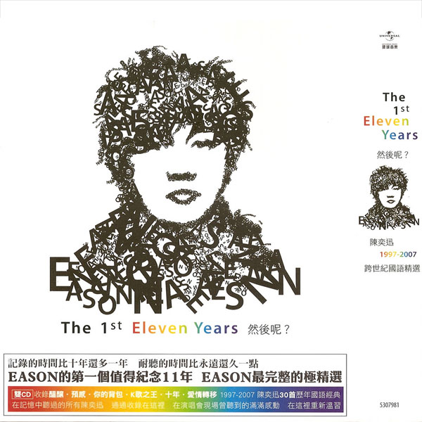

	

# [1997-2007 跨世纪国语精选](https://music.163.com/album?id=6404)

* 时间：2008-03-25
* 歌手：陈奕迅
* 唱片公司：新艺宝
## Songs

* [K歌之王](songs/k歌之王_65047/README.md)
* [十年](songs/十年_65050/README.md)
* [淘汰(国)](songs/淘汰_国__65053/README.md)
* [爱是怀疑](songs/爱是怀疑_65056/README.md)
* [想哭](songs/想哭_65060/README.md)
* [圣诞结](songs/圣诞结_65063/README.md)
* [婚礼的祝福](songs/婚礼的祝福_65066/README.md)
* [烟味(国)](songs/烟味_国__65070/README.md)
* [对不起 谢谢(国)](songs/对不起_谢谢_国__65074/README.md)
* [好久不见(国)](songs/好久不见_国__65078/README.md)
* [低等动物(国)](songs/低等动物_国__65082/README.md)
* [我们都寂寞](songs/我们都寂寞_65086/README.md)
* [谢谢](songs/谢谢_65090/README.md)
* [阿怪](songs/阿怪_65094/README.md)
* [狂人日记](songs/狂人日记_65097/README.md)
* [爱情转移(国)](songs/爱情转移_国__65099/README.md)
* [你的背包](songs/你的背包_65101/README.md)
* [预感](songs/预感_65104/README.md)
* [谢谢侬](songs/谢谢侬_65107/README.md)
* [兄妹](songs/兄妹_65110/README.md)
* [全世界失眠](songs/全世界失眠_65114/README.md)
* [不如这样](songs/不如这样_65117/README.md)
* [要你的](songs/要你的_65120/README.md)
* [不睡(国)](songs/不睡_国__65123/README.md)
* [红玫瑰(国)](songs/红玫瑰_国__65126/README.md)
* [拔河](songs/拔河_65130/README.md)
* [不然你要我怎么样(国)](songs/不然你要我怎么样_国__65134/README.md)
* [世界](songs/世界_65138/README.md)
* [人造卫星](songs/人造卫星_65142/README.md)
* [酝酿](songs/酝酿_65146/README.md)
## Appendix

### Description

这张《The First Eleven Years 然后呢》双CD乃首张集合Eason十年以来最完整国语精选专辑，收录了1997年至2007年间30首严精国语经典歌，包括∶“酝酿”、“预感”、“拔河”、“你的背包”、“不如这样”、“K歌之王”、“十年”、“爱情转移”等，来为Eason这十年的国语乐坛作见证。

### Score

|歌曲数|评论数|分享数|
|:---:|:---:|:---:|
|30|188|118|

|歌名|分数|
|:---:|:---:|
|淘汰(国)|100.0
|好久不见(国)|100.0
|爱情转移(国)|100.0
|红玫瑰(国)|100.0
|对不起 谢谢(国)|95.0
|预感|90.0
|K歌之王|85.0
|十年|85.0
|圣诞结|85.0
|婚礼的祝福|85.0
|烟味(国)|85.0
|谢谢侬|80.0
|想哭|70.0
|你的背包|70.0
|不睡(国)|60.0
|拔河|60.0
|酝酿|60.0
|兄妹|55.0
|全世界失眠|45.0
|不然你要我怎么样(国)|40.0
|爱是怀疑|25.0
|低等动物(国)|25.0
|阿怪|25.0
|不如这样|25.0
|我们都寂寞|20.0
|谢谢|20.0
|狂人日记|20.0
|世界|20.0
|要你的|5.0
|人造卫星|5.0
