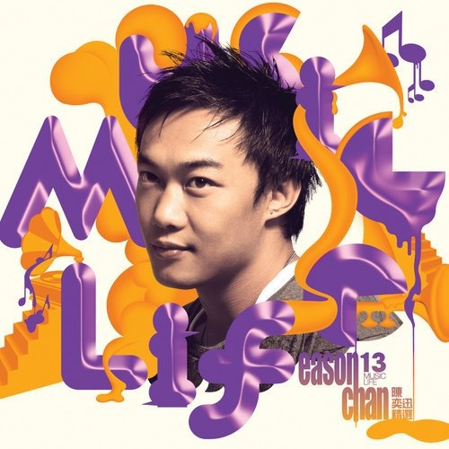

	

# [2013 陈奕迅 music life 精选](https://music.163.com/album?id=2532179)

* 时间：2013-06-26
* 歌手：陈奕迅
* 唱片公司：英皇唱片
## Songs

* [岁月如歌](songs/岁月如歌_26608787/README.md)
* [K歌之王(粤)](songs/k歌之王_粤__26608788/README.md)
* [明年今日](songs/明年今日_26608789/README.md)
* [十面埋伏](songs/十面埋伏_26608790/README.md)
* [打回原形](songs/打回原形_26608791/README.md)
* [孤独探戈](songs/孤独探戈_26608792/README.md)
* [Lonely Christmas](songs/lonely_christmas_26608793/README.md)
* [1874](songs/__26608794/README.md)
* [单车](songs/单车_26608795/README.md)
* [人来人往](songs/人来人往_26608796/README.md)
* [一疋布](songs/一疋布_26608797/README.md)
* [低等动物(粤)](songs/低等动物_粤__26608798/README.md)
* [他一个人](songs/他一个人_26608799/README.md)
* [活着多好](songs/活着多好_26608800/README.md)
* [天使的礼物](songs/天使的礼物_26608801/README.md)
* [我不好爱](songs/我不好爱_26608802/README.md)
* [小孩不懂怕](songs/小孩不懂怕_26608803/README.md)
* [少见不怪](songs/少见不怪_26608804/README.md)
* [绵绵](songs/绵绵_26608805/README.md)
* [Shall We Talk](songs/shall_we_talk_26608806/README.md)
* [一切还好](songs/一切还好_26608807/README.md)
* [猜情寻](songs/猜情寻_26608808/README.md)
* [忘记歌词](songs/忘记歌词_26608809/README.md)
* [打得火热](songs/打得火热_26608810/README.md)
* [给爱丽斯](songs/给爱丽斯_26608811/README.md)
* [2001太空漫游](songs/_太空漫游_26608812/README.md)
* [阿士匹灵](songs/阿士匹灵_26608813/README.md)
* [人工智能](songs/人工智能_26608814/README.md)
* [第一类接触](songs/第一类接触_26608815/README.md)
* [冲口而出](songs/冲口而出_26608816/README.md)
* [随意门](songs/随意门_26608817/README.md)
* [呀边个边个](songs/呀边个边个_26608818/README.md)
* [坏情人](songs/坏情人_26608819/README.md)
* [幸灾乐祸](songs/幸灾乐祸_26608820/README.md)
* [King Kong](songs/king_kong_26608821/README.md)
* [最后今晚](songs/最后今晚_26608822/README.md)
* [兄妹 (国语版)](songs/兄妹_国语版__26608823/README.md)
* [爱是怀疑 (国语版)](songs/爱是怀疑_国语版__26608824/README.md)
* [谢谢侬 (国语版)](songs/谢谢侬_国语版__26608825/README.md)
* [Shall We Talk (国语版)](songs/shall_we_talk_国语版__26608826/README.md)
* [K歌之王 (国语版)](songs/k歌之王_国语版__26608827/README.md)
* [十年 (国语版)](songs/十年_国语版__26608828/README.md)
* [阿怪 (国语版)](songs/阿怪_国语版__26608829/README.md)
* [你的背包 (国语版)](songs/你的背包_国语版__26608830/README.md)
* [没有手机的日子 (国语版)](songs/没有手机的日子_国语版__26608831/README.md)
* [低等动物 (国语版)](songs/低等动物_国语版__26608832/README.md)
* [圣诞结 (国语版)](songs/圣诞结_国语版__26608833/README.md)
* [人造卫星 (国语版)](songs/人造卫星_国语版__26608834/README.md)
* [狂人日记 (国语版)](songs/狂人日记_国语版__26608835/README.md)
* [寂寞让你更快乐 (国语版)](songs/寂寞让你更快乐_国语版__26608841/README.md)
* [Because You're Good To Me (国语版)](songs/because_you_re_good_to_me_国语版__26608843/README.md)
* [像一句广告 (国语版)](songs/像一句广告_国语版__26608848/README.md)
* [不如这样 (国语版)](songs/不如这样_国语版__26608849/README.md)
* [我们都寂寞 (国语版)](songs/我们都寂寞_国语版__26608851/README.md)
* [岁月如歌 (钢琴版)](songs/岁月如歌_钢琴版__26608852/README.md)
* [明年今日 (钢琴版)](songs/明年今日_钢琴版__26608860/README.md)
* [十面埋伏 (钢琴版)](songs/十面埋伏_钢琴版__26608861/README.md)
* [打回原形 (钢琴版)](songs/打回原形_钢琴版__26608862/README.md)
* [K歌之王 (钢琴版)](songs/k歌之王_钢琴版__26608863/README.md)
* [Shall We Talk (钢琴版)](songs/shall_we_talk_钢琴版__26608864/README.md)
* [给爱丽斯 (钢琴版)](songs/给爱丽斯_钢琴版__26608865/README.md)
* [Lonely Christmas (钢琴版)](songs/lonely_christmas_钢琴版__26608866/README.md)
* [忘记歌词 (钢琴版)](songs/忘记歌词_钢琴版__26608867/README.md)
* [猜情寻 (钢琴版)](songs/猜情寻_钢琴版__26608868/README.md)
* [幸灾乐祸 (钢琴版)](songs/幸灾乐祸_钢琴版__26608869/README.md)
* [人来人往 (钢琴版)](songs/人来人往_钢琴版__26608870/README.md)
* [你的背包 (钢琴版)](songs/你的背包_钢琴版__26608871/README.md)
* [想哭 (钢琴版)](songs/想哭_钢琴版__26608872/README.md)
* [天使的礼物 (钢琴版)](songs/天使的礼物_钢琴版__26608873/README.md)
* [打得火热 (钢琴版)](songs/打得火热_钢琴版__26608874/README.md)
* [孤儿仔 (钢琴版)](songs/孤儿仔_钢琴版__26608875/README.md)
* [单车 (钢琴版)](songs/单车_钢琴版__26608876/README.md)
* [少见不怪 (钢琴版)](songs/少见不怪_钢琴版__26608877/README.md)
* [他一个人 (钢琴版)](songs/他一个人_钢琴版__26608878/README.md)
## Appendix

### Description

### Score

|歌曲数|评论数|分享数|
|:---:|:---:|:---:|
|74|57|37|

|歌名|分数|
|:---:|:---:|
|K歌之王(粤)|85.0
|K歌之王 (国语版)|80.0
|十年 (国语版)|80.0
|十面埋伏|65.0
|打回原形|60.0
|明年今日|55.0
|圣诞结 (国语版)|55.0
|单车|45.0
|Shall We Talk (国语版)|40.0
|人来人往|35.0
|最后今晚|30.0
|岁月如歌|25.0
|Lonely Christmas|25.0
|1874|25.0
|低等动物(粤)|25.0
|活着多好|25.0
|一切还好|25.0
|兄妹 (国语版)|25.0
|谢谢侬 (国语版)|25.0
|你的背包 (国语版)|25.0
|不如这样 (国语版)|25.0
|孤独探戈|20.0
|一疋布|20.0
|少见不怪|20.0
|Shall We Talk|20.0
|给爱丽斯|20.0
|绵绵|15.0
|猜情寻|15.0
|打得火热|15.0
|低等动物 (国语版)|15.0
|人来人往 (钢琴版)|15.0
|他一个人|5.0
|天使的礼物|5.0
|我不好爱|5.0
|小孩不懂怕|5.0
|忘记歌词|5.0
|2001太空漫游|5.0
|阿士匹灵|5.0
|人工智能|5.0
|第一类接触|5.0
|冲口而出|5.0
|随意门|5.0
|呀边个边个|5.0
|坏情人|5.0
|幸灾乐祸|5.0
|King Kong|5.0
|爱是怀疑 (国语版)|5.0
|阿怪 (国语版)|5.0
|没有手机的日子 (国语版)|5.0
|人造卫星 (国语版)|5.0
|狂人日记 (国语版)|5.0
|寂寞让你更快乐 (国语版)|5.0
|Because You're Good To Me (国语版)|5.0
|像一句广告 (国语版)|5.0
|我们都寂寞 (国语版)|5.0
|岁月如歌 (钢琴版)|5.0
|明年今日 (钢琴版)|5.0
|十面埋伏 (钢琴版)|5.0
|打回原形 (钢琴版)|5.0
|K歌之王 (钢琴版)|5.0
|Shall We Talk (钢琴版)|5.0
|给爱丽斯 (钢琴版)|5.0
|Lonely Christmas (钢琴版)|5.0
|忘记歌词 (钢琴版)|5.0
|猜情寻 (钢琴版)|5.0
|幸灾乐祸 (钢琴版)|5.0
|你的背包 (钢琴版)|5.0
|想哭 (钢琴版)|5.0
|天使的礼物 (钢琴版)|5.0
|打得火热 (钢琴版)|5.0
|孤儿仔 (钢琴版)|5.0
|单车 (钢琴版)|5.0
|少见不怪 (钢琴版)|5.0
|他一个人 (钢琴版)|5.0
