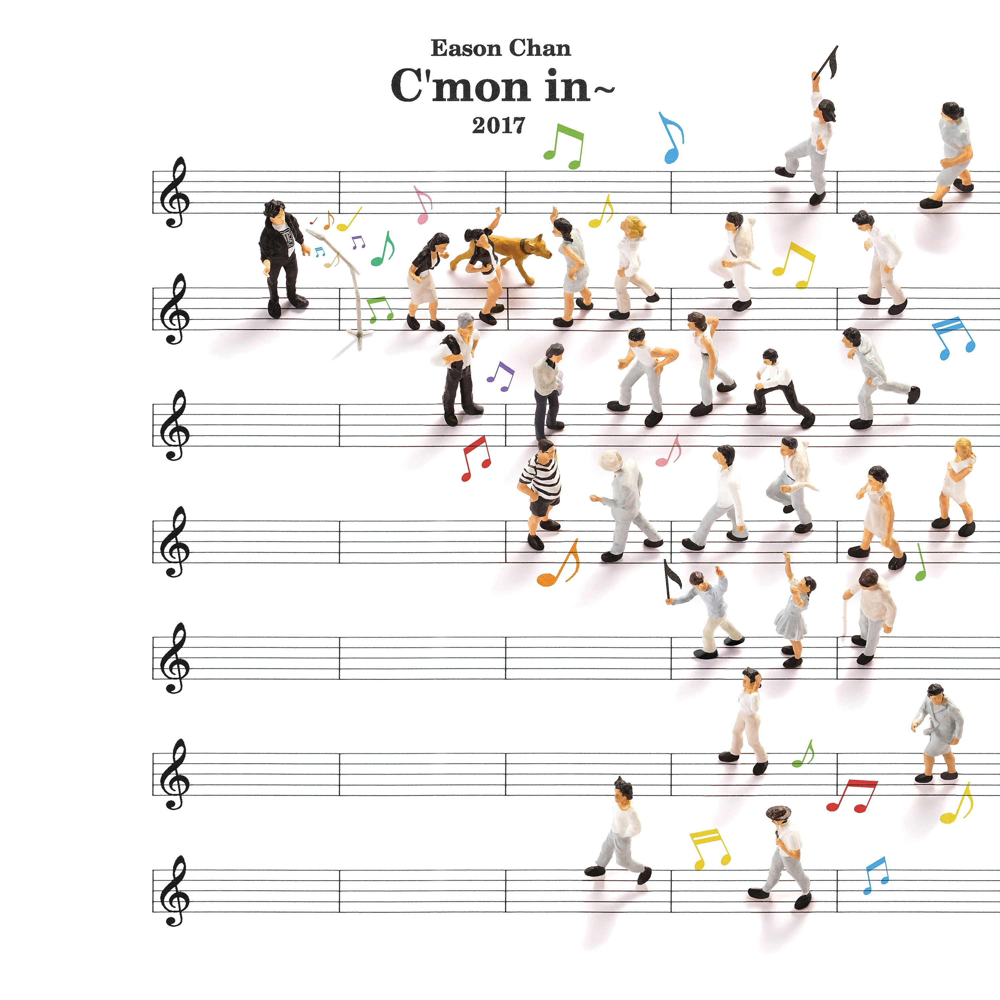

	

# [C'mon in~](https://music.163.com/album?id=36304576)

* 时间：2017-10-09
* 歌手：陈奕迅
* 唱片公司：环球唱片
## Songs

* [放](songs/放_509098886/README.md)
* [收心操](songs/收心操_509098885/README.md)
* [海胆](songs/海胆_509098887/README.md)
* [谁来剪月光](songs/谁来剪月光_509098889/README.md)
* [床上的黑洞](songs/床上的黑洞_509098884/README.md)
* [右上角](songs/右上角_509098883/README.md)
* [之外](songs/之外_509106722/README.md)
* [傅科摆](songs/傅科摆_509106724/README.md)
* [零下几分钟](songs/零下几分钟_509106725/README.md)
* [披风](songs/披风_509098892/README.md)
## Appendix

### Description

C’mon in~
Eason Chan
睽违三年期待 全新国语专辑
就这样…..就酱
怎么样？
就这样…..就酱
唱什么？
就这样…..就酱
只有他可以这样玩弄音符！
只有音乐可以颠倒他行为！
只有他可以“唱”所欲为！
借着音乐与文字 摆己渡人 摆人渡己
请你自己在这十首曲中 寻找到最深层的自我
你是怎样的？
就这样…..就酱
就这样一个人
就这样一个经历
就这样一个故事
没有借口 没有理由 没有牵绊 没有废话
就这样…..就酱
Eason这次主要透过两大著名作词家易家扬、葛大为将藉由他们的笔触以及音乐人Jerald监制，并邀请许多音乐菁英一同参与完成…..
而这一次专辑的名称 [C’mon in~] 开宗明义简单明了，就是希望欢迎请进来我的音乐世界，随着十首不同的旋律音符以及文字想象空间，尽情暂时抛开所有的一切，用心细细咀嚼品尝…..
就酱…..就这样
就听歌吧！

### Score

|歌曲数|评论数|分享数|
|:---:|:---:|:---:|
|10|3242|6790|

|歌名|分数|
|:---:|:---:|
|谁来剪月光|85.0
|之外|85.0
|披风|85.0
|海胆|80.0
|零下几分钟|80.0
|放|75.0
|收心操|75.0
|床上的黑洞|75.0
|右上角|75.0
|傅科摆|75.0
