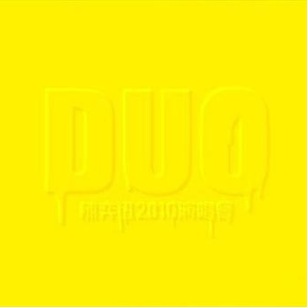

	

# [DUO 陈奕迅2010演唱会](https://music.163.com/album?id=6365)

* 时间：2010-06-28
* 歌手：陈奕迅
* 唱片公司：环球唱片
## Songs

* [今天等我来(Live) - live](songs/今天等我来_live_live_64421/README.md)
* [好歌献给你(Live) - live](songs/好歌献给你_live_live_64425/README.md)
* [落花流水(Live) - live](songs/落花流水_live_live_64429/README.md)
* [囍帖街(Live) - live](songs/囍帖街_live_live_64435/README.md)
* [七百年后(Live) - live](songs/七百年后_live_live_64439/README.md)
* [约定(Live)](songs/约定_live__64443/README.md)
* [寂寞夜晚(Live) - live](songs/寂寞夜晚_live_live_64447/README.md)
* [浮夸(Live) - live](songs/浮夸_live_live_64453/README.md)
* [禁色(Live) - live](songs/禁色_live_live_64459/README.md)
* [无人之境(Live) - live](songs/无人之境_live_live_64465/README.md)
* [破晓(Live) - live](songs/破晓_live_live_64471/README.md)
* [夕阳无限好(Live) - live](songs/夕阳无限好_live_live_64481/README.md)
* [人车志(Live) - live](songs/人车志_live_live_64487/README.md)
* [裙下之臣(Live) - live](songs/裙下之臣_live_live_64492/README.md)
* [陀飞轮(Live) - live](songs/陀飞轮_live_live_64496/README.md)
* [沙龙 (Live) - live](songs/沙龙_live_live_29017184/README.md)
* [葡萄成熟时(Live) - live](songs/葡萄成熟时_live_live_64501/README.md)
* [热辣辣+ 反斗星+头发乱了+好戏在后头(Live) - live](songs/热辣辣_反斗星_头发乱了_好戏在后头_live_live_64506/README.md)
* [芳华绝代(Live) - live](songs/芳华绝代_live_live_64513/README.md)
* [富士山下(Live) - live](songs/富士山下_live_live_64517/README.md)
* [不来也不去 (Live) - live](songs/不来也不去_live_live_29017185/README.md)
* [与我常在(Live) - live](songs/与我常在_live_live_64522/README.md)
* [我的快乐时代(Live) - live](songs/我的快乐时代_live_live_64528/README.md)
* [歌.颂(Live) - live](songs/歌_颂_live_live_64534/README.md)
* [PG家长指引(Live) - live](songs/pg家长指引_live_live_64540/README.md)
* [那一夜有没有说(Live) - live](songs/那一夜有没有说_live_live_64544/README.md)
* [反高潮(Live) - live](songs/反高潮_live_live_64550/README.md)
* [一丝不挂(Live) - live](songs/一丝不挂_live_live_64556/README.md)
* [单车(Live) - live](songs/单车_live_live_64561/README.md)
* [等(Live) - live](songs/等_live_live_64566/README.md)
* [Mr Lonely(Live) - live](songs/mr_lonely_live_live_64570/README.md)
* [我甚么都没有(Live) - live](songs/我甚么都没有_live_live_64574/README.md)
* [抱拥这分钟(Live) - live](songs/抱拥这分钟_live_live_64578/README.md)
* [The End of the World (Live)](songs/the_end_of_the_world_live__64583/README.md)
* [我的世界末日(Live) - live](songs/我的世界末日_live_live_64588/README.md)
* [每一个明天(Live) - live](songs/每一个明天_live_live_64594/README.md)
* [明年今日(Live) - live](songs/明年今日_live_live_64599/README.md)
* [Every Time We Say Goodbye(Live) - live](songs/every_time_we_say_goodbye_live_live_64603/README.md)
## Appendix

### Description

2010年，陈奕迅突破个人演唱会场数的纪录，于3月20日至4月6日香港红馆举行一连18场《DUO 陈奕迅2010演唱会》。为配合「DUO 双面」主题，在歌曲和造型上大玩 crossover。Eason 穿上半黑半白的造型出场，在齿轮为背景的舞台上大唱出「今天等我来」。选曲上亦作出突破，近40首歌曲中，几乎唱了三分之一其他歌手的名作，如「好歌献给你」、「囍帖街」、「约定」、「寂寞夜晚」、「破晓」等，歌者再把他自己的歌曲配上意境和故事，同时以《Time files》的妖冶造型现身，重新诠释和连接「DUO」的演唱会概念。

### Score

|歌曲数|评论数|分享数|
|:---:|:---:|:---:|
|38|1268|4990|

|歌名|分数|
|:---:|:---:|
|今天等我来(Live) - live|100.0
|落花流水(Live) - live|100.0
|囍帖街(Live) - live|100.0
|七百年后(Live) - live|100.0
|约定(Live)|100.0
|寂寞夜晚(Live) - live|100.0
|浮夸(Live) - live|100.0
|无人之境(Live) - live|100.0
|陀飞轮(Live) - live|100.0
|沙龙 (Live) - live|100.0
|葡萄成熟时(Live) - live|100.0
|富士山下(Live) - live|100.0
|不来也不去 (Live) - live|100.0
|与我常在(Live) - live|100.0
|我的快乐时代(Live) - live|100.0
|反高潮(Live) - live|100.0
|一丝不挂(Live) - live|100.0
|单车(Live) - live|100.0
|等(Live) - live|100.0
|Mr Lonely(Live) - live|100.0
|我甚么都没有(Live) - live|100.0
|抱拥这分钟(Live) - live|100.0
|明年今日(Live) - live|100.0
|好歌献给你(Live) - live|95.0
|禁色(Live) - live|95.0
|破晓(Live) - live|95.0
|夕阳无限好(Live) - live|95.0
|裙下之臣(Live) - live|95.0
|歌.颂(Live) - live|95.0
|PG家长指引(Live) - live|95.0
|那一夜有没有说(Live) - live|95.0
|The End of the World (Live)|95.0
|每一个明天(Live) - live|95.0
|人车志(Live) - live|90.0
|热辣辣+ 反斗星+头发乱了+好戏在后头(Live) - live|90.0
|芳华绝代(Live) - live|90.0
|我的世界末日(Live) - live|90.0
|Every Time We Say Goodbye(Live) - live|85.0
