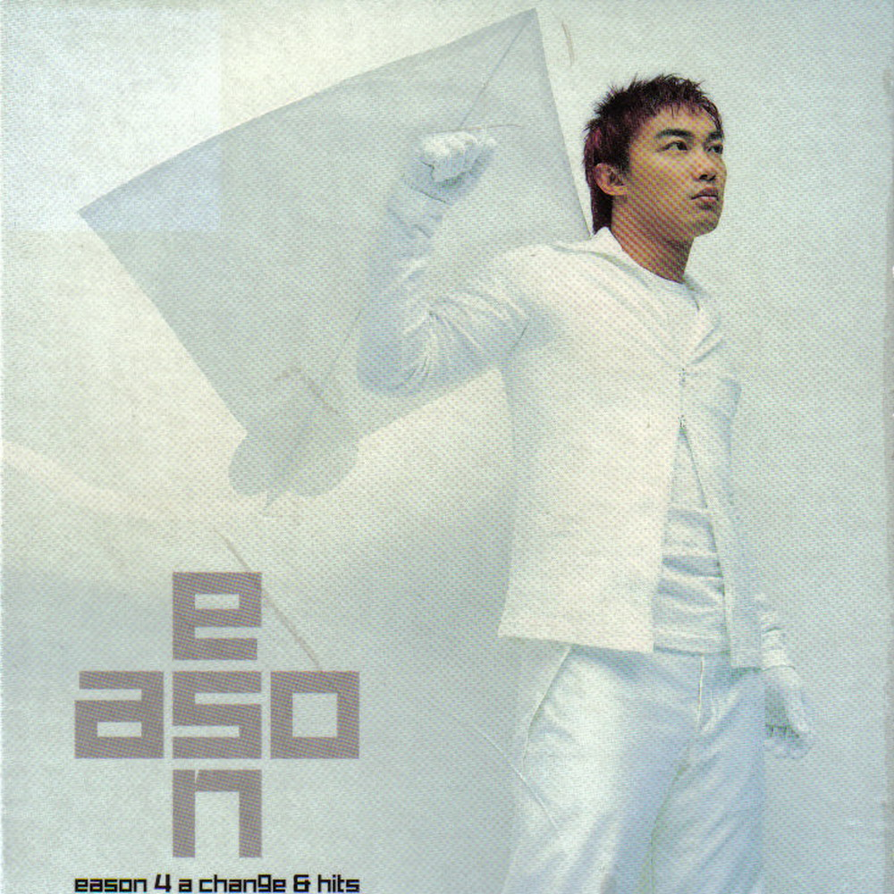

	

# [Eason 4 A Change & Hits](https://music.163.com/album?id=6555)

* 时间：2002-12-01
* 歌手：陈奕迅
* 唱片公司：英皇
## Songs

* [King Kong](songs/king_kong_66936/README.md)
* [Lonely Christmas](songs/lonely_christmas_66938/README.md)
* [第一类接触](songs/第一类接触_66940/README.md)
* [少见不怪](songs/少见不怪_66942/README.md)
* [打得火热](songs/打得火热_66945/README.md)
* [K歌之王](songs/k歌之王_66948/README.md)
* [绵绵](songs/绵绵_66951/README.md)
* [低等动物](songs/低等动物_66954/README.md)
* [2001太空漫游](songs/_太空漫游_66957/README.md)
* [Shall We Talk](songs/shall_we_talk_66961/README.md)
* [单车](songs/单车_66963/README.md)
* [天使的礼物](songs/天使的礼物_66967/README.md)
* [失恋太少](songs/失恋太少_66970/README.md)
* [冲口而出](songs/冲口而出_66972/README.md)
* [大开眼戒](songs/大开眼戒_66974/README.md)
* [热带雨林](songs/热带雨林_66976/README.md)
* [活着多好](songs/活着多好_66977/README.md)
* [给爱丽斯](songs/给爱丽斯_66979/README.md)
* [孤儿仔](songs/孤儿仔_66981/README.md)
* [一疋布](songs/一疋布_66984/README.md)
* [孤独探戈](songs/孤独探戈_66987/README.md)
* [我不好爱](songs/我不好爱_66990/README.md)
## Appendix

### Description

在2002年终结前，香港乐坛天王陈奕迅推出新曲加精选专辑《Eason 4 A Change & Hits》。碟内收录了Eason四首新歌，四首精彩歌曲的MV，以及由「K歌之王」至「给爱丽斯」等18首大热之作。
正如碟名一样，2002年即将过去，是时候重温Eason在音乐及曲风上的变化—《4 A Change》吧！

### Score

|歌曲数|评论数|分享数|
|:---:|:---:|:---:|
|22|17|2|

|歌名|分数|
|:---:|:---:|
|Lonely Christmas|60.0
|Shall We Talk|35.0
|K歌之王|25.0
|绵绵|25.0
|单车|25.0
|孤儿仔|25.0
|失恋太少|20.0
|大开眼戒|20.0
|热带雨林|20.0
|King Kong|5.0
|第一类接触|5.0
|少见不怪|5.0
|打得火热|5.0
|低等动物|5.0
|2001太空漫游|5.0
|天使的礼物|5.0
|冲口而出|5.0
|活着多好|5.0
|给爱丽斯|5.0
|一疋布|5.0
|孤独探戈|5.0
|我不好爱|5.0
