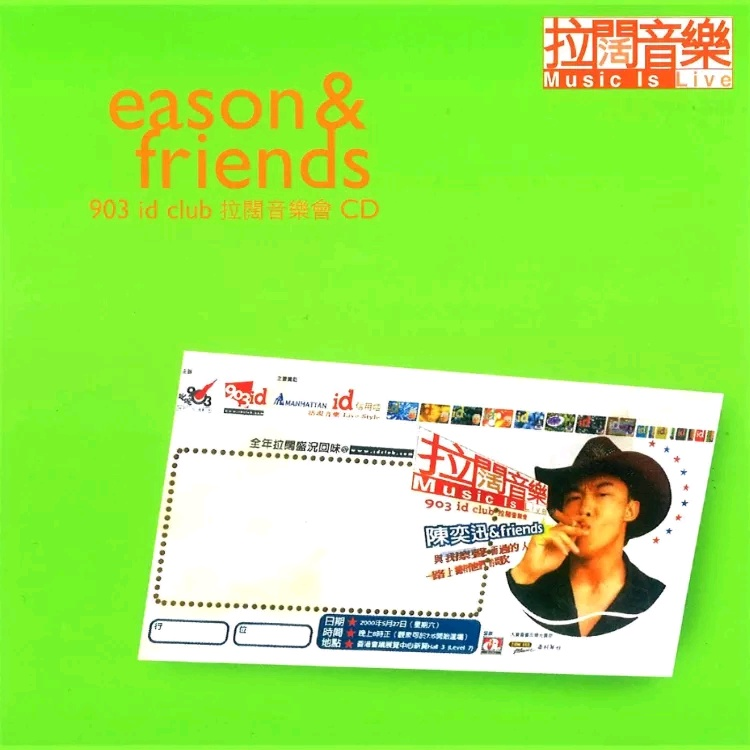

	

# [Eason & Friends 903 Id Club](https://music.163.com/album?id=2621232)

* 时间：2000-06-01
* 歌手：陈奕迅
* 唱片公司：华星唱片
## Songs

* [等](songs/等_27506283/README.md)
* [遥远的她](songs/遥远的她_27506284/README.md)
* [要是有缘](songs/要是有缘_27506282/README.md)
* [奋斗](songs/奋斗_27506281/README.md)
* [幸福摩天轮](songs/幸福摩天轮_27506280/README.md)
* [那一夜有没有说](songs/那一夜有没有说_27506287/README.md)
* [贝多芬与我(梁汉文钢琴伴奏) - instrumental](songs/贝多芬与我_梁汉文钢琴伴奏_instrumental_27506289/README.md)
* [美丽有罪](songs/美丽有罪_27506286/README.md)
* [我的世界末日](songs/我的世界末日_27506291/README.md)
* [第五个现代化](songs/第五个现代化_27506288/README.md)
* [黑夜不再来](songs/黑夜不再来_27506290/README.md)
## Appendix

### Description

### Score

|歌曲数|评论数|分享数|
|:---:|:---:|:---:|
|11|13|2|

|歌名|分数|
|:---:|:---:|
|遥远的她|95.0
|等|25.0
|要是有缘|5.0
|奋斗|5.0
|幸福摩天轮|5.0
|那一夜有没有说|5.0
|贝多芬与我(梁汉文钢琴伴奏) - instrumental|5.0
|美丽有罪|5.0
|我的世界末日|5.0
|第五个现代化|5.0
|黑夜不再来|5.0
