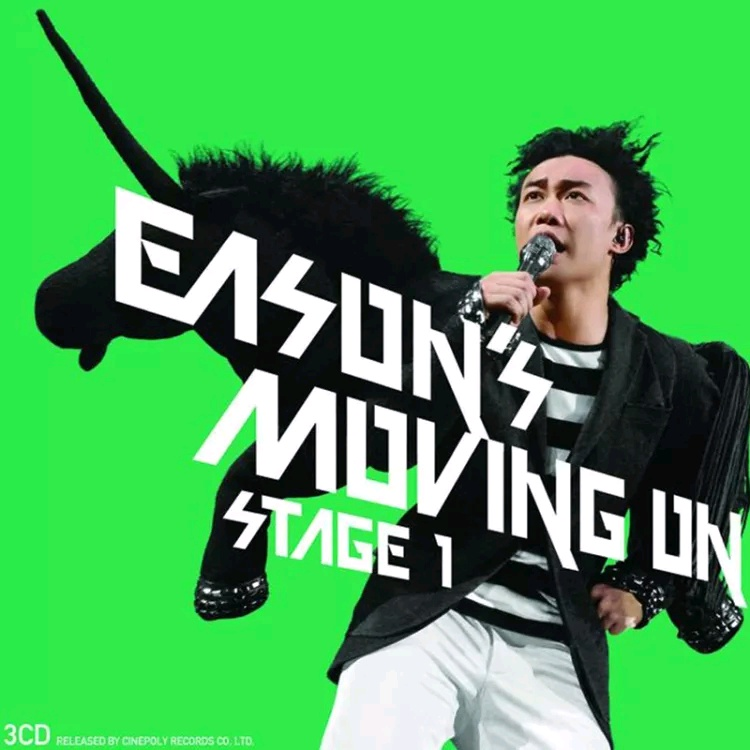

	

# [Eason Moving On Stage 1](https://music.163.com/album?id=6410)

* 时间：2008-04-30
* 歌手：陈奕迅
* 唱片公司：环球唱片
## Songs

* [Overture - 2007 Live](songs/overture_live_65159/README.md)
* [白玫瑰 - 2007 Live](songs/白玫瑰_live_65162/README.md)
* [信心花舍 - 2007 Live](songs/信心花舍_live_65165/README.md)
* [K歌之王 - 2007 Live](songs/k歌之王_live_65167/README.md)
* [裙下之臣 - 2007 Live](songs/裙下之臣_live_65169/README.md)
* [富士山下 - 2007 Live](songs/富士山下_live_65171/README.md)
* [不如不见 - 2007 Live](songs/不如不见_live_65173/README.md)
* [夕阳无限好 - 2007 Live](songs/夕阳无限好_live_65177/README.md)
* [人车志 - 2007 Live](songs/人车志_live_65181/README.md)
* [马利奥派对 - 2007 Live](songs/马利奥派对_live_65185/README.md)
* [最佳损友 - 2007 Live](songs/最佳损友_live_65189/README.md)
* [What a Wonderful World - 2007 Live](songs/what_a_wonderful_world_live_65193/README.md)
* [今日](songs/今日_65199/README.md)
* [黑择明 - 2007 Live](songs/黑择明_live_65204/README.md)
* [Shall We Dance+伤信+幸福摩天轮+美丽有罪+2001漫游太空+给爱丽斯](songs/shall_we_dance_伤信_幸福摩天轮_美丽有罪_漫游太空_给爱丽斯_65209/README.md)
* [热岛小夜曲 - 2007 Live](songs/热岛小夜曲_live_65214/README.md)
* [Crying in the Party - 2007 Live](songs/crying_in_the_party_live_65219/README.md)
* [我不好爱 - 2007 Live](songs/我不好爱_live_65225/README.md)
* [打回原形 - 2007 Live](songs/打回原形_live_65234/README.md)
* [冲口而出 - 2007 Live](songs/冲口而出_live_65250/README.md)
* [月球上的人 - 2007 Live](songs/月球上的人_live_65256/README.md)
* [葡萄成熟时 - 2007 Live](songs/葡萄成熟时_live_65259/README.md)
* [浮夸 - 2007 Live](songs/浮夸_live_65261/README.md)
* [低等动物 - 2007 Live](songs/低等动物_live_65266/README.md)
* [粤语残片 - 2007 Live](songs/粤语残片_live_65269/README.md)
* [淘汰 - 2007 Live](songs/淘汰_live_65274/README.md)
* [黄金时代](songs/黄金时代_65285/README.md)
* [落花流水 - 2007 Live](songs/落花流水_live_65288/README.md)
* [第五个现代化](songs/第五个现代化_65292/README.md)
* [演唱会 - 2007 Live](songs/演唱会_live_65296/README.md)
* [天下无双](songs/天下无双_65301/README.md)
* [与我常在](songs/与我常在_65307/README.md)
* [明年今日 - 2007 Live](songs/明年今日_live_65312/README.md)
## Appendix

### Description

陈奕迅Eason's Moving On Stage 1演唱会自宣布以来反应热烈，几度加场，由十场加开到16场，依然全场爆满！首首快歌，劲舞震撼乐迷耳朵，无论是一开幕的铁笼，间场的电脑效果，抑或是每日不同的服装，均为喜欢陈奕迅的歌迷带来惊喜。陈奕迅表示:「16场我都做得咁开心，每场都有少许变化，睇多过一场的Fans就会知道，我每日的衫都会有场少少唔同。」每场临近尾声Eason身穿的Tee都有歌曲名称的英文版，例如<与我常在>就是 “Always With Me”而<明年今日>就是 “Same Time Next Year”，十分过瘾。是次演唱会Live CD共3只碟，而且随碟的Booklet制作十分精美，把舞台上每一个值得纪念的时刻都摄下，配以有型的后期加工。大碟中有附送Tee形贴纸，完本设计师打算用 “Make your own Stage”的概念，做出Eason于舞台上的贴纸，让听众自己砌出一个舞台，不过Eason一向以歌会友，最后还是以靓相做Booklet，无需花巧呈现Eason的现场音乐。

继香港Eason's Moving On Stage 1后，Eason会作巡回演唱，档期排得密麻麻。而为了下一个演唱会作准备，Eason希望给大家一个全新惊喜，要用相当时间准备，应该要到2009年才会于香港再开演唱会，所以是次演唱会Live CD十分具价值！

### Score

|歌曲数|评论数|分享数|
|:---:|:---:|:---:|
|33|348|407|

|歌名|分数|
|:---:|:---:|
|信心花舍 - 2007 Live|100.0
|K歌之王 - 2007 Live|100.0
|打回原形 - 2007 Live|100.0
|明年今日 - 2007 Live|100.0
|富士山下 - 2007 Live|95.0
|我不好爱 - 2007 Live|95.0
|白玫瑰 - 2007 Live|90.0
|不如不见 - 2007 Live|90.0
|月球上的人 - 2007 Live|90.0
|低等动物 - 2007 Live|85.0
|落花流水 - 2007 Live|85.0
|夕阳无限好 - 2007 Live|80.0
|What a Wonderful World - 2007 Live|80.0
|葡萄成熟时 - 2007 Live|80.0
|淘汰 - 2007 Live|80.0
|浮夸 - 2007 Live|75.0
|粤语残片 - 2007 Live|75.0
|最佳损友 - 2007 Live|70.0
|黑择明 - 2007 Live|70.0
|与我常在|65.0
|裙下之臣 - 2007 Live|60.0
|今日|60.0
|Crying in the Party - 2007 Live|60.0
|冲口而出 - 2007 Live|55.0
|马利奥派对 - 2007 Live|50.0
|演唱会 - 2007 Live|50.0
|人车志 - 2007 Live|45.0
|Shall We Dance+伤信+幸福摩天轮+美丽有罪+2001漫游太空+给爱丽斯|45.0
|黄金时代|45.0
|Overture - 2007 Live|40.0
|天下无双|40.0
|热岛小夜曲 - 2007 Live|35.0
|第五个现代化|5.0
