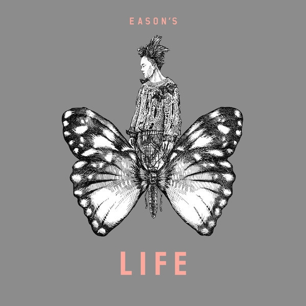

	

# [Eason's Life 陈奕迅2013演唱会](https://music.163.com/album?id=2732645)

* 时间：2013-12-18
* 歌手：陈奕迅
* 唱片公司：EAS Music
## Songs

* [今天只做一件事 (Live In Hong Kong, 2013)](songs/今天只做一件事_live_in_hong_kong__28160867/README.md)
* [L.I.F.E. Overture (Live In Hong Kong, 2013)](songs/l_i_f_e_overture_live_in_hong_kong__28160868/README.md)
* [花花世界 (Live In Hong Kong, 2013)](songs/花花世界_live_in_hong_kong__28160869/README.md)
* [Life Goes On (Live In Hong Kong, 2013)](songs/life_goes_on_live_in_hong_kong__28160870/README.md)
* [每一个明天 (Live In Hong Kong, 2013)](songs/每一个明天_live_in_hong_kong__28160871/README.md)
* [美满人生 (Live In Hong Kong, 2013)](songs/美满人生_live_in_hong_kong__28160872/README.md)
* [Welcome To The Future (Live In Hong Kong, 2013)](songs/welcome_to_the_future_live_in_hong_kong__28160873/README.md)
* [时代巨轮 (Live In Hong Kong, 2013)](songs/时代巨轮_live_in_hong_kong__28160885/README.md)
* [大人 (Live In Hong Kong, 2013)](songs/大人_live_in_hong_kong__28160874/README.md)
* [碌卡 (Live In Hong Kong, 2013)](songs/碌卡_live_in_hong_kong__28160875/README.md)
* [Stranger Under My Skin (Live In Hong Kong, 2013)](songs/stranger_under_my_skin_live_in_hong_kong__28160876/README.md)
* [幸福摩天轮 (Live In Hong Kong, 2013)](songs/幸福摩天轮_live_in_hong_kong__28160877/README.md)
* [信任 (Live In Hong Kong, 2013)](songs/信任_live_in_hong_kong__28160878/README.md)
* [时光倒流二十年 (Live In Hong Kong, 2013)](songs/时光倒流二十年_live_in_hong_kong__28160879/README.md)
* [夕阳无限好 (Live In Hong Kong, 2013)](songs/夕阳无限好_live_in_hong_kong__28160880/README.md)
* [今日 (Live In Hong Kong, 2013)](songs/今日_live_in_hong_kong__28160886/README.md)
* [我的快乐时代 (Live In Hong Kong, 2013)](songs/我的快乐时代_live_in_hong_kong__28160881/README.md)
* [天下无双 (Live In Hong Kong, 2013)](songs/天下无双_live_in_hong_kong__28160882/README.md)
* [与我常在 (Live In Hong Kong, 2013)](songs/与我常在_live_in_hong_kong__28160884/README.md)
* [床头床尾 (Live In Hong Kong, 2013)](songs/床头床尾_live_in_hong_kong__28160883/README.md)
* [主旋律 (Live In Hong Kong, 2013)](songs/主旋律_live_in_hong_kong__28160887/README.md)
* [每天爱你多一些 (Live In Hong Kong, 2013)](songs/每天爱你多一些_live_in_hong_kong__34228642/README.md)
## Appendix

### Description

完美收录陈奕迅2013 Life演唱会2CD
七月六日至八月二日连续25场座无虚席
Eason神级演出, 及珍贵收录只此一晚压轴安歌
好歌包括: 夕阳无限好 幸福摩天轮 每一个明天 时代巨轮 今天只做一件事 信任 今日 我的快乐时代…
压轴安歌: 天下无双 与我常在 床头床尾
《Eason’s Life》演唱会的主题是「Life」，是 Eason 的主意，而且演唱曲目更是在开唱前的3个月前已经敲定。要在Eason的400多首歌内挑出与生命有关的歌，非常不容易，加上为了配合主题与思想，也为自己定下「三不政策」，不请嘉宾、不说话、不 encore，以符合主题的概念！

### Score

|歌曲数|评论数|分享数|
|:---:|:---:|:---:|
|22|387|611|

|歌名|分数|
|:---:|:---:|
|每一个明天 (Live In Hong Kong, 2013)|100.0
|时光倒流二十年 (Live In Hong Kong, 2013)|100.0
|今日 (Live In Hong Kong, 2013)|100.0
|天下无双 (Live In Hong Kong, 2013)|100.0
|与我常在 (Live In Hong Kong, 2013)|100.0
|今天只做一件事 (Live In Hong Kong, 2013)|95.0
|幸福摩天轮 (Live In Hong Kong, 2013)|95.0
|我的快乐时代 (Live In Hong Kong, 2013)|95.0
|美满人生 (Live In Hong Kong, 2013)|90.0
|时代巨轮 (Live In Hong Kong, 2013)|90.0
|床头床尾 (Live In Hong Kong, 2013)|90.0
|主旋律 (Live In Hong Kong, 2013)|90.0
|花花世界 (Live In Hong Kong, 2013)|85.0
|Life Goes On (Live In Hong Kong, 2013)|85.0
|Stranger Under My Skin (Live In Hong Kong, 2013)|85.0
|信任 (Live In Hong Kong, 2013)|85.0
|夕阳无限好 (Live In Hong Kong, 2013)|85.0
|每天爱你多一些 (Live In Hong Kong, 2013)|80.0
|碌卡 (Live In Hong Kong, 2013)|75.0
|L.I.F.E. Overture (Live In Hong Kong, 2013)|60.0
|Welcome To The Future (Live In Hong Kong, 2013)|60.0
|大人 (Live In Hong Kong, 2013)|60.0
