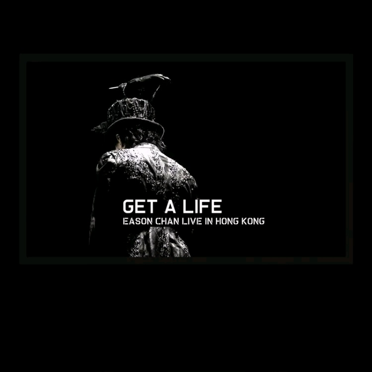

	

# [Get A Life 演唱会](https://music.163.com/album?id=6454)

* 时间：2006-04-01
* 歌手：陈奕迅
* 唱片公司：环球唱片
## Songs

* [Overture (Live)](songs/overture_live__65816/README.md)
* [浮夸 (Live)](songs/浮夸_live__65819/README.md)
* [怪物 (Live)](songs/怪物_live__65822/README.md)
* [心里有鬼 (Live)](songs/心里有鬼_live__65825/README.md)
* [两名男子街头相遇 (Live)](songs/两名男子街头相遇_live__65828/README.md)
* [不良嗜好 (Live)](songs/不良嗜好_live__65830/README.md)
* [Shall We Dance (Live)](songs/shall_we_dance_live__65833/README.md)
* [三个人的探戈 (Live)](songs/三个人的探戈_live__65835/README.md)
* [孤独探戈 (Live)](songs/孤独探戈_live__65837/README.md)
* [活着多好 (Live)](songs/活着多好_live__65839/README.md)
* [怕死 (Live)](songs/怕死_live__65842/README.md)
* [烂 (Live)](songs/烂_live__65843/README.md)
* [大个女 (Live)](songs/大个女_live__65845/README.md)
* [单车 (Live)](songs/单车_live__65847/README.md)
* [最佳损友 (Live)](songs/最佳损友_live__65851/README.md)
* [Shall We Talk (Live)](songs/shall_we_talk_live__65855/README.md)
* [如果这一秒钟你跟我讲你不爱我 (Live)](songs/如果这一秒钟你跟我讲你不爱我_live__65859/README.md)
* [伤信 (Live)](songs/伤信_live__65863/README.md)
* [1874 (Live)](songs/_live__65867/README.md)
* [黑夜不再来 (Live)](songs/黑夜不再来_live__65871/README.md)
* [美丽有罪 (Live)](songs/美丽有罪_live__65875/README.md)
* [2001太空漫游 (Live)](songs/_太空漫游_live__65879/README.md)
* [打得火热 (Live)](songs/打得火热_live__65882/README.md)
* [送院途中 (Live)](songs/送院途中_live__65885/README.md)
* [幸灾乐祸 (Live)](songs/幸灾乐祸_live__65887/README.md)
* [忘记歌词 (Live)](songs/忘记歌词_live__65890/README.md)
* [夕阳无限好 (Live)](songs/夕阳无限好_live__65893/README.md)
* [打回原形 (Live)](songs/打回原形_live__65896/README.md)
* [防不胜防 (Live)](songs/防不胜防_live__65900/README.md)
* [十面埋伏 (Live)](songs/十面埋伏_live__65904/README.md)
* [葡萄成熟时 (Live)](songs/葡萄成熟时_live__65907/README.md)
* [King Kong (Live)](songs/king_kong_live__65911/README.md)
* [明年今日 (Live)](songs/明年今日_live__65915/README.md)
* [K歌之王 (Live)](songs/k歌之王_live__65919/README.md)
* [人来人往 (Live)](songs/人来人往_live__65923/README.md)
* [阿牛 (Live)](songs/阿牛_live__65927/README.md)
* [与我常在 (Live)](songs/与我常在_live__65930/README.md)
## Appendix

### Description

陈奕迅 (Eason) 2月中旬在香港红馆举行一连九场的《Get A Life 演唱会》之延续 Live 3 CD，历史性集合他于华星、英皇及新艺宝三个不同时代的38首精选金曲，包括：出道成名作“伤信”、“黑夜不再来”、英皇时期的金曲“Shall We Talk”、“明年今日”、“K歌之王”、2005年复出唱片《U 87》之“浮夸”、“夕阳无限好”、“葡萄成熟时”、新碟《Life Continues》内主打歌的“最佳损友”等。
虽然 Eason 离开乐坛一年，今次再战乐坛成绩斐然，《Get A Life 演唱会》九场全部爆满，Eason 更创新地以丧礼概念为演唱会揭开序幕，舞台以不规则黑色图案组成；Eason 以全黑服饰出场，意念大胆创新。Eason 以一曲“浮夸”出场，由德国交响乐团打头阵。接近三个小时的演唱会充斥着诡异气氛，有妖怪、蜘蛛助阵在台上跳舞，又出现撞车、打雷下雨、火烧木屋等场面。演唱会除了大玩诡异外，Eason 也尽现亲情，他在台上对着女儿小康堤唱“大个女”及“单车”，尽显温情，最后在一片热烈的欢呼声下结束《Get A Life 演唱会》。

### Score

|歌曲数|评论数|分享数|
|:---:|:---:|:---:|
|37|376|785|

|歌名|分数|
|:---:|:---:|
|单车 (Live)|100.0
|Shall We Talk (Live)|100.0
|伤信 (Live)|100.0
|1874 (Live)|100.0
|忘记歌词 (Live)|100.0
|打回原形 (Live)|100.0
|防不胜防 (Live)|100.0
|十面埋伏 (Live)|100.0
|明年今日 (Live)|100.0
|K歌之王 (Live)|100.0
|人来人往 (Live)|100.0
|与我常在 (Live)|100.0
|浮夸 (Live)|95.0
|活着多好 (Live)|95.0
|最佳损友 (Live)|95.0
|黑夜不再来 (Live)|95.0
|阿牛 (Live)|95.0
|孤独探戈 (Live)|90.0
|大个女 (Live)|90.0
|葡萄成熟时 (Live)|90.0
|如果这一秒钟你跟我讲你不爱我 (Live)|85.0
|夕阳无限好 (Live)|85.0
|怪物 (Live)|80.0
|两名男子街头相遇 (Live)|80.0
|不良嗜好 (Live)|80.0
|怕死 (Live)|80.0
|心里有鬼 (Live)|75.0
|三个人的探戈 (Live)|75.0
|幸灾乐祸 (Live)|75.0
|Overture (Live)|70.0
|Shall We Dance (Live)|70.0
|烂 (Live)|70.0
|美丽有罪 (Live)|65.0
|2001太空漫游 (Live)|65.0
|打得火热 (Live)|65.0
|送院途中 (Live)|65.0
|King Kong (Live)|65.0
