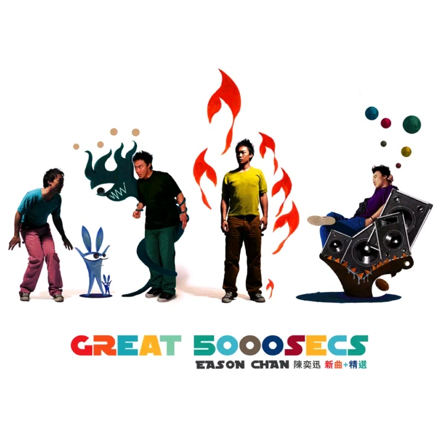

	

# [Great 5000 Secs](https://music.163.com/album?id=6498)

* 时间：2005-02-01
* 歌手：陈奕迅
* 唱片公司：英皇娱乐
## Songs

* [一切还好](songs/一切还好_66308/README.md)
* [万佛朝宗](songs/万佛朝宗_66312/README.md)
* [冤气](songs/冤气_66315/README.md)
* [岁月如歌](songs/岁月如歌_66321/README.md)
* [十面埋伏](songs/十面埋伏_66326/README.md)
* [明年今日](songs/明年今日_66331/README.md)
* [K歌之王](songs/k歌之王_66336/README.md)
* [Shall We Talk](songs/shall_we_talk_66342/README.md)
* [低等动物(粤)](songs/低等动物_粤__66348/README.md)
* [打得火热](songs/打得火热_66354/README.md)
* [单车](songs/单车_66359/README.md)
* [孤独探戈](songs/孤独探戈_66363/README.md)
* [天使的礼物](songs/天使的礼物_66366/README.md)
* [人工智能](songs/人工智能_66369/README.md)
* [他一个人](songs/他一个人_66372/README.md)
* [呀边个边个](songs/呀边个边个_66374/README.md)
* [人来人往](songs/人来人往_66378/README.md)
* [绵绵](songs/绵绵_66381/README.md)
## Appendix

### Description

陈奕迅将转投新唱片公司，这张《Great 5000 Secs》是他于英皇年代最辉煌的一张精选唱片，由出道名作“K歌之王”、"Shall We Talk"，到卡拉OK大热曲“明年今日”“十面埋伏”，至无线剧集《冲上云霄》主题曲“岁月如歌”共15首Eason精选之最全辑录。

至于新曲方面，“一切还好”、“万佛朝宗”及“冤气”由词人林夕、编曲刘志远及监制Jim Lee这个铁三角主理，陈奕迅分别在三首新歌中讲述了他做爸爸后心态成熟，还有他回归乐坛的新目标。2005年是Eason入行十周年，预计他将会于夏天在香港红馆举行演唱会，全力再战香港乐坛！

### Score

|歌曲数|评论数|分享数|
|:---:|:---:|:---:|
|18|19|3|

|歌名|分数|
|:---:|:---:|
|明年今日|85.0
|人来人往|85.0
|冤气|35.0
|一切还好|25.0
|K歌之王|25.0
|单车|25.0
|岁月如歌|20.0
|万佛朝宗|5.0
|十面埋伏|5.0
|Shall We Talk|5.0
|低等动物(粤)|5.0
|打得火热|5.0
|孤独探戈|5.0
|天使的礼物|5.0
|人工智能|5.0
|他一个人|5.0
|呀边个边个|5.0
|绵绵|5.0
