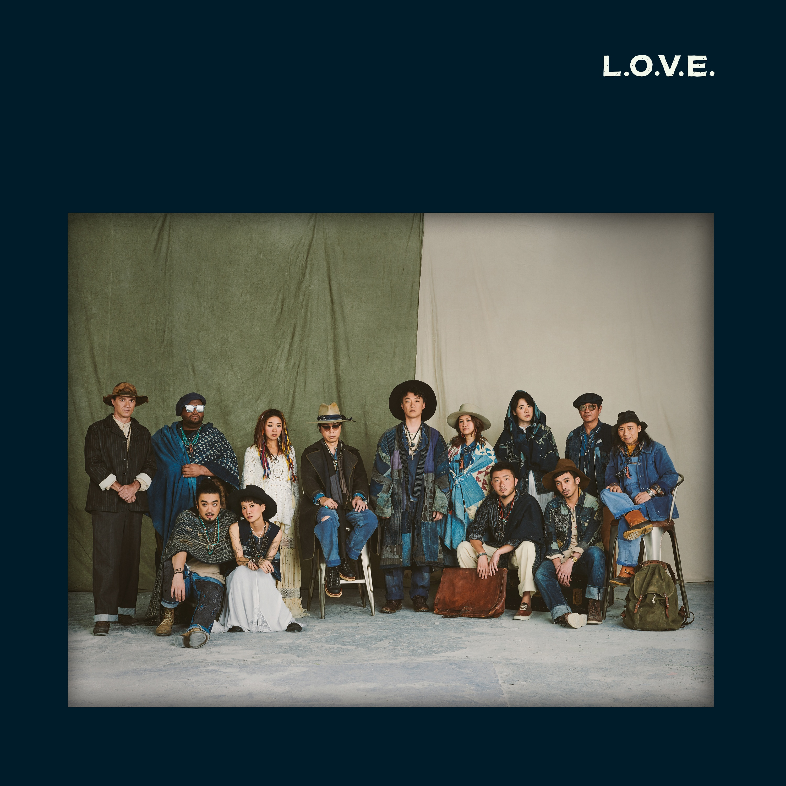

	

# [L.O.V.E.](https://music.163.com/album?id=74268947)

* 时间：2018-12-12
* 歌手：陈奕迅，eason and the duo band
* 唱片公司：环球唱片
## Songs

* [8:15pm (Intro)](songs/_pm_intro__1323302905/README.md)
* [破坏王](songs/破坏王_1318630444/README.md)
* [海里睡人](songs/海里睡人_1323301909/README.md)
* [渐渐](songs/渐渐_574908698/README.md)
* [Devotion (Interlude)](songs/devotion_interlude__1323303920/README.md)
* [敬烟](songs/敬烟_1323301910/README.md)
* [蠢](songs/蠢_1323304978/README.md)
* [疯狂的朋友](songs/疯狂的朋友_1323302906/README.md)
* [Unity (Interlude)](songs/unity_interlude__1323304979/README.md)
* [R U N](songs/r_u_n_1323301912/README.md)
* [龙舌兰](songs/龙舌兰_1323302907/README.md)
* [我们万岁](songs/我们万岁_1323304980/README.md)
* [Originality  (Interlude)](songs/originality_interlude__1323304981/README.md)
* [与你常在](songs/与你常在_567447039/README.md)
* [可一可再](songs/可一可再_1300423074/README.md)
## Appendix

### Description

｜为欢笑与泪水留下印记・刻划来自团队间深厚的爱｜
DUO团队倾心打造全新大碟《L.O.V.E.》
由陈奕迅带你走进11个「爱」的故事

如果「爱」是一门数学，
那么全新的数学公式「L.O.V.E. ＝ 陈奕迅」早已成立

陈奕迅：「2010年，《DUO》世界巡回演唱会跨越了两个年头，两年多的经历令eason and the duo band之间渐渐产生了感情、默契、亦孕育了L.O.V.E.这个计划。」

Eason早在举行《DUO》世界巡回演唱会时，希望在完成各地巡演后，演唱会乐手们能够打造一张属于他们的专辑，收录队员们亲自创作的音乐作品，作为DUO团队之间弥足珍贵的纪念品。犹记得最初乐队成员聚首时的互不相熟，到跨过两年共66场的巡演后，DUO团队所建立的深厚感情，远远超越他们所想象。透过前后辈间的相互交流，风格各异的音乐人擦出了截然不同的火花，让他们获益良多的同时更得到了无可比拟的友爱团结。而《L.O.V.E.》就是希望能够把这份最纯朴、最简单、最基本的「爱」传递出去，让大家一同分享这份浓厚爱意。

时隔6年，一首首具个人色彩的作品逐渐诞生，让这个愿望不再只是纸言词组。全新大碟《L.O.V.E.》一共收录8首广东作品、2首国语作品，以及1首英语作品，由DUO团队成员包办曲词编监全碟制作。6年间先后在英国、广州及香港三地录音室进行现场录音(Live Recording)，历经无数次的反覆录制及编排后，终让这批风格多样的「臣」曲呈现大家眼前。

如果「爱」是一门数学，
11道基础理论将逐步引导你寻找答案

「爱你的佻皮，爱你的反叛，爱你这个《破坏王》」
｜曲：王双骏｜词：陈咏谦｜编：the duo band｜监：王双骏｜
撇开深情唱腔，最佻皮的Eason正式上线！《破坏王》由DUO团队的乐队指挥兼贝斯手王双骏作曲，担任团队和音之一的陈咏谦执笔填词。抢耳的旋律一起首就让人蠢蠢欲动，加上由DUO团队合唱的副歌部份「顽童在破坏 搞破坏」，每一节拍都仿佛在刺激你潜在的反叛细胞！而在歌曲上特意加入了小提琴独奏，以及教人热血沸腾的饶舌部份，玩味性十足的编曲都突显出DUO团队整群人的贪玩特质，让人一听就按捺不住，试图立即跟随节奏一同大肆「破坏」！

「爱使人飘飘然，从《海里睡人》的昏睡状态中甦醒过来」
｜曲：卢凯彤/孙伟明｜词：卢凯彤｜编：the duo band｜监：王双骏｜
所谓的「睡人」，原是指患上嗜睡症的人，患者或会随病情恶化进入数月、数年，甚至数十年的昏睡状态，但也有极少数人会有昙花一现的「甦醒」的机会。而这首《海里睡人》由DUO团队的结他手卢凯彤及钢琴师孙伟明共同打造，寓意着每一次的DUO巡演都是从现实生活中「睡醒」，虽然不是永久，但已经教他们心满意足。如同歌名《海里睡人》，字里行间渗透着满满诗意，音乐一起就仿似入眠般营造出无重力的状态。而在流行曲中较少见的7拍子上铺垫「臣」式的随心唱法，如同一股清泉带你到海上随水波飘荡，云淡风轻的氛围让人倍感自由自在。

「即使随年月《渐渐》逝去，那份爱却从未消散」
｜曲：张杰邦｜词：陈咏谦｜编：the duo band｜监：王双骏｜
《渐渐》这首慢板情歌由DUO团队担当和音成员之一的张杰邦作曲。起首以简单钢琴作引子，Eason如同在你旁边诉说剩下的孤寂之情，一字一句看似淡淡然，但其实充满伤感。随着歌词流转，感受到主角藉着一事一物，追思已经离开自己的所爱之人，歌曲情绪也如歌名，「渐渐」推进，逐层剖白歌者睹物思人之空虚孤寂。从《渐渐》中，绝对能感受到一份来自Eason对「爱」的执着。

「你好，请问能借个火吗？－《敬菸》把爱代代传承」
｜曲：苏德华｜词：陈咏谦｜编：the duo band｜监：王双骏｜
你缓缓呼出烟圈，手里拿着半根烟的同时，当有个年轻小伙走近，示意想借个火，你又会否拒绝？《敬菸》由DUO团队担任结他手的苏德华作曲，歌曲就以这根烟把故事燃起，轻描谈写着前辈与年轻人之间的交流，犹如DUO团队中集合了不同资历的音乐人一样，只要有爱，就能把信念一代一代的传承下去。歌曲起首先以孤独的电结他声音作导入，Eason沙哑的唱腔把曲中的唏嘘感演绎得淋漓尽致，而在满满沧桑感的背后，却燃点起内心深处的丝丝温暖，使更广阔的感动缕缕袭来。
「能占有大家的爱，别人笑我《蠢》又如何？」
｜曲：陈铭泽｜词：陈咏谦｜编：the duo band｜监：王双骏｜
踏入了大人世界，总难免想重拾孩提时期那个蠢蠢呆呆的自己。「发达世界工于心计 高级的玩法」就如同歌词般描脍，置身复杂的世界时偶尔装蠢一回又如何？60年代摇滚风格之作《蠢》以简单的旋律混合Indie Band元素，也是Eason少有演绎的曲风。副歌部份由Eason与DUO团队的对唱，打造出典型的60年代的流行编曲。而为了表现那份纯粹的怀旧感，团队更特意挑选了木结他及古董鼓等古董乐器弹奏，让体内每一条神经也都随着那欢快的节拍不期然地跳动。

「最幸福的莫过于，有着一群深爱你的《疯狂的朋友》」
｜曲：恭硕良｜词：陈咏谦｜编：the duo band｜监：王双骏｜
一说起你身旁最疯狂的朋友，想必在脑海中会浮现出那么的一个人吧。《疯狂的朋友》由DUO团队担任鼓手的恭硕良作曲。而就在歌曲敲响节奏前，团队中的打击乐手Chris Polanco以普通话唱出了一句不太准确的歌词作为歌曲引入，欢快的笑声为歌曲铺垫起满满的愉悦感。《疯狂的朋友》把DUO团队的有趣时光以音乐剧般的律动感投影到大家的脑海当中，让人跟随轻松的节拍捕捉他们在巡演期间更鲜为人知的疯狂一面。

「Let’s go into our dream, and《Run》for our LOVE 」
｜唱：岑宁儿/陈奕迅｜
｜曲：岑宁儿｜词：岑宁儿｜编：the duo band｜监：王双骏｜
《Run》是专辑内唯一一首英语作品，由DUO团队担当和音成员之一的岑宁儿(Yoyo)包办曲词创作，并与Eason共同合唱。虽说是合唱作品，幻化的却是两份截然不同的味道。《Run》以一把纯净的结他声作为主干，打造出夜阑人静的时份，筑起作梦的氛围。Eason就像以叙事者的身份轻声吟唱，与Yoyo仿佛身处于两个时空。二人虽各自进入梦境，但又似在梦中擦肩而过，梦中一扇耸立的大门伴随着合唱团的高声和唱而缓缓打开，瞬间营造出浓厚的神圣感，似是把听众拉进他们的梦境里。

「呷一口《龙舌兰》，让人藉着醉意吐露爱的心声」
｜曲：Chris Polanco｜词：陈咏谦｜编：the duo band｜监：王双骏｜
甚么时候的你，会咽下浓浓的烈酒？一杯龙舌兰，带你进入微醺的深夜感性。带90年代流行曲风的《龙舌兰》，由DUO团队中的打击乐手Chris Polanco创作，特别混合了Eason从未演绎过的拉丁音乐元素。而在编曲上特意加入了为数不少的弦乐(Strings)作升华，再进一步勾勒出酒醉后的独有感性。像这杯散发着90年代味道的《龙舌兰》一样，歌曲愈尝愈香醇，愈听愈耐听。

「为我俩坚定不移的爱，喊一声《我们万岁》」
｜曲：翁玮盈｜词：陈咏谦｜编：the duo band｜监：王双骏｜
就让我俩…为我们密不可分的爱而欢呼。《我们万岁》由DUO团队中担当小提琴手的翁玮盈作曲，甜蜜无比的情歌搭配上引人入胜的旋律，温馨的情感油然而生，直到副歌的「情人游天地 日月换行李 如果失忆 我渴望再多一次 认识你」，更是把爱意表露无遗地推至顶峰，让人听着听着也不自知地流下幸福的泪水。Eason以细腻唱法敲打出动人的故事：二人的相遇是彼此的幸运，纵然日转星移，历经风风雨雨，但你仍然坐在我面前，毋需说话，就经已足够非常。此刻不妨为我们每份珍贵的情感，打从心底里喊声万岁。

「爱，是一直《与你常在》」
｜曲：Charlie Huntley/Mark James Fortin｜词：陈咏谦｜
｜编：the duo band  监：王双骏｜
曲风轻快的Band sound作品《与你常在》，呼应着Eason早年代表作《与我常在》之余，更如一齣DUO巡唱的生活纪录片，文字就是摄影机，记录这几年团队之间的欢乐时光。歌词中可看到「你和他都烂玩」、「同枱喝红酒威士忌」、「顽童锲而不舍录像」，这些描写都是真实而且是DUO团队之间的珍贵回忆。《与你常在》亦寓意着这些年来，Eason的音乐路途不止有宠爱他的歌迷和观众共同渡过，背后有着一班劳苦功高的音乐团队共同进退。

「让我一而再，再而三，《可一可再》地爱上你们」
｜曲：陈奕迅｜词：陈咏谦｜编：the duo band｜监：王双骏｜
《可一可再》是由Eason亲自执笔写的歌，作为大碟内最后录制完成的作品，歌曲犹如一本泛黄的相簿，翻开的同时也随即回首过往的种种点滴。从躺在草原上创作的Demo开始，Eason就早已把无数的话寄语在内，诉说着DUO团队并非是巡唱过后就会各散东西的组合，而是可一可再的存在。淡然的曲风滤走了过多的修饰，Eason以感恩的心唱出一句句的真挚诚悬，而中途更逐一与DUO团队成员惊喜合唱，编写出一整个友爱满泻的节奏。而歌曲后段的「LaLaLa」大合唱部份，更象是使出了会令人微笑的魔法，让人感受到曲中满满的幸福感。

如果「爱」是一门数学，
计算后所得出毫无误差的结果是……
——《L.O.V.E.》
1张专辑・6年沉淀・11首作品・来自13个人的故事，寄存着∞的「爱」

### Score

|歌曲数|评论数|分享数|
|:---:|:---:|:---:|
|15|4119|12406|

|歌名|分数|
|:---:|:---:|
|渐渐|100.0
|龙舌兰|100.0
|我们万岁|100.0
|可一可再|100.0
|破坏王|95.0
|海里睡人|95.0
|敬烟|95.0
|与你常在|95.0
|8:15pm (Intro)|90.0
|Devotion (Interlude)|90.0
|蠢|90.0
|疯狂的朋友|90.0
|Unity (Interlude)|90.0
|R U N|90.0
|Originality  (Interlude)|90.0
