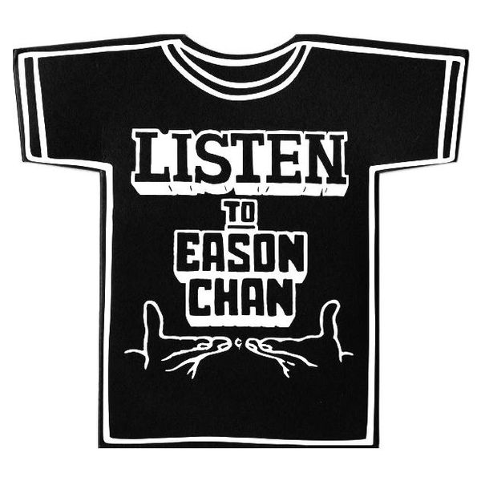

	

# [Listen To Eason Chan](https://music.163.com/album?id=6429)

* 时间：2007-10-18
* 歌手：陈奕迅
* 唱片公司：新艺宝
## Songs

* [玛利奥派对(Mario Party)](songs/玛利奥派对_mario_party__65449/README.md)
* [热岛小夜曲(Hot Island Serenade)](songs/热岛小夜曲_hot_island_serenade__65452/README.md)
* [闪](songs/闪_65455/README.md)
* [演唱会](songs/演唱会_65459/README.md)
* [滑铁卢车站](songs/滑铁卢车站_65463/README.md)
* [Crying In The Party](songs/crying_in_the_party_65467/README.md)
* [狂热革命](songs/狂热革命_65471/README.md)
* [变色龙](songs/变色龙_65475/README.md)
* [时代巨轮](songs/时代巨轮_65478/README.md)
* [乜嘢啫](songs/乜嘢啫_65483/README.md)
* [兄弟](songs/兄弟_65487/README.md)
* [玛利奥派对(Remix Edition) - remix](songs/玛利奥派对_remix_edition_remix_65491/README.md)
* [热岛小夜曲(Remix Edition) - remix](songs/热岛小夜曲_remix_edition_remix_65494/README.md)
* [闪(Remix Edition) - remix](songs/闪_remix_edition_remix_65496/README.md)
* [演唱会(Remix Edition) - live](songs/演唱会_remix_edition_live_65498/README.md)
* [滑铁卢车站(Remix Edition) - remix](songs/滑铁卢车站_remix_edition_remix_65500/README.md)
* [Crying In The Party(Remix Edition) - remix](songs/crying_in_the_party_remix_edition_remix_65503/README.md)
* [狂热革命(Remix Edition) - remix](songs/狂热革命_remix_edition_remix_65506/README.md)
* [变色龙(Remix Edition) - remix](songs/变色龙_remix_edition_remix_65509/README.md)
* [时代巨轮(Remix Edition) - remix](songs/时代巨轮_remix_edition_remix_65513/README.md)
* [乜嘢啫(Remix Edition) - remix](songs/乜嘢啫_remix_edition_remix_65516/README.md)
## Appendix

### Description

陈奕迅于10月25日起至11月5日共12场的《Moving On Stage 1演唱会》，门票开售以来反应热烈，已三度加场。忙于筹备举行演唱会的Eason，以2007年度新专辑《Listen To Eason Chan》来先会乐迷，他亲自为唱片当监制，兼写了三首歌。唱片以舞曲为主题，十首新歌中率先曝光之作有“Crying In The Party”，黎小田作曲，黄伟文填词，歌词中写出时下派对参加者的情绪喜怒哀乐。

除了新碟及演唱会，Eason马不停蹄为电影《兄弟》进行宣传工作，电影中两位主角Eason与刘德华为电影合唱国语主题曲“兄弟”，分别由陈奕迅作曲、刘德华填词，曲中道尽兄弟之间的英雄情义。

《Listen to Eason Chan》以双CD发行，Disk 1乃十首新歌和与刘德华合唱的电影《兄弟》主题曲；Disk 2则是十首新曲的Remix版，以配合舞曲主题。

### Score

|歌曲数|评论数|分享数|
|:---:|:---:|:---:|
|21|107|88|

|歌名|分数|
|:---:|:---:|
|兄弟|100.0
|Crying In The Party|95.0
|玛利奥派对(Mario Party)|90.0
|演唱会|85.0
|闪|70.0
|变色龙|70.0
|时代巨轮|70.0
|热岛小夜曲(Hot Island Serenade)|60.0
|滑铁卢车站|60.0
|狂热革命|60.0
|乜嘢啫|40.0
|玛利奥派对(Remix Edition) - remix|25.0
|热岛小夜曲(Remix Edition) - remix|25.0
|闪(Remix Edition) - remix|25.0
|演唱会(Remix Edition) - live|25.0
|滑铁卢车站(Remix Edition) - remix|25.0
|Crying In The Party(Remix Edition) - remix|25.0
|狂热革命(Remix Edition) - remix|25.0
|变色龙(Remix Edition) - remix|25.0
|时代巨轮(Remix Edition) - remix|25.0
|乜嘢啫(Remix Edition) - remix|25.0
