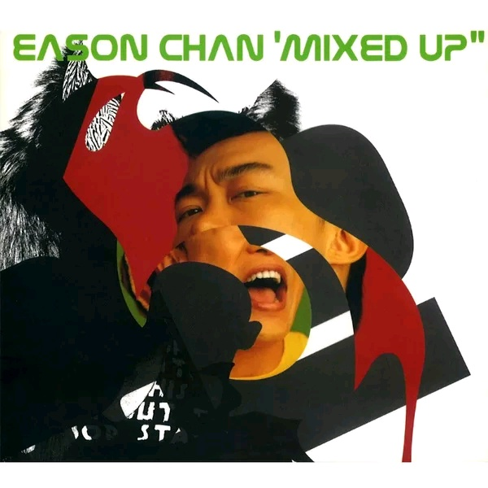

	

# [Mixed up](https://music.163.com/album?id=2374009)

* 时间：2001-07-01
* 歌手：陈奕迅
* 唱片公司：英皇唱片
## Songs

* [幸福摩天轮 (James Ting Remix)](songs/幸福摩天轮_james_ting_remix__28613420/README.md)
* [美丽有罪 (Brandon Vs Loopmusic Mix)](songs/美丽有罪_brandon_vs_loopmusic_mix__28613421/README.md)
* [我的世界末日 (Teoh Remix)](songs/我的世界末日_teoh_remix__26075102/README.md)
* [时代曲 (Tszpun Remix)](songs/时代曲_tszpun_remix__26075100/README.md)
* [超人的主题曲 (Club Mix)](songs/超人的主题曲_club_mix__26075096/README.md)
* [美丽有罪 (James Ting Remix)](songs/美丽有罪_james_ting_remix__26075098/README.md)
* [专家话 (Mininal Remix)](songs/专家话_mininal_remix__26075103/README.md)
* [黑夜不再来 (Slow Tech Riddim Remix)](songs/黑夜不再来_slow_tech_riddim_remix__26075097/README.md)
* [伤信 (梁基爵 Remix)](songs/伤信_梁基爵_remix__26075099/README.md)
* [贝多芬与我 (四方果 Remix)](songs/贝多芬与我_四方果_remix__26075095/README.md)
## Appendix

### Description

陈奕迅现在已经贵为英皇一哥，旧东家华星唱片在此时也推出Eason首张全Remix 大碟《Mixed Up》，收录了十首Eason大热歌曲，包括‘幸福摩天轮’、‘美丽有罪’、‘专家话’、‘黑夜不再来’等的Remix 版本。不要以为《Mixed Up》是一张普通的精选辑，它是由香港多位当红电子音乐乐手包括：Minimal、梁基爵、四方果等人共同混音，呈现出完全不同的新感觉

### Score

|歌曲数|评论数|分享数|
|:---:|:---:|:---:|
|10|6|0|

|歌名|分数|
|:---:|:---:|
|幸福摩天轮 (James Ting Remix)|5.0
|美丽有罪 (Brandon Vs Loopmusic Mix)|5.0
|我的世界末日 (Teoh Remix)|5.0
|时代曲 (Tszpun Remix)|5.0
|超人的主题曲 (Club Mix)|5.0
|美丽有罪 (James Ting Remix)|5.0
|专家话 (Mininal Remix)|5.0
|黑夜不再来 (Slow Tech Riddim Remix)|5.0
|伤信 (梁基爵 Remix)|5.0
|贝多芬与我 (四方果 Remix)|5.0
