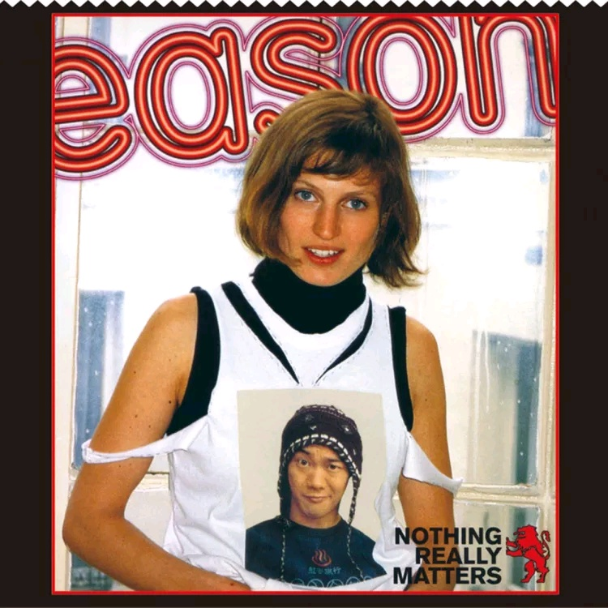

	

# [Nothing Really Matters](https://music.163.com/album?id=6599)

* 时间：2000-07-01
* 歌手：陈奕迅
* 唱片公司：华星唱片
## Songs

* [送院途中](songs/送院途中_67522/README.md)
* [黑夜不再来](songs/黑夜不再来_67527/README.md)
* [美丽有罪](songs/美丽有罪_67532/README.md)
* [戏迷情人](songs/戏迷情人_67537/README.md)
* [和平饭店](songs/和平饭店_67541/README.md)
* [我感激](songs/我感激_67545/README.md)
* [到此一游](songs/到此一游_67549/README.md)
* [当这地球没有花](songs/当这地球没有花_67553/README.md)
* [Made In Hong Kong](songs/made_in_hong_kong_67557/README.md)
* [爱上你是我眼睛的错](songs/爱上你是我眼睛的错_67560/README.md)
## Appendix

### Description

这张NOTHING REALLY MATTERS 是陈奕迅离开华星的最后一张大碟，喜欢陈奕迅的乐迷，应该大部份都见证着他从新秀得奖、推出第一张大碟一直到现在，短短的五年里转变之大像是意料不到，但能够拥有自己喜欢的歌手从成长到离巢，这么完整的音乐见证，你我都不应错过。

### Score

|歌曲数|评论数|分享数|
|:---:|:---:|:---:|
|10|17|2|

|歌名|分数|
|:---:|:---:|
|当这地球没有花|40.0
|黑夜不再来|25.0
|爱上你是我眼睛的错|20.0
|送院途中|5.0
|美丽有罪|5.0
|戏迷情人|5.0
|和平饭店|5.0
|我感激|5.0
|到此一游|5.0
|Made In Hong Kong|5.0
