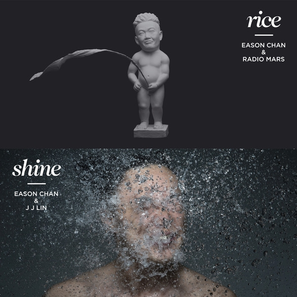

	

# [rice & shine](https://music.163.com/album?id=2801259)

* 时间：2014-05-15
* 歌手：陈奕迅
* 唱片公司：Eas Music Ltd
## Songs

* [娱乐天空](songs/娱乐天空_28481104/README.md)
* [四季圈](songs/四季圈_28481817/README.md)
* [愚人快乐](songs/愚人快乐_28465267/README.md)
* [不如承诺来的简单](songs/不如承诺来的简单_28563311/README.md)
* [对面](songs/对面_28563312/README.md)
* [娱乐天空 (Remix)](songs/娱乐天空_remix__28563313/README.md)
* [放弃治疗](songs/放弃治疗_28563315/README.md)
* [时光隧道](songs/时光隧道_28563314/README.md)
* [可以了](songs/可以了_28481818/README.md)
* [阴天快乐](songs/阴天快乐_28563317/README.md)
* [你给我听好](songs/你给我听好_28481103/README.md)
## Appendix

### Description

Eason《rice & shine》
「迷你臣」俏现精髓
赤祼上身被水喉直射面上
Eason最新国语专辑《rice & shine》于5月15日正式推出，是次封套拍摄找来林海峰（Jan）作为创作总监及着名摄影师夏永康（Wing Shya）操刀， 把「rice & shine」的概念以每个人起床后第一时间会做的两件事情表达出来。
专辑封套分了两部份，黑色部份代表「rice」。Jan特别为了要表达「上洗手间」整个意识形态，所以打造了一个立体的「迷你臣」人像。虽然人像只有2尺高，但制作亦非常认真。为了要制造一个栩栩如生的「迷你臣」，除了事前360度拍摄Eason的全身外，最重要是Eason动作上的意识形态，缩小版陈奕迅就是这样演变出来。「迷你臣」趣怪的表情配合动作，整个画面活灵活现十分有趣！
期待两年陈奕迅全新国语专辑
第一主打《娱乐天空》
首次合作单位「火星电台」擦出玩味新火花
事隔两年多，Eason再度推出全新国语专辑，这次找来「火星电台」合作，这个单位的成员分别是黄少锋及曾宇，一位爱说话的人和一位沉默而有智慧的家伙，因为对音乐和生活有了太多相似的想象，所以决定走在一起。而他们曾经为老狼、周迅等制作歌曲，而Eason就是听了周迅的专辑，给他们的音乐深深吸引，所以当决定今年制作国语专辑时，第一时间找他们合作。
由火星电台包办曲词编监的主打歌《娱乐天空》，歌曲走电子音乐配衬Band Sound鲜明节拍，歌词说的是在娱乐圈工作的人，面对着五光十色的花花世界，其实和一般工作分别不大，一样要面对现实和理想总有出入，还因为是公众人物反而少了一些个人自由，虽然作品充斥无限自嘲，但亦不乏积极的能量。
这首歌Eason用了正能量心态去唱，「用勇敢积极正面态度去面对生活，每天睡醒起来又回到起点，执着也没意思吧！」他有感而发。这个心态其实不只在娱乐圈工作的人，从事各行各业的人亦应该要积极起来。
第二国语主打《你给我听好》
林俊杰度身订造「臣」级情歌
林夕鬼斧神工点出精髓
陈奕迅2014感性之作
林俊杰(JJ)Sing along的音乐泛起无数人心里的涟漪，勾起心灵深处的情感，在Eason最新国语大碟《rice & shine》，JJ为Eason度身订造了他独有的一套抒情风格，打造五首回肠荡气之作。二人首次合作，成功打造扣人心弦的旋律，更从回忆中寻找灵感，把经历化成一个与一个故事。透过Eason的揣摩下唱出共鸣感，让大家浸润在浓馥的感性里，挥之不去，就像第二主打《你给我听好》。
为何你总是满怀烦恼困扰？我们淼小的控诉，只是一粒微尘，生存的意义根本没完没了。当大家都在笑，你的笑容却从不出现，究竟是我们装傻，还是你真的有很多普通人没有的困扰？既然你爱这套模式我也不会过问，但，请你给我听好，想哭就要笑，生活就是这样不无聊，才不枉过。 林夕的鬼斧神工，尤其见在尾句，「别让我知道其实你在背着 我们 偷笑」一语道破！

### Score

|歌曲数|评论数|分享数|
|:---:|:---:|:---:|
|11|1673|1041|

|歌名|分数|
|:---:|:---:|
|娱乐天空|100.0
|时光隧道|100.0
|可以了|100.0
|阴天快乐|100.0
|你给我听好|100.0
|四季圈|95.0
|愚人快乐|95.0
|不如承诺来的简单|95.0
|放弃治疗|95.0
|对面|90.0
|娱乐天空 (Remix)|70.0
