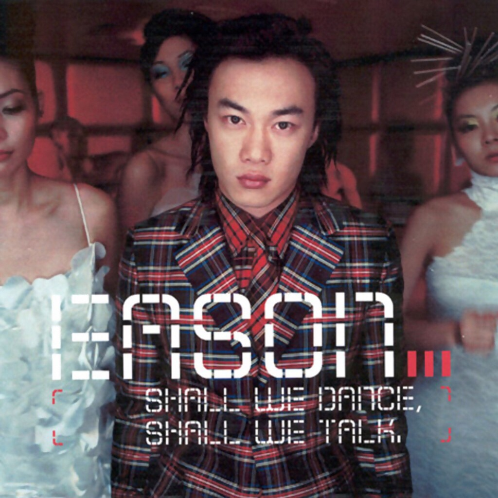

	

# [Shall We Dance? Shall We Talk!](https://music.163.com/album?id=6590)

* 时间：2001-03-01
* 歌手：陈奕迅
* 唱片公司：英皇娱乐
## Songs

* [黎喇](songs/黎喇_67402/README.md)
* [Shall We Dance](songs/shall_we_dance_67407/README.md)
* [Shall We Talk](songs/shall_we_talk_67411/README.md)
* [2001太空漫游](songs/_太空漫游_67418/README.md)
* [失恋太少](songs/失恋太少_67420/README.md)
* [单车](songs/单车_67422/README.md)
* [天使的礼物](songs/天使的礼物_67427/README.md)
* [Easons Angel](songs/easons_angel_67432/README.md)
* [怪物](songs/怪物_67437/README.md)
* [孤独探戈](songs/孤独探戈_67442/README.md)
* [信心花舍](songs/信心花舍_67447/README.md)
* [黑暗中漫舞](songs/黑暗中漫舞_67452/README.md)
* [遗失的国度](songs/遗失的国度_32451037/README.md)
## Appendix

### Description

继《K歌之王》之后，新一代实力派歌王陈奕迅推出全新粵语专辑《Shall We Dance? Shall We Talk!》，依然是品质的保证。新专辑收录了十三首新歌，首波主打歌「2001太空漫游」已雄踞香港各大排行榜榜首，成绩斐然；第二主打「Shall We Talk」是首旋律优美的慢歌，由林夕负责填词，描述二代之间的亲子关系，歌词意义深远；其他歌曲如「Shall We Dance」、「单车」等也是百听不厌的上上之选。
另外更附送一张收录「太空漫游」MTV的VCD。《Shall We Dance? Shall We Talk!》绝对是今年难得的佳作，你绝对不能错过！

### Score

|歌曲数|评论数|分享数|
|:---:|:---:|:---:|
|13|166|40|

|歌名|分数|
|:---:|:---:|
|单车|95.0
|Shall We Talk|75.0
|黑暗中漫舞|75.0
|失恋太少|55.0
|信心花舍|55.0
|孤独探戈|25.0
|Shall We Dance|20.0
|天使的礼物|20.0
|怪物|20.0
|遗失的国度|15.0
|黎喇|5.0
|2001太空漫游|5.0
|Easons Angel|5.0
