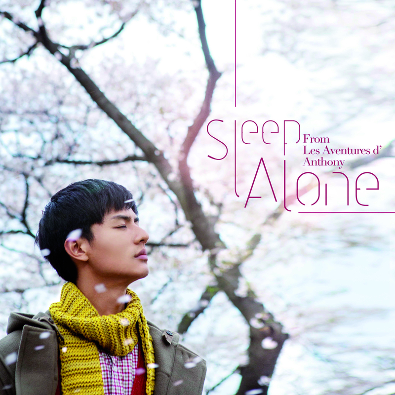

	

# [Sleep Alone](https://music.163.com/album?id=3404003)

* 时间：2015-11-10
* 歌手：陈奕迅
* 唱片公司：环球唱片
## Songs

* [Sleep Alone](songs/sleep_alone_36539010/README.md)
## Appendix

### Description

Eason陈奕迅接受好友周迅的邀请,在其首次担任监制的电影《陪安东尼度过漫长岁月》演唱电影主题曲《陪你度过漫长岁月》。电影讲述一个男生在成长的阶段,所体认的真实感悟，Eason用其极具辨识度的温暖嗓音配上悠扬柔美的词曲，娓娓唱出男人成长的经历，歌曲中“陪伴是最长情的告白”等歌词也是句句直击心窝,肯定再度掀起属于Eason的暖心狂潮,疗愈聆听者的心灵。

### Score

|歌曲数|评论数|分享数|
|:---:|:---:|:---:|
|1|328|213|

|歌名|分数|
|:---:|:---:|
|Sleep Alone|100.0
