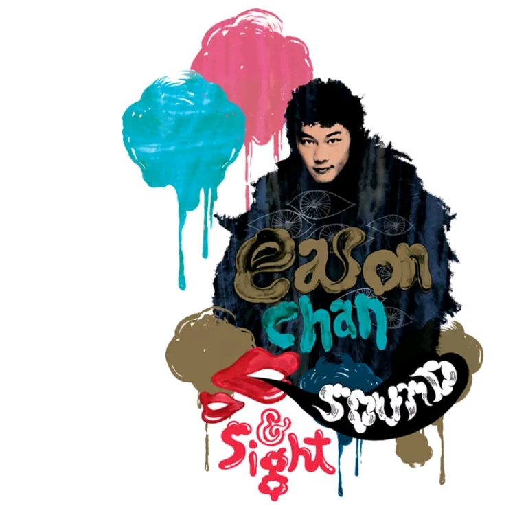

	

# [Sound & Sight](https://music.163.com/album?id=6437)

* 时间：2006-12-01
* 歌手：陈奕迅
* 唱片公司：英皇娱乐
## Songs

* [24](songs/__65559/README.md)
* [不求人](songs/不求人_65562/README.md)
* [最后今晚](songs/最后今晚_65565/README.md)
* [爱你入骨](songs/爱你入骨_65568/README.md)
* [岁月如歌](songs/岁月如歌_65569/README.md)
* [2001太空漫游](songs/_太空漫游_65570/README.md)
* [明年今日](songs/明年今日_65571/README.md)
* [给爱丽斯](songs/给爱丽斯_65574/README.md)
* [一切还好](songs/一切还好_65577/README.md)
* [打得火热](songs/打得火热_65580/README.md)
* [打回原形(大开眼戒)](songs/打回原形_大开眼戒__65584/README.md)
* [1874](songs/__65588/README.md)
* [单车](songs/单车_65592/README.md)
* [天使的礼物](songs/天使的礼物_65596/README.md)
* [跳得火热 (Remix) - remix](songs/跳得火热_remix_remix_65600/README.md)
* [K歌之王](songs/k歌之王_65604/README.md)
* [十面埋伏](songs/十面埋伏_65608/README.md)
* [孤独探戈](songs/孤独探戈_65611/README.md)
* [幸灾乐祸](songs/幸灾乐祸_65614/README.md)
* [第一类接触](songs/第一类接触_65617/README.md)
* [低等动物](songs/低等动物_65620/README.md)
* [绵绵](songs/绵绵_65622/README.md)
* [人来人往](songs/人来人往_65624/README.md)
* [忘记歌词](songs/忘记歌词_65626/README.md)
* [失恋太少](songs/失恋太少_65628/README.md)
* [猜情寻](songs/猜情寻_65631/README.md)
* [冤气](songs/冤气_65634/README.md)
* [冲口而出](songs/冲口而出_65637/README.md)
* [2006岁月如歌(Remix) - remix](songs/_岁月如歌_remix_remix_65640/README.md)
* [Shall We Talk](songs/shall_we_talk_65643/README.md)
* [Lonely Christmas](songs/lonely_christmas_65646/README.md)
* [随意门](songs/随意门_65648/README.md)
* [阿士匹灵](songs/阿士匹灵_65650/README.md)
* [King Kong](songs/king_kong_65652/README.md)
* [他一个人](songs/他一个人_65654/README.md)
* [Katrina](songs/katrina_65657/README.md)
* [少见不怪](songs/少见不怪_65659/README.md)
* [人工智能](songs/人工智能_65661/README.md)
* [活着多好](songs/活着多好_65663/README.md)
* [呀边个边个](songs/呀边个边个_65665/README.md)
* [八里公路](songs/八里公路_65668/README.md)
* [热带雨林](songs/热带雨林_65671/README.md)
* [Hit List Remix - remix](songs/hit_list_remix_remix_65674/README.md)
* [爱是怀疑](songs/爱是怀疑_65677/README.md)
* [坏情人](songs/坏情人_65684/README.md)
* [活跃症](songs/活跃症_65687/README.md)
* [真相](songs/真相_65689/README.md)
* [谎言](songs/谎言_65691/README.md)
* [小孩不懂怕](songs/小孩不懂怕_65693/README.md)
* [我不好爱](songs/我不好爱_65695/README.md)
* [心里有鬼](songs/心里有鬼_65696/README.md)
* [五星级迫爆](songs/五星级迫爆_65697/README.md)
* [不知所谓](songs/不知所谓_65698/README.md)
* [孤儿仔](songs/孤儿仔_65700/README.md)
* [一疋布](songs/一疋布_65702/README.md)
* [细路](songs/细路_65704/README.md)
* [岁月如歌(钢琴曲)](songs/岁月如歌_钢琴曲__65707/README.md)
* [明年今日(钢琴曲)](songs/明年今日_钢琴曲__65710/README.md)
* [十面埋伏(钢琴曲)](songs/十面埋伏_钢琴曲__65713/README.md)
* [打回原形(钢琴曲)](songs/打回原形_钢琴曲__65716/README.md)
* [K歌之王(钢琴曲)](songs/k歌之王_钢琴曲__65719/README.md)
* [Shall We Talk(钢琴曲)](songs/shall_we_talk_钢琴曲__65722/README.md)
* [给爱丽斯(钢琴曲)](songs/给爱丽斯_钢琴曲__65725/README.md)
* [忘记歌词(钢琴曲)](songs/忘记歌词_钢琴曲__65728/README.md)
* [Lonely Christmas (钢琴曲)](songs/lonely_christmas_钢琴曲__65731/README.md)
* [猜情寻(钢琴曲)](songs/猜情寻_钢琴曲__65734/README.md)
* [幸灾乐祸(钢琴曲)](songs/幸灾乐祸_钢琴曲__65736/README.md)
* [人来人往(钢琴曲)](songs/人来人往_钢琴曲__65738/README.md)
* [想哭(钢琴曲)](songs/想哭_钢琴曲__65740/README.md)
* [你的背包(钢琴曲)](songs/你的背包_钢琴曲__65742/README.md)
* [天使的礼物(钢琴曲)](songs/天使的礼物_钢琴曲__65744/README.md)
* [打得火热(钢琴曲)](songs/打得火热_钢琴曲__65746/README.md)
* [孤儿仔(钢琴曲)](songs/孤儿仔_钢琴曲__65749/README.md)
* [单车(钢琴曲)](songs/单车_钢琴曲__65752/README.md)
* [少见不怪(钢琴曲)](songs/少见不怪_钢琴曲__65754/README.md)
* [他一个人(钢琴曲)](songs/他一个人_钢琴曲__65756/README.md)
## Appendix

### Description

专辑介绍：陈奕迅 Sound & Sight (5CD+2DVD)

4CD 精选歌曲 1CD 钢琴音乐 2DVD 精选 MV

4首新歌

3首全新 Remix

### Score

|歌曲数|评论数|分享数|
|:---:|:---:|:---:|
|76|53|28|

|歌名|分数|
|:---:|:---:|
|单车|90.0
|1874|75.0
|K歌之王|75.0
|十面埋伏|75.0
|绵绵|65.0
|最后今晚|60.0
|人来人往|40.0
|24|25.0
|不求人|25.0
|岁月如歌|25.0
|明年今日|25.0
|一切还好|25.0
|猜情寻|25.0
|冤气|25.0
|爱是怀疑|25.0
|爱你入骨|20.0
|打回原形(大开眼戒)|20.0
|失恋太少|20.0
|Lonely Christmas|20.0
|热带雨林|20.0
|2001太空漫游|5.0
|给爱丽斯|5.0
|打得火热|5.0
|天使的礼物|5.0
|跳得火热 (Remix) - remix|5.0
|孤独探戈|5.0
|幸灾乐祸|5.0
|第一类接触|5.0
|低等动物|5.0
|忘记歌词|5.0
|冲口而出|5.0
|2006岁月如歌(Remix) - remix|5.0
|Shall We Talk|5.0
|随意门|5.0
|阿士匹灵|5.0
|King Kong|5.0
|他一个人|5.0
|Katrina|5.0
|少见不怪|5.0
|人工智能|5.0
|活着多好|5.0
|呀边个边个|5.0
|八里公路|5.0
|Hit List Remix - remix|5.0
|坏情人|5.0
|活跃症|5.0
|真相|5.0
|谎言|5.0
|小孩不懂怕|5.0
|我不好爱|5.0
|心里有鬼|5.0
|五星级迫爆|5.0
|不知所谓|5.0
|孤儿仔|5.0
|一疋布|5.0
|细路|5.0
|岁月如歌(钢琴曲)|5.0
|明年今日(钢琴曲)|5.0
|十面埋伏(钢琴曲)|5.0
|打回原形(钢琴曲)|5.0
|K歌之王(钢琴曲)|5.0
|Shall We Talk(钢琴曲)|5.0
|给爱丽斯(钢琴曲)|5.0
|忘记歌词(钢琴曲)|5.0
|Lonely Christmas (钢琴曲)|5.0
|猜情寻(钢琴曲)|5.0
|幸灾乐祸(钢琴曲)|5.0
|人来人往(钢琴曲)|5.0
|想哭(钢琴曲)|5.0
|你的背包(钢琴曲)|5.0
|天使的礼物(钢琴曲)|5.0
|打得火热(钢琴曲)|5.0
|孤儿仔(钢琴曲)|5.0
|单车(钢琴曲)|5.0
|少见不怪(钢琴曲)|5.0
|他一个人(钢琴曲)|5.0
