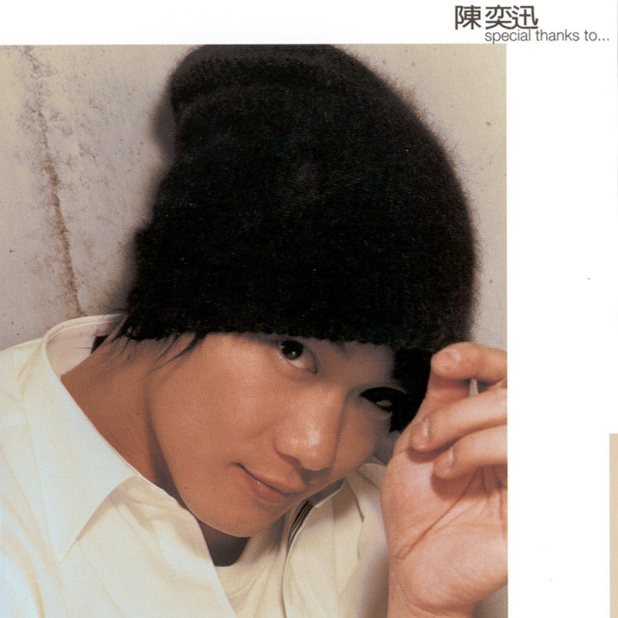

	

# [Special Thanks To…](https://music.163.com/album?id=6565)

* 时间：2002-04-02
* 歌手：陈奕迅
* 唱片公司：英皇娱乐
## Songs

* [Special Thanks To 1](songs/special_thanks_to__67049/README.md)
* [你的背包](songs/你的背包_67050/README.md)
* [谢谢侬](songs/谢谢侬_67051/README.md)
* [男人的错](songs/男人的错_67054/README.md)
* [你会不会](songs/你会不会_67057/README.md)
* [故事](songs/故事_67060/README.md)
* [想哭](songs/想哭_67063/README.md)
* [Special Thanks To 2](songs/special_thanks_to__67064/README.md)
* [人造卫星](songs/人造卫星_67067/README.md)
* [没有手机的日子](songs/没有手机的日子_67069/README.md)
* [跳蚤市场](songs/跳蚤市场_67072/README.md)
* [狂人日记](songs/狂人日记_67075/README.md)
* [Special Thanks To 3](songs/special_thanks_to__67078/README.md)
* [给爱丽斯](songs/给爱丽斯_67081/README.md)
## Appendix

### Description

香港版除收录了国语版的十三首歌外，更附送他的最新广东歌「给爱丽斯」。

⊙特别感谢Jim Lee一个人制作

继上一张专辑「反正是我」获得港台媒体及市场一致的好评，eason与唱片公司更是不敢掉以轻心的筹备2002年最新国语专辑「Special Thanks To...」。有鉴于担心专辑缺乏整体性及规划，很容易因为过多的制作人参与而变成一张多头马车的专辑，因此eason特别建议公司将专辑交由一位制作人完成。既然要合作整张专辑，专辑的掌舵手─制作人必须与歌手已有良好的默契，方能产生最佳的互动，于是公司及eason邀请曾经与他在广东专辑合作过多次的资深音乐人，同时也是在美国有成长背景，长期接触欧美音乐的Jim Lee负责制作整张专辑。企图在整张专辑的音乐走向及型态有着相当统一的风格，另外也想透过他们熟悉彼此的互动产生令人期待的火花。

### Score

|歌曲数|评论数|分享数|
|:---:|:---:|:---:|
|14|74|26|

|歌名|分数|
|:---:|:---:|
|你的背包|90.0
|谢谢侬|75.0
|想哭|60.0
|你会不会|25.0
|男人的错|20.0
|狂人日记|20.0
|Special Thanks To 1|5.0
|故事|5.0
|Special Thanks To 2|5.0
|人造卫星|5.0
|没有手机的日子|5.0
|跳蚤市场|5.0
|Special Thanks To 3|5.0
|给爱丽斯|5.0
