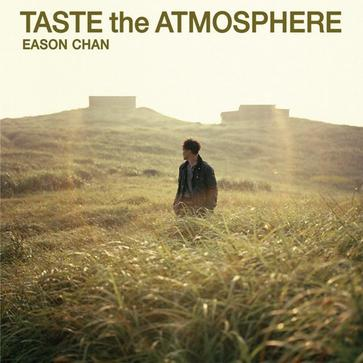

	

# [Taste the Atmosphere](https://music.163.com/album?id=6362)

* 时间：2010-10-15
* 歌手：陈奕迅
* 唱片公司：新艺宝
## Songs

* [Welcome to the future](songs/welcome_to_the_future_64368/README.md)
* [讲男讲女](songs/讲男讲女_64374/README.md)
* [叶问风中转](songs/叶问风中转_64380/README.md)
* [花花世界](songs/花花世界_64385/README.md)
* [我杯茶](songs/我杯茶_64390/README.md)
* [超错](songs/超错_64394/README.md)
* [叶问风中转(Demo version) - demo](songs/叶问风中转_demo_version_demo_64399/README.md)
* [讲男讲女(NG take)](songs/讲男讲女_ng_take__64403/README.md)
## Appendix

### Description

陈奕迅又有新搞作，在最新EP《Taste the Atmosphere》与三位天后交锋，在首支主打歌“讲男讲女”请来阔别乐坛23年的露云娜合唱，大胆地把两性心态来高谈阔论，由伍仲衡作曲和蓝奕邦填词。此外，Eason在“ Welcome to the Future”和“我杯茶”分别找来萨顶顶和莫文蔚来作featuring，感觉耳目一新。第二主打“超错”由潘源良作词和前乐队CityBeat主音刘诺生作、编曲， Eason 的演绎充满了摇滚玩味。

### Score

|歌曲数|评论数|分享数|
|:---:|:---:|:---:|
|8|140|107|

|歌名|分数|
|:---:|:---:|
|讲男讲女|95.0
|花花世界|90.0
|超错|90.0
|Welcome to the future|85.0
|叶问风中转|85.0
|我杯茶|85.0
|讲男讲女(NG take)|60.0
|叶问风中转(Demo version) - demo|25.0
