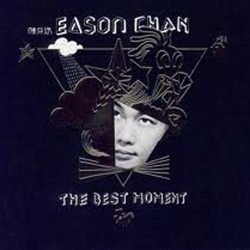

	

# [The Best Moment](https://music.163.com/album?id=34611604)

* 时间：2008-09-03
* 歌手：陈奕迅
* 唱片公司：英皇
## Songs

* [单车](songs/单车_409931765/README.md)
* [打回原形](songs/打回原形_409941723/README.md)
* [活着多好](songs/活着多好_409941725/README.md)
* [他一个人](songs/他一个人_409931766/README.md)
* [明年今日](songs/明年今日_409941726/README.md)
* [人来人往](songs/人来人往_409931767/README.md)
* [1874](songs/__409941727/README.md)
* [Lonely Christmas](songs/lonely_christmas_409931769/README.md)
* [十面埋伏](songs/十面埋伏_409931770/README.md)
* [岁月如歌](songs/岁月如歌_409931771/README.md)
* [我们都寂寞](songs/我们都寂寞_409931772/README.md)
* [一切还好](songs/一切还好_409931773/README.md)
* [绵绵](songs/绵绵_409931774/README.md)
* [天使的礼物](songs/天使的礼物_409931775/README.md)
* [K歌之王](songs/k歌之王_409941722/README.md)
* [Shall We Talk](songs/shall_we_talk_409941730/README.md)
* [低等动物](songs/低等动物_409931776/README.md)
* [你的背包](songs/你的背包_409941731/README.md)
* [阿怪](songs/阿怪_409931778/README.md)
* [阿士匹灵](songs/阿士匹灵_409931780/README.md)
* [冲口而出](songs/冲口而出_409941734/README.md)
* [人工智能](songs/人工智能_409941735/README.md)
* [坏情人](songs/坏情人_409941736/README.md)
* [随意门](songs/随意门_409941738/README.md)
* [King Kong](songs/king_kong_409941739/README.md)
* [第一类接触](songs/第一类接触_409931783/README.md)
* [给爱丽斯](songs/给爱丽斯_409941745/README.md)
* [幸灾乐祸](songs/幸灾乐祸_409931787/README.md)
* [Katrina](songs/katrina_409941746/README.md)
* [呀边个边个](songs/呀边个边个_409931788/README.md)
* [猜情寻](songs/猜情寻_409941748/README.md)
* [忘记歌词](songs/忘记歌词_409931792/README.md)
* [打得火热](songs/打得火热_409941751/README.md)
* [孤独探戈](songs/孤独探戈_409931793/README.md)
* [2001太空漫游](songs/_太空漫游_409931794/README.md)
* [阿怪](songs/阿怪_409931807/README.md)
* [K歌之王](songs/k歌之王_409931795/README.md)
* [谢谢侬](songs/谢谢侬_409941733/README.md)
* [低等动物](songs/低等动物_409941768/README.md)
* [没有手机的日子](songs/没有手机的日子_409941754/README.md)
* [兄妹](songs/兄妹_409931809/README.md)
* [十年](songs/十年_409931814/README.md)
* [圣诞结](songs/圣诞结_409931779/README.md)
* [Shall We Talk](songs/shall_we_talk_409941771/README.md)
* [Because You're Good To Me](songs/because_you_re_good_to_me_409941755/README.md)
* [爱是怀疑](songs/爱是怀疑_409931797/README.md)
* [狂人日记](songs/狂人日记_409931798/README.md)
* [像一句广告](songs/像一句广告_409931799/README.md)
* [寂寞让你更快乐](songs/寂寞让你更快乐_409941756/README.md)
* [人造卫星](songs/人造卫星_409931800/README.md)
## Appendix

### Description

陈奕迅《The Best Moment 精选》，3CD合共48首Eason's Popular Hits。

### Score

|歌曲数|评论数|分享数|
|:---:|:---:|:---:|
|50|39|13|

|歌名|分数|
|:---:|:---:|
|单车|95.0
|十年|95.0
|你的背包|85.0
|人来人往|80.0
|K歌之王|80.0
|圣诞结|75.0
|明年今日|70.0
|1874|70.0
|谢谢侬|65.0
|十面埋伏|60.0
|绵绵|60.0
|岁月如歌|55.0
|K歌之王|45.0
|兄妹|40.0
|打回原形|25.0
|活着多好|25.0
|Lonely Christmas|25.0
|一切还好|25.0
|低等动物|25.0
|Shall We Talk|25.0
|我们都寂寞|20.0
|爱是怀疑|20.0
|寂寞让你更快乐|20.0
|他一个人|5.0
|天使的礼物|5.0
|Shall We Talk|5.0
|低等动物|5.0
|阿怪|5.0
|阿士匹灵|5.0
|冲口而出|5.0
|人工智能|5.0
|坏情人|5.0
|随意门|5.0
|King Kong|5.0
|第一类接触|5.0
|给爱丽斯|5.0
|幸灾乐祸|5.0
|Katrina|5.0
|呀边个边个|5.0
|猜情寻|5.0
|忘记歌词|5.0
|打得火热|5.0
|孤独探戈|5.0
|2001太空漫游|5.0
|阿怪|5.0
|没有手机的日子|5.0
|Because You're Good To Me|5.0
|狂人日记|5.0
|像一句广告|5.0
|人造卫星|5.0
