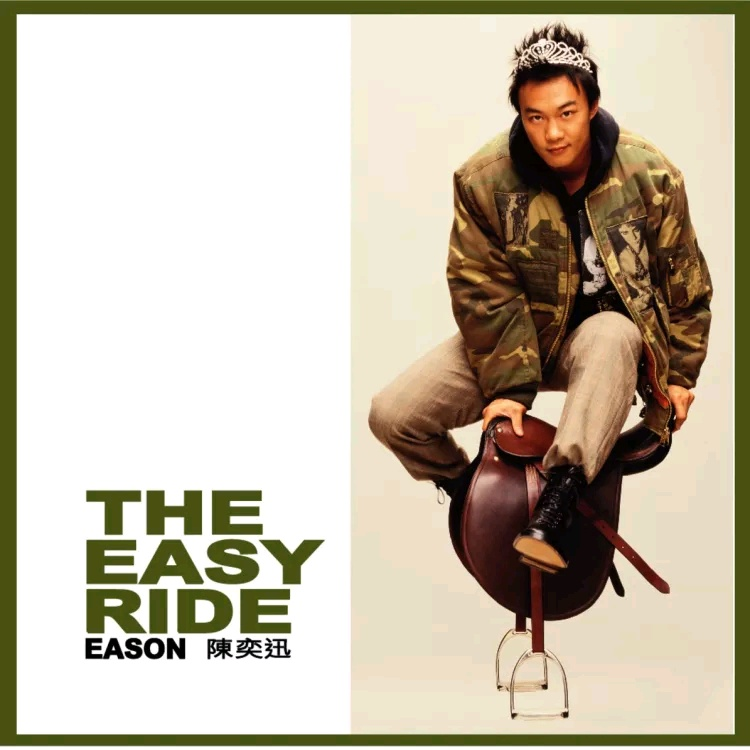

	

# [The Easy Ride](https://music.163.com/album?id=6581)

* 时间：2001-11-01
* 歌手：陈奕迅
* 唱片公司：英皇娱乐
## Songs

* [阿士匹灵](songs/阿士匹灵_67263/README.md)
* [阳性反应](songs/阳性反应_67267/README.md)
* [冲口而出](songs/冲口而出_67273/README.md)
* [大开眼戒](songs/大开眼戒_67279/README.md)
* [我不好爱](songs/我不好爱_67284/README.md)
* [热带雨林](songs/热带雨林_67289/README.md)
* [人工智能](songs/人工智能_67294/README.md)
* [结束开始](songs/结束开始_67300/README.md)
* [活着多好](songs/活着多好_67307/README.md)
* [他一个人](songs/他一个人_67312/README.md)
* [不知所谓](songs/不知所谓_67317/README.md)
## Appendix

### Description

最近炙手可热的陈奕迅，为配合他在十一月举行的演唱会，推出最新粤语唱碟《The Easy Ride》，收录了11首新歌，主打歌是甫推出即进占流行榜三甲的《冲口而出》；同时还收录了电影《常在我心》主题曲《活着多好》、某美容用品广告歌《大开眼戒》。随碟更附送《冲口而出》MTV的VCD，绝不可错过！

于Eason配合演唱会推出的这张大碟，将于演唱会开始前一天面世。单看TiTi Kwan为Eason精心设计的封面造型已令人惊叹，“后冠”与“军佬装”都是时下最时髦的打扮，“上马”的姿势是Eason随时就位开唱的意思。问到Eason会否担心TiTiKwan为他设计演唱会造型太“激”？Eason称绝不担心，还笑言：“放马过来。”

### Score

|歌曲数|评论数|分享数|
|:---:|:---:|:---:|
|11|142|64|

|歌名|分数|
|:---:|:---:|
|大开眼戒|40.0
|活着多好|40.0
|我不好爱|25.0
|热带雨林|25.0
|他一个人|25.0
|不知所谓|25.0
|阿士匹灵|20.0
|冲口而出|20.0
|结束开始|20.0
|阳性反应|5.0
|人工智能|5.0
