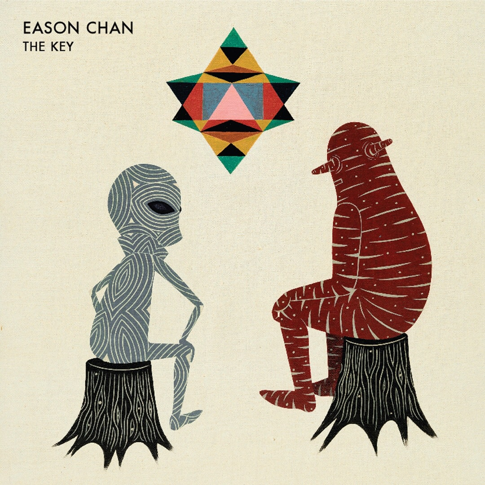

	

# [The Key](https://music.163.com/album?id=2518003)

* 时间：2013-07-22
* 歌手：陈奕迅
* 唱片公司：环球唱片
## Songs

* [主旋律](songs/主旋律_26523013/README.md)
* [告别娑婆](songs/告别娑婆_27483201/README.md)
* [斯德哥尔摩情人](songs/斯德哥尔摩情人_27483204/README.md)
* [任我行](songs/任我行_27483202/README.md)
* [远在咫尺](songs/远在咫尺_27483206/README.md)
* [失忆蝴蝶](songs/失忆蝴蝶_27483203/README.md)
* [床头床尾](songs/床头床尾_27483199/README.md)
* [阿猫阿狗](songs/阿猫阿狗_27483200/README.md)
* [同舟之情](songs/同舟之情_27483205/README.md)
## Appendix

### Description

陈奕迅《The Key》以音乐作钥匙 开启时代之曲。

Eason Chan X C. Y. Kong X 梁荣骏 X Eric Kwok x林夕 x 小克 x 林若宁。

跨进音乐新领域

2013年，陈奕迅全新广东大碟《The Key》，再次伙拍资深监制梁荣骏，以及老拍档C .Y. Kong，Eric Kwok，而填词人同样三足鼎立，由林夕、小克、林若宁分别操刀，以音乐作钥匙，记录时代之曲，内容由人际关系、爱情态度、夫妻相处、以至生死轮回均有涉及，绝对为Eason的音乐迈进另一新领域。

《The Key》原自Eason看过的一幅画像，当时画像还未完整，并未加上当中最重要的一个图案， 那就是今天大家可以在封面上看到的星星图案"The Key"。当Eason了解此画的"Main Theme (主旨)" 后，觉得与这张专辑内自己想表达的意思一致，因为每一首歌曲也是如生命("Life") 的钥匙，所以用上了《The Key》作为此专辑的名称，及以此画作为专辑封面。

***陈奕迅全新广东大碟《The Key》， 2013年7月22日****

《The Key》歌曲解说

1、《主旋律》

《主旋律》顾名思义指一首歌的主要结构部分，也可延伸解作主流思想态度。在Eason的演绎下，成为一首气势澎湃、意义深远的时代作品。C.Y. Kong、Lesley的曲，紧密的结构但也完全难不上Eason。Eason解说《主旋律》即"Main Theme"，借情侣关系讲人与人的相处之道，如何和谐地生活，经营互惠关系，是永远学不完的人生哲学。

2、《告别娑婆》

在小克词作中，有一门专探讨宇宙、时间、生命的分类，此歌就可归纳其中。《娑婆》在佛经通常解作大千世界。而《告别娑婆》亦是一本着名灵修文学的书名。小克借此歌探讨生存意义，无论有否轮回、无常、因果，当下人生其实才是最为重要。C. Y. Kong的雄壮编曲带领乐迷进入宇宙穹苍之领域。

3、《斯德哥尔摩情人》

Eason这曲亦充满了一份妖艳、迷离的爱欲情感。究意是絪着你才能爱着你，抑或愿可做你脚下那堆烂泥，说到底是只有你情才有我愿，旁人难以评论，林夕用全新的感情角度，写出打破流行曲框架充满叛逆的《虐待情歌》。

4、《任我行》

《富士山下》经典班底再次相遇。作曲人Chrisopher Chak绵密曲式已成个人风格，林夕亦擅于为这种一句到尾的结构入字。《千山万水任我行》，纵然是洒脱人生境界，但人不能只当孤岛，境随心转，偶而随着大队走又何况？《任我行》是非情歌，却道出最为潇洒的人生境界。

5、《远在咫尺》

犹记得Eason《于心有愧》写出男人愧对前度的深情告白，打动多少情路崎岖的过来人心声。今次林若宁＋Eric Kwok的《远在咫尺》，肯定能再次击中万千男人感情弱点。当爱情已成习惯，深夜梦回你也可能假设如果跟当天那个她一起，会否有不一样的结局？可是我们不能像《阿飞正传》的旭仔所讲：《要到死那天才知最爱的人是谁》，无论心如何翻腾，歌词最后还是歌颂细水长流的关系。

6、《失忆蝴蝶》

台湾唱作人陈晓娟， 曾凭《爱》、《叶子》获台湾金曲奖最佳作曲人，谱写过多首华语流行曲，包括张国荣《路过蜻蜓》、《洁身自爱》，王菲的《流年》，莫文蔚 《爱》等。林夕撰词的《失忆蝴蝶》也像一个《路过蜻蜓》的延续篇，从卑微的路过心情，演化到只求一剎蝶恋，亲密过后了无痕，没有记忆，又何来忘不了的遗憾，这是一首需经再三品尝方能领略箇中滋味的情歌。

7、《床头床尾》

Eason的作曲作品其实并不少，词人亦常为他打造生活化内容。小克以直接文笔，写出夫妇关系相处之道。是词人的过来人心声，还是万千伴侣的写照，大家各自入座，不过歌词中《徐徐入眠沉睡∕徐徐入眠没眼泪》就颇为幽默，惹人联想。 Eason还把自我的感情放进此曲，而当中吉他Solo部份，更亲自录奏。

8、《阿猫阿狗》

作为大碟最后一曲，一向喜爱与新单位合作的Eason，这次也 尝试与新晋作曲、编曲人Jimmy Fung合作，而林夕的词是写出新世代的故事，歌词内容直接而振奋。人生在世，未必个个都是大人物大英雄，然而蜉蝣并非面目模糊，蝼蚁的故事也可歌可泣！

9、Bonus Single 《同舟之情》

为《家是香港运动》而创作的主题曲《同舟之情》，再次撮合两位歌神张学友、陈奕迅继《天下太平》后的二度合唱。Eric Kwok＋陈咏谦结合《狮子山下》经典曲词配搭顾嘉辉和黄霑，亦如两个世代的音乐交流。藉着大街小巷及电子媒体的热播，早已深入民心，当中《爱在旧城窄巷》相信人人都懂哼两句吧。

### Score

|歌曲数|评论数|分享数|
|:---:|:---:|:---:|
|9|1699|3309|

|歌名|分数|
|:---:|:---:|
|斯德哥尔摩情人|100.0
|任我行|100.0
|远在咫尺|100.0
|失忆蝴蝶|100.0
|床头床尾|100.0
|阿猫阿狗|100.0
|主旋律|95.0
|告别娑婆|95.0
|同舟之情|95.0
