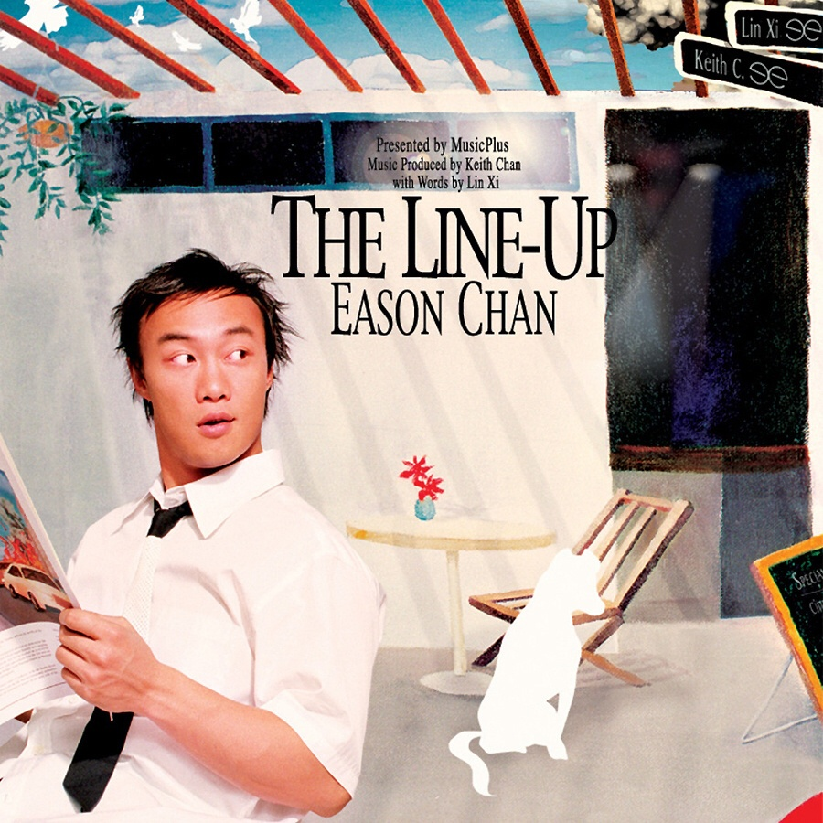

	

# [The Line-Up](https://music.163.com/album?id=6559)

* 时间：2002-07-01
* 歌手：陈奕迅
* 唱片公司：英皇娱乐
## Songs

* [心里有鬼](songs/心里有鬼_66997/README.md)
* [我有我爱你](songs/我有我爱你_66999/README.md)
* [明年今日](songs/明年今日_67001/README.md)
* [人来人往](songs/人来人往_67005/README.md)
* [季军](songs/季军_67009/README.md)
* [随意门](songs/随意门_67012/README.md)
* [1874](songs/__67014/README.md)
* [防不胜防](songs/防不胜防_67015/README.md)
* [两名男子街头相遇](songs/两名男子街头相遇_67018/README.md)
* [黑面](songs/黑面_67021/README.md)
## Appendix

### Description

专辑介绍：《The Line-Up》 的概念，就是以陈辉阳加林夕、黄双骏加黄伟文两个组合上阵，各自为 Eason 炮制五首歌曲。

### Score

|歌曲数|评论数|分享数|
|:---:|:---:|:---:|
|10|108|58|

|歌名|分数|
|:---:|:---:|
|明年今日|80.0
|人来人往|75.0
|防不胜防|70.0
|1874|65.0
|我有我爱你|25.0
|两名男子街头相遇|25.0
|季军|20.0
|黑面|20.0
|心里有鬼|5.0
|随意门|5.0
