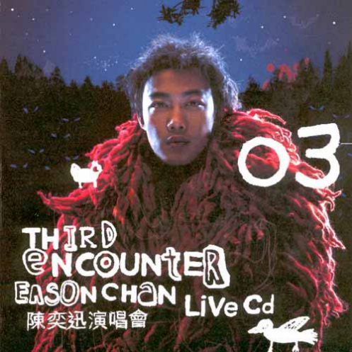

	

# [Third Encounter Live](https://music.163.com/album?id=6551)

* 时间：2003-03-01
* 歌手：陈奕迅
* 唱片公司：英皇娱乐
## Songs

* [Se Voul Ballare(Live) - live](songs/se_voul_ballare_live_live_66867/README.md)
* [孤独探戈(Live) - live](songs/孤独探戈_live_live_66870/README.md)
* [人工智能(Live) - live](songs/人工智能_live_live_66873/README.md)
* [第一类接触(Live) - live](songs/第一类接触_live_live_66875/README.md)
* [King Kong(Live) - live](songs/king_kong_live_live_66877/README.md)
* [给爱丽斯(Live) - live](songs/给爱丽斯_live_live_66879/README.md)
* [爱是怀疑(Live) - live](songs/爱是怀疑_live_live_66881/README.md)
* [阿士匹灵(Live) - live](songs/阿士匹灵_live_live_66883/README.md)
* [我有我爱你(Live) - live](songs/我有我爱你_live_live_66884/README.md)
* [与我常在(Live) - live](songs/与我常在_live_live_66885/README.md)
* [1874(Live) - live](songs/_live_live_66886/README.md)
* [Lonely Christmas(Live) - live](songs/lonely_christmas_live_live_66887/README.md)
* [谢谢侬(Live) - live](songs/谢谢侬_live_live_66888/README.md)
* [他一个人(Live) - live](songs/他一个人_live_live_66889/README.md)
* [活跃症(Live) - live](songs/活跃症_live_live_66892/README.md)
* [几许风雨(Live) - live](songs/几许风雨_live_live_66893/README.md)
* [一生中最爱 (Live) - live](songs/一生中最爱_live_live_66895/README.md)
* [不再问究竟(Live) - live](songs/不再问究竟_live_live_66897/README.md)
* [黑夜不再来(Live) - live](songs/黑夜不再来_live_live_66899/README.md)
* [人来人往(Live) - live](songs/人来人往_live_live_66900/README.md)
* [Shall We Talk(Live) - live](songs/shall_we_talk_live_live_66902/README.md)
* [我的世界末日(Live) - live](songs/我的世界末日_live_live_66904/README.md)
* [当这地球没有花(Live) - live](songs/当这地球没有花_live_live_66906/README.md)
* [打回原形 大开眼戒(Live) - live](songs/打回原形_大开眼戒_live_live_66909/README.md)
* [2001太空漫游+美丽有罪+打得火热+第五个现代化+随意门(Live) - live](songs/_太空漫游_美丽有罪_打得火热_第五个现代化_随意门_live_live_66912/README.md)
* [K歌之王(Live) - live](songs/k歌之王_live_live_66914/README.md)
* [孤儿仔(Live) - live](songs/孤儿仔_live_live_66916/README.md)
* [幸福摩天轮(Live) - live](songs/幸福摩天轮_live_live_66918/README.md)
* [天下无双(Live) - live](songs/天下无双_live_live_66920/README.md)
* [绵绵(Live) - live](songs/绵绵_live_live_66923/README.md)
* [单车(Live) - live](songs/单车_live_live_66926/README.md)
* [明年今日(Live) - live](songs/明年今日_live_live_66929/README.md)
## Appendix

### Description

专辑介绍： 陈奕迅一连七场的《Third Encounter》演唱会于2003年2月16日在香港红磡体育馆开锣，顾名思义是在香港第三度举行演唱会。Eason穿上一条黑色长褛，以一段意大利歌剧「Se Voul Ballare」作开场，之后才演绎自己的首本名曲。这次个唱的舞台设计成一个废墟。

2002年Eason 于乐坛上之成绩大家有目共睹，单是今年占据各大媒体流行榜的大热之作己数之不尽。Eason对是次演唱会可谓一丝不苟，希望能予人耳目一新之感，还以「第三类接触」作主题，望能将另一个Eason带给观众。如果你错过了是次演唱会，就不要错过这张《Third Encounter Live》双CD吧！

### Score

|歌曲数|评论数|分享数|
|:---:|:---:|:---:|
|32|167|92|

|歌名|分数|
|:---:|:---:|
|一生中最爱 (Live) - live|85.0
|黑夜不再来(Live) - live|35.0
|当这地球没有花(Live) - live|35.0
|幸福摩天轮(Live) - live|25.0
|绵绵(Live) - live|25.0
|爱是怀疑(Live) - live|20.0
|我有我爱你(Live) - live|20.0
|与我常在(Live) - live|20.0
|1874(Live) - live|20.0
|Lonely Christmas(Live) - live|20.0
|几许风雨(Live) - live|20.0
|不再问究竟(Live) - live|20.0
|人来人往(Live) - live|20.0
|K歌之王(Live) - live|20.0
|孤儿仔(Live) - live|20.0
|明年今日(Live) - live|20.0
|Se Voul Ballare(Live) - live|5.0
|孤独探戈(Live) - live|5.0
|人工智能(Live) - live|5.0
|第一类接触(Live) - live|5.0
|King Kong(Live) - live|5.0
|给爱丽斯(Live) - live|5.0
|阿士匹灵(Live) - live|5.0
|谢谢侬(Live) - live|5.0
|他一个人(Live) - live|5.0
|活跃症(Live) - live|5.0
|Shall We Talk(Live) - live|5.0
|我的世界末日(Live) - live|5.0
|打回原形 大开眼戒(Live) - live|5.0
|2001太空漫游+美丽有罪+打得火热+第五个现代化+随意门(Live) - live|5.0
|天下无双(Live) - live|5.0
|单车(Live) - live|5.0
