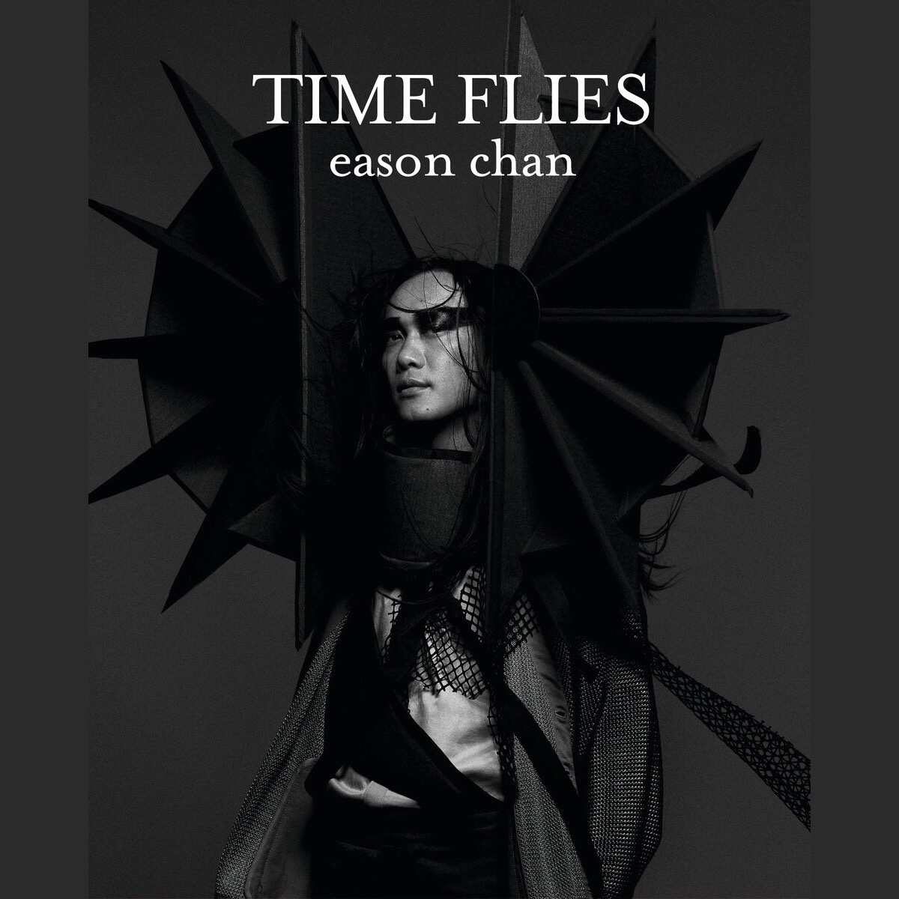

	

# [Time Flies](https://music.163.com/album?id=6375)

* 时间：2010-03-12
* 歌手：陈奕迅
* 唱片公司：新艺宝
## Songs

* [无人之境](songs/无人之境_64625/README.md)
* [大人](songs/大人_64630/README.md)
* [一丝不挂](songs/一丝不挂_64634/README.md)
* [陀飞轮](songs/陀飞轮_64638/README.md)
* [心腹](songs/心腹_64643/README.md)
* [味之素](songs/味之素_64648/README.md)
## Appendix

### Description

香港乐坛天王陈奕迅在3月再踏红馆，举行18场《DUO 陈奕迅2010演唱会》，门票销情热烈并再度加场。在个唱之前，Eason 特别推出最新迷你广东大碟《Time Flies》，表达出人随着长大而对时间流逝的感慨，再与合作无间的黄伟文再次打造「无人之境」和「陀飞轮」。近年来备受绯闻困扰的Eason，借着「无人之境」唱出偷欢者的心声，「陀飞轮」则是刻划他的人生历程之作。碟内并收录了Eason代言连锁快餐店2010主题曲「心腹」。

随碟附上全六首新曲MV。为了「无人之境」配合无重空间，Eason 在低温下特别在水中唱歌并拍摄MV。至于「陀飞轮」MV，则有超人、航天员、小丑、兔仔等助阵，令 MV 充满童年趣味。

### Score

|歌曲数|评论数|分享数|
|:---:|:---:|:---:|
|6|298|206|

|歌名|分数|
|:---:|:---:|
|无人之境|100.0
|一丝不挂|100.0
|陀飞轮|100.0
|大人|80.0
|心腹|70.0
|味之素|70.0
