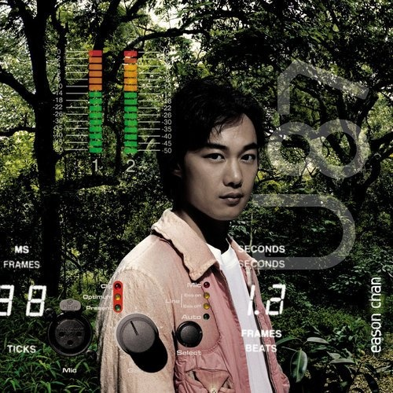

	

# [U-87](https://music.163.com/album?id=6491)

* 时间：2005-06-01
* 歌手：陈奕迅
* 唱片公司：正东唱片
## Songs

* [烂](songs/烂_66261/README.md)
* [阿牛](songs/阿牛_66265/README.md)
* [夕阳无限好](songs/夕阳无限好_66272/README.md)
* [16月6日 晴](songs/_月_日_晴_66277/README.md)
* [浮夸](songs/浮夸_66282/README.md)
* [葡萄成熟时](songs/葡萄成熟时_66285/README.md)
* [三个人的探戈](songs/三个人的探戈_66288/README.md)
* [不良嗜好](songs/不良嗜好_66291/README.md)
* [怕死](songs/怕死_66297/README.md)
* [大个女](songs/大个女_66300/README.md)
* [新美人主义](songs/新美人主义_66302/README.md)
* [遇见了你](songs/遇见了你_66304/README.md)
* [夕阳无限好 (只是近黄昏) (Remix)](songs/夕阳无限好_只是近黄昏_remix__478736220/README.md)
## Appendix

### Description

继《Live For Today》唱片后阔别乐坛两年，陈奕迅2005年加盟新艺宝后，全力再战香港乐坛！继3月复出乐坛的首场音乐会《新城唱好陈奕迅05'出击音乐会》，并于5月初特别举行大型音乐会“NCMLive 向 Eason 狂呼”，为新碟造势，Eason 在音乐会上大唱新歌11首，现场招待2,500名歌迷，整个制作费过百万元，而是次音乐会“NCMLive 向 Eason 狂呼”将转录成 DVD 随新碟《U-87》附送，回馈多年来乐迷等待他复出多时的支持。

全新主打歌“夕阳无限好”，则由 Eric Kwok 创作，歌词讲述 Eason 当了父亲及转会后的心境及想法，其中他觉得夕阳黄昏才是新一天的序幕，人要向前望，才有更多更想做的事情，因此凡事亦会看得长远些。

另一首新歌“不良嗜好”讲食烟问题，他觉得女人不钟意男人食烟是理所当然，出发点都是为男人着想。而黄伟文以 Eason 的写照填了“浮夸”一词，另一首“大个女”则是送给自己的女儿康堤。碟内亦收录了两首国语新歌“新美人主义”及“遇见了你”。

新碟由三个监制 Alvin Leong、雷颂德与 Eric Kwok 联合制作，碟名《U87》竟然用一支 Mic 的编号来命名，皆因他不约而同都用同一支名为“U87”的 Mic 录音，Eason 觉得此 Mic 收录了他最真实的声音，故此起用它来为新碟命名。

⊙Eason 的心里话

关于这张专辑，陈奕迅首次谈起自己离开英皇转入环球的原因，狠批当下的香港乐坛的种种恶劣现象。他悲观地说：“这不是一个属于巨星的时代。”

★迷茫

“那之后我还是不知道自己到底应该选择哪种方式，完全不清楚自己的方向，所以《神经侠侣》里面的表演是我最本色的表演。剧中人物的心态很符合我当时的心态。”

★热爱

“我其实很喜欢自己的声音，很爱玩自己的声音。”

★感慨

“80年代的香港乐坛，是最丰盛的年代。你会想起谭咏麟的时代、梅艳芳的时代、张学友的时代、张国荣的时代，每一个巨星，都有他们的年代。但是现在，已经不是属于巨星的时代。”

★愤怒

“做音乐就不要为了赚钱，很喜欢音乐的话，就应该一辈子做下去。赚那么多钱，你花得光吗？”

### Score

|歌曲数|评论数|分享数|
|:---:|:---:|:---:|
|13|525|446|

|歌名|分数|
|:---:|:---:|
|阿牛|100.0
|夕阳无限好|100.0
|浮夸|100.0
|葡萄成熟时|100.0
|16月6日 晴|90.0
|三个人的探戈|90.0
|不良嗜好|90.0
|怕死|90.0
|大个女|90.0
|烂|85.0
|遇见了你|85.0
|新美人主义|75.0
|夕阳无限好 (只是近黄昏) (Remix)|65.0
