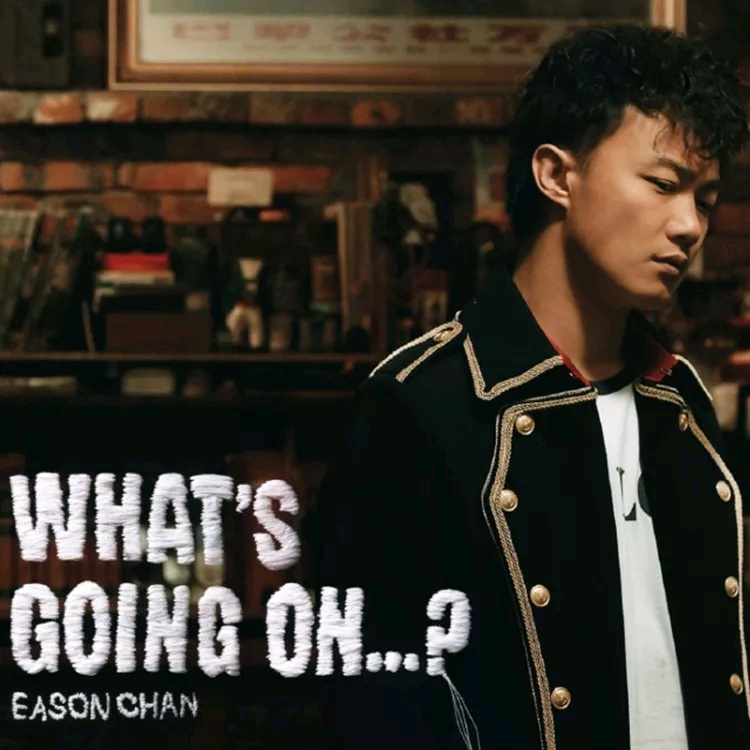

	

# [What's Going On…?](https://music.163.com/album?id=6451)

* 时间：2006-11-01
* 歌手：陈奕迅
* 唱片公司：新艺宝
## Songs

* [裙下之臣](songs/裙下之臣_65758/README.md)
* [最后的嬉皮士](songs/最后的嬉皮士_65759/README.md)
* [白玫瑰](songs/白玫瑰_65761/README.md)
* [黑择明](songs/黑择明_65763/README.md)
* [富士山下](songs/富士山下_65766/README.md)
* [不如不见](songs/不如不见_65769/README.md)
* [心深伤透](songs/心深伤透_65772/README.md)
* [解药](songs/解药_65775/README.md)
* [天公地道](songs/天公地道_22198009/README.md)
* [粤语残片](songs/粤语残片_65778/README.md)
* [裙下之臣 (Live)](songs/裙下之臣_live__33255169/README.md)
* [解药 (Live)](songs/解药_live__33255170/README.md)
* [白玫瑰 (Live)](songs/白玫瑰_live__33255171/README.md)
* [最后的嬉皮士 (Live)](songs/最后的嬉皮士_live__33255172/README.md)
* [富士山下 (Live)](songs/富士山下_live__33255173/README.md)
## Appendix

### Description

陈奕迅自从于2005年回归乐坛后，一直追求质素的慢工出细货而见称，因此令广东碟《U 87》、《Life Continues》及国语碟《怎么 样》均广受欢迎。万众期待已久的2006年 Eason 年度大碟粤语唱片《What’s Going On…？》终于上市。随碟附送制作特辑DVD “What’s Going On With Eason？”(全长30分钟)，让乐迷可全程追击录音过程，还有三首主打歌新MV。

### Score

|歌曲数|评论数|分享数|
|:---:|:---:|:---:|
|15|258|211|

|歌名|分数|
|:---:|:---:|
|裙下之臣|100.0
|白玫瑰|100.0
|黑择明|100.0
|富士山下|100.0
|不如不见|100.0
|粤语残片|100.0
|解药|95.0
|天公地道|95.0
|富士山下 (Live)|85.0
|最后的嬉皮士|80.0
|心深伤透|80.0
|解药 (Live)|70.0
|白玫瑰 (Live)|65.0
|裙下之臣 (Live)|45.0
|最后的嬉皮士 (Live)|35.0
