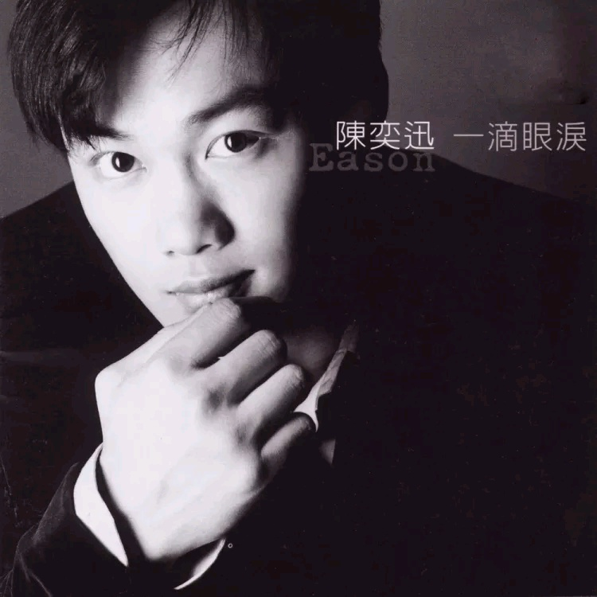

	

# [一滴眼泪](https://music.163.com/album?id=6624)

* 时间：1997-01-01
* 歌手：陈奕迅
* 唱片公司：Victory Magic
## Songs

* [Style](songs/style_67877/README.md)
* [爱到疯](songs/爱到疯_67857/README.md)
* [拜访](songs/拜访_67852/README.md)
* [二个人的夜晚](songs/二个人的夜晚_67881/README.md)
* [感情约](songs/感情约_67885/README.md)
* [情深怎么办](songs/情深怎么办_67866/README.md)
* [我怎么可以哭](songs/我怎么可以哭_67870/README.md)
* [学会爱](songs/学会爱_67873/README.md)
* [一滴眼泪](songs/一滴眼泪_67848/README.md)
* [永远都天明](songs/永远都天明_67862/README.md)
## Appendix

### Description

陈奕迅最新国语专辑，收录日剧『爱的真谛』主题曲『一滴眼泪』，触动男人心中最脆弱的一根弦，令人无法抗拒。

Eason 强力至尊推荐曲

一滴眼泪--情歌，原来也可以气势磅礴、细腻兼具，错过可惜

拜访--献给不做梦的人，因为这一次拜访将撼动尘封已久的感动

我怎么可以哭 -触动男人心中最脆弱的一根弦，令人无法抗拒.

如果在英国,EASON应该会是个建筑师。

1995年从英国到参加香港无线电视台举办的“第十四届新秀歌唱大赛”过关斩将,一举夺魁；同时拿下“自我风格演绎奖”双料冠军。同年十月又应东京山叶音响基金邀约,参加“第四届东京音乐节比赛”担任特别佳宾。主办单位还特别情商日本名作曲家“蒲田博信”为EASON量身作曲现场演出,不仅现场大爱欢迎,同时立即进阶香港排行榜。

听EASON的歌,总让人有一种解渴的感觉。

淳厚、浑圆的嗓音,腼腆的笑容与从容不迫的表演,EASON的每一次演出都充满了声音的力与美。

或许长年居住英国伦敦,眼界宽了些；而在音乐的研习上,也开始的较早,在英国接受四年正统的声乐训练,对EASON来说,声音的驾驭更能收放自如、得心应手。

狮子座的EASON,不仅对声音具有天赋,连带对语言都有很出色的表现,英文、法文、中文、广东话都难不倒他,同时对小提琴、吉他、钢琴等乐器,也都有所涉略。更令人意外地是他在英国大学KINGSTON UNIVERSITY里主修的竟然是建筑系,可以说是知性与感性并演。

喜欢打网球、游泳、喜欢白色、黑色,喜欢小狗狗。喜欢吃鱼丸、烧鸭饭,喜欢冬天,喜欢自己的家,喜欢听忠言。老喜欢说:不过……可是……不过这样的EASON,可是真让人喜欢！

——拜访陈奕迅

### Score

|歌曲数|评论数|分享数|
|:---:|:---:|:---:|
|10|224|64|

|歌名|分数|
|:---:|:---:|
|我怎么可以哭|70.0
|拜访|65.0
|二个人的夜晚|60.0
|一滴眼泪|60.0
|情深怎么办|55.0
|学会爱|40.0
|永远都天明|40.0
|感情约|35.0
|爱到疯|30.0
|Style|25.0
