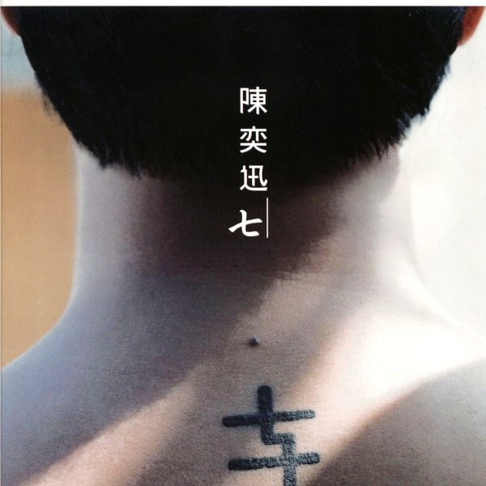

	

# [七](https://music.163.com/album?id=6530)

* 时间：2003-11-01
* 歌手：陈奕迅
* 唱片公司：英皇唱片
## Songs

* [圣诞结](songs/圣诞结_66587/README.md)
* [Shall We Talk](songs/shall_we_talk_66591/README.md)
* [寂寞让你更快乐](songs/寂寞让你更快乐_66594/README.md)
* [K歌之王](songs/k歌之王_66596/README.md)
* [想哭](songs/想哭_66601/README.md)
* [爱是怀疑](songs/爱是怀疑_66604/README.md)
* [十年](songs/十年_66608/README.md)
* [不如这样](songs/不如这样_66612/README.md)
* [谢谢侬](songs/谢谢侬_66618/README.md)
* [你的背包](songs/你的背包_66623/README.md)
* [低等动物(国)](songs/低等动物_国__66628/README.md)
* [男人的错](songs/男人的错_66633/README.md)
* [Last Order](songs/last_order_66638/README.md)
* [没有手机的日子](songs/没有手机的日子_66643/README.md)
* [要你的](songs/要你的_66647/README.md)
* [全世界失眠](songs/全世界失眠_66651/README.md)
* [兄妹](songs/兄妹_66656/README.md)
* [我们都寂寞](songs/我们都寂寞_66660/README.md)
## Appendix

### Description

Eason音乐路程的第七年，发行了第七张国语专辑，加上他的生日是7月27日，所以这张精选集的方向，慢慢的浮现，Eason不知不觉的发现，他不经意的抬头也会看到时钟指向“7：27” ，他特地将这特别的数字，刺上他的背身，他觉得“七”成为他很重要的数字，这张专辑遵照他的想法去纪念，带来KTV点播排行榜有名的「K歌之王」，金曲经典「你的背包」，动感Funky「爱是怀疑」，小市民心声「谢谢侬」，悲哀王老伍「Last Order」，听了会感动流泪的「想哭」…

### Score

|歌曲数|评论数|分享数|
|:---:|:---:|:---:|
|18|166|104|

|歌名|分数|
|:---:|:---:|
|全世界失眠|80.0
|圣诞结|65.0
|K歌之王|60.0
|十年|60.0
|你的背包|60.0
|谢谢侬|45.0
|Shall We Talk|25.0
|寂寞让你更快乐|25.0
|想哭|25.0
|不如这样|25.0
|我们都寂寞|25.0
|爱是怀疑|20.0
|Last Order|20.0
|兄妹|20.0
|低等动物(国)|5.0
|男人的错|5.0
|没有手机的日子|5.0
|要你的|5.0
