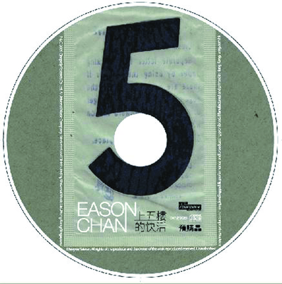

	

# [上五楼的快活- EDITED ROUGH MIX](https://music.163.com/album?id=35398900)

* 时间：2009-05-01
* 歌手：陈奕迅
* 唱片公司：环球唱片
## Songs

* [在你身边 (Edited Rough Mix)](songs/在你身边_edited_rough_mix__473058072/README.md)
* [这样的一个麻烦 (Edited Rough Mix)](songs/这样的一个麻烦_edited_rough_mix__473058073/README.md)
* [多少 (Edited Rough Mix)](songs/多少_edited_rough_mix__473058074/README.md)
* [Nothing Ever Happened (Edited Rough Mix)](songs/nothing_ever_happened_edited_rough_mix__473058075/README.md)
* [你为什么哭了呢 (Edited Rough Mix)](songs/你为什么哭了呢_edited_rough_mix__473058076/README.md)
* [我甲你 (Edited Rough Mix)](songs/我甲你_edited_rough_mix__473058077/README.md)
* [谋情害命 (Edited Rough Mix)](songs/谋情害命_edited_rough_mix__473058078/README.md)
* [心的距离 (Edited Rough Mix)](songs/心的距离_edited_rough_mix__473058079/README.md)
* [床头灯 (Edited Rough Mix)](songs/床头灯_edited_rough_mix__473058080/README.md)
* [给你 (Edited Rough Mix)](songs/给你_edited_rough_mix__473058081/README.md)
* [从何说起 (Edited Rough Mix)](songs/从何说起_edited_rough_mix__473058082/README.md)
## Appendix

### Description

### Score

|歌曲数|评论数|分享数|
|:---:|:---:|:---:|
|11|38|23|

|歌名|分数|
|:---:|:---:|
|心的距离 (Edited Rough Mix)|35.0
|在你身边 (Edited Rough Mix)|25.0
|这样的一个麻烦 (Edited Rough Mix)|25.0
|多少 (Edited Rough Mix)|25.0
|Nothing Ever Happened (Edited Rough Mix)|25.0
|你为什么哭了呢 (Edited Rough Mix)|25.0
|我甲你 (Edited Rough Mix)|25.0
|谋情害命 (Edited Rough Mix)|25.0
|床头灯 (Edited Rough Mix)|25.0
|给你 (Edited Rough Mix)|25.0
|从何说起 (Edited Rough Mix)|25.0
