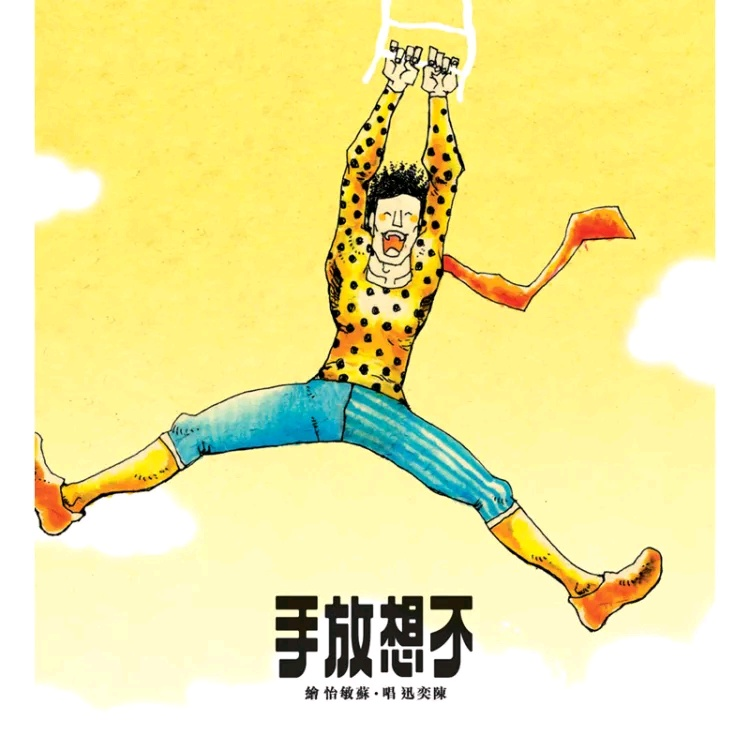

	

# [不想放手](https://music.163.com/album?id=2339617)

* 时间：2008-06-30
* 歌手：陈奕迅
* 唱片公司：新艺宝
## Songs

* [27 Seconds (Music Box of '然后怎样')](songs/_seconds_music_box_of_然后怎样__25906120/README.md)
* [路...一直都在](songs/路_一直都在_25906126/README.md)
* [独居动物](songs/独居动物_25906117/README.md)
* [倒带人生](songs/倒带人生_25906122/README.md)
* [Aren't You Glad](songs/aren_t_you_glad_25906123/README.md)
* [7](songs/__25906125/README.md)
* [不要说话](songs/不要说话_25906124/README.md)
* [漂亮小姐](songs/漂亮小姐_25906119/README.md)
* [臭美](songs/臭美_25906121/README.md)
* [土星环](songs/土星环_25906116/README.md)
* [然后怎样](songs/然后怎样_25906118/README.md)
## Appendix

### Description

陈奕迅全新国语专辑 [不想放手]
好歌打出头来！ 冠军作品 <路...一直都在> 推介歌曲<然后怎样>
11年来第一首英文单曲
爱与记忆 国语交融 陈奕迅音乐备忘 歌迷侧耳要听
凭《认了吧》入围第19届金曲奖最佳国语男歌手奖的陈奕迅，在公布赛果前推出2008年度国语大碟《不想放手》。由Jim Lee製作，新碟将不同音乐元素集合，音乐诗人方大同为Eason创作一曲「倒带人生」，碟内还收录了一首英文歌，以及为中国电影《时尚先生》灌录的主题曲「不要说话」。
至於主打歌，陈奕迅请来好友冯德伦编导甚至客串此MV，由影后周迅当女主角，此MV以电影方式拍摄，製作费接近七位数字。

### Score

|歌曲数|评论数|分享数|
|:---:|:---:|:---:|
|11|298|299|

|歌名|分数|
|:---:|:---:|
|路...一直都在|100.0
|不要说话|100.0
|倒带人生|95.0
|7|95.0
|然后怎样|95.0
|Aren't You Glad|90.0
|土星环|90.0
|独居动物|85.0
|漂亮小姐|85.0
|臭美|85.0
|27 Seconds (Music Box of '然后怎样')|50.0
