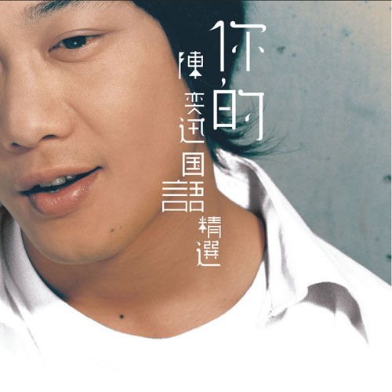

	

# [你的陈奕迅 国语精选](https://music.163.com/album?id=6423)

* 时间：2007-10-23
* 歌手：陈奕迅
* 唱片公司：英皇娱乐
## Songs

* [兄妹](songs/兄妹_65321/README.md)
* [十年](songs/十年_65326/README.md)
* [你的背包](songs/你的背包_65334/README.md)
* [K歌之王](songs/k歌之王_65337/README.md)
* [Shall We Talk](songs/shall_we_talk_65342/README.md)
* [低等动物](songs/低等动物_65347/README.md)
* [寂寞让你更快乐](songs/寂寞让你更快乐_65350/README.md)
* [圣诞结](songs/圣诞结_65355/README.md)
* [想哭](songs/想哭_65360/README.md)
* [不如这样](songs/不如这样_65365/README.md)
* [你会不会](songs/你会不会_65369/README.md)
* [Last Order](songs/last_order_65373/README.md)
* [冤家](songs/冤家_65377/README.md)
* [全世界失眠](songs/全世界失眠_65381/README.md)
* [我们都寂寞](songs/我们都寂寞_65385/README.md)
* [阿怪](songs/阿怪_65389/README.md)
* [谢谢侬](songs/谢谢侬_65393/README.md)
* [爱是怀疑](songs/爱是怀疑_65397/README.md)
* [Because You're Good To Me](songs/because_you_re_good_to_me_65400/README.md)
* [Good Times](songs/good_times_65403/README.md)
* [要你的](songs/要你的_65406/README.md)
* [像一句广告](songs/像一句广告_65410/README.md)
* [我也不会那样做](songs/我也不会那样做_65414/README.md)
* [人造卫星](songs/人造卫星_65418/README.md)
* [狂人日记](songs/狂人日记_65421/README.md)
* [没有手机的日子](songs/没有手机的日子_65425/README.md)
* [跳蚤市场](songs/跳蚤市场_65429/README.md)
* [故事](songs/故事_65433/README.md)
* [男人的错](songs/男人的错_65437/README.md)
* [没有你](songs/没有你_65441/README.md)
## Appendix

### Description

陈奕迅虽然已蝉过别枝，2000年至2003年在旧东家英皇娱乐的日子让他的事业创出高峰，尤其是国语乐坛，更于2002年凭《Special Thanks To》勇夺台湾金曲奖的歌王。

旧东家为Eason推出国语大碟《你的陈奕迅国语精选》，碟内收录了《反正是我》、《黑．白．灰》、《Special Thanks To》、《七》等国语唱片内多首大热的国语情歌。《你的陈奕迅国语精选》专辑收录了30首情歌和15首MV，包括了「兄妹」、「十年」、「你的背包」、「K歌之王」和「Shall We Talk」，并随碟加送15首精选歌的卡拉OK DVD。

### Score

|歌曲数|评论数|分享数|
|:---:|:---:|:---:|
|30|63|47|

|歌名|分数|
|:---:|:---:|
|十年|95.0
|你的背包|90.0
|K歌之王|90.0
|圣诞结|85.0
|Shall We Talk|50.0
|全世界失眠|50.0
|不如这样|45.0
|寂寞让你更快乐|30.0
|兄妹|25.0
|你会不会|25.0
|Last Order|25.0
|谢谢侬|25.0
|低等动物|20.0
|想哭|20.0
|我们都寂寞|20.0
|阿怪|20.0
|爱是怀疑|20.0
|像一句广告|20.0
|男人的错|20.0
|冤家|5.0
|Because You're Good To Me|5.0
|Good Times|5.0
|要你的|5.0
|我也不会那样做|5.0
|人造卫星|5.0
|狂人日记|5.0
|没有手机的日子|5.0
|跳蚤市场|5.0
|故事|5.0
|没有你|5.0
