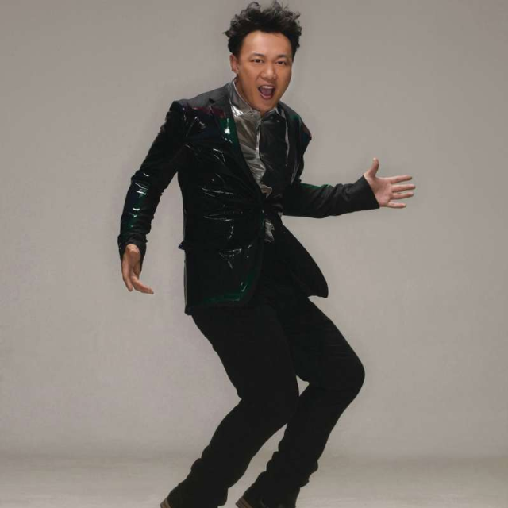

	

# [光辉岁月](https://music.163.com/album?id=2465020)

* 时间：2013-05-14
* 歌手：陈奕迅
* 唱片公司：环球唱片
## Songs

* [光辉岁月](songs/光辉岁月_26354130/README.md)
## Appendix

### Description

陈奕迅重新演绎《光辉岁月》 向经典致敬

作为一首经典歌曲，《光辉岁月》传唱几十年经久不衰，也是被众位明星翻唱过最多的经典歌曲。而6月9日，同名电影《光辉岁月》也将全国公映，影片制作方特意力邀陈奕迅重新演绎《光辉岁月》，作为这部“向经典致敬”的动作电影大片主题曲。对于这次的献唱，陈奕迅难掩兴奋的说，“他们每个人都有属于自己的光辉岁月，是香港影视经典的大集合，能翻唱这首歌是我的荣幸，在我们那个时代无可能未听过这首歌。”

《光辉岁月》英雄聚首 曾志伟钦点陈奕迅

电影《光辉岁月》集结曾志伟、黄日华、梁咏琪、吕良伟、惠英红、任达华等数十位明星，演绎一段“英雄聚首，再战江湖”的光辉岁月。导演熊欣欣毫不讳言表示，这部电影的创作灵感正是源于Beyond的《光辉岁月》。1990年，黄家驹为颂扬南非黑人领袖曼德拉，创作了这首《光辉岁月》。如今谁又能赋予《光辉岁月》新的生命？监制曾志伟及制片方经反复挑选后，最终邀请陈奕迅献声，重新演绎这首《光辉岁月》。

据了解，陈奕迅表示此次献唱，是自己对经典的致敬，是对所有参演的影坛前辈的致敬，是对过往光辉岁月的致敬，“经典不是用来超越的，是用来致敬的，其实每个人都有自己的光辉岁月，我也要唱出属于我的《光辉岁月》”。

一向对音乐严苛的陈奕迅为了让歌曲与电影故事更加贴合，亲自找来音乐人叶广权重新进行编曲。23年前，《光辉岁月》让黄家驹成为华人音乐的“精神领袖”。简单直接却寓意深刻的歌词，配合令人振奋的旋律，在黄家驹柔情且温暖的歌声中，听到了爱、理想和热血奋斗。这次陈奕迅为配合电影情节，在保留原本粤语歌词的基础上，加入多种电影气质的音乐元素，使编曲更为现代、更为雄浑。电影中金戈铁马的大漠厮杀，英雄复仇的浴血奋战，陈奕迅演唱彷佛置身于那段波澜壮阔的光辉岁月，全心演唱，全新演绎，听经典旋律，看经典偶像，一起追忆光辉岁月。

### Score

|歌曲数|评论数|分享数|
|:---:|:---:|:---:|
|1|27|23|

|歌名|分数|
|:---:|:---:|
|光辉岁月|100.0
