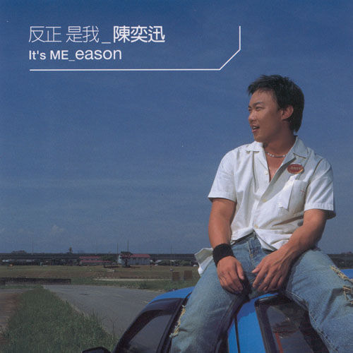

	

# [反正是我](https://music.163.com/album?id=6584)

* 时间：2001-07-01
* 歌手：陈奕迅
* 唱片公司：英皇娱乐
## Songs

* [Because You're Good To Me](songs/because_you_re_good_to_me_67338/README.md)
* [低等动物](songs/低等动物_67343/README.md)
* [不如这样](songs/不如这样_67348/README.md)
* [爱是怀疑](songs/爱是怀疑_67354/README.md)
* [我也不会那样做](songs/我也不会那样做_67361/README.md)
* [K歌之王](songs/k歌之王_67364/README.md)
* [没有你](songs/没有你_67370/README.md)
* [冤家](songs/冤家_67377/README.md)
* [全世界失眠](songs/全世界失眠_67381/README.md)
* [Good Times](songs/good_times_67387/README.md)
## Appendix

### Description

集结亚洲知名音乐人的一张专辑

而挟着在香港的好成绩，陈奕迅在今年选择艾回音乐作为他在台湾音乐事业的新起点，在7月份集结亚洲知名音乐人：周杰伦、林夕、陈奂仁、陈伟…等联合打造，推出自己第四张最新国语专辑「反正是我」，同时也是艾回音乐与英皇集团合作后所发行第一张国语专辑。

### Score

|歌曲数|评论数|分享数|
|:---:|:---:|:---:|
|10|89|23|

|歌名|分数|
|:---:|:---:|
|全世界失眠|85.0
|K歌之王|80.0
|不如这样|55.0
|爱是怀疑|35.0
|低等动物|25.0
|没有你|20.0
|Because You're Good To Me|5.0
|我也不会那样做|5.0
|冤家|5.0
|Good Times|5.0
