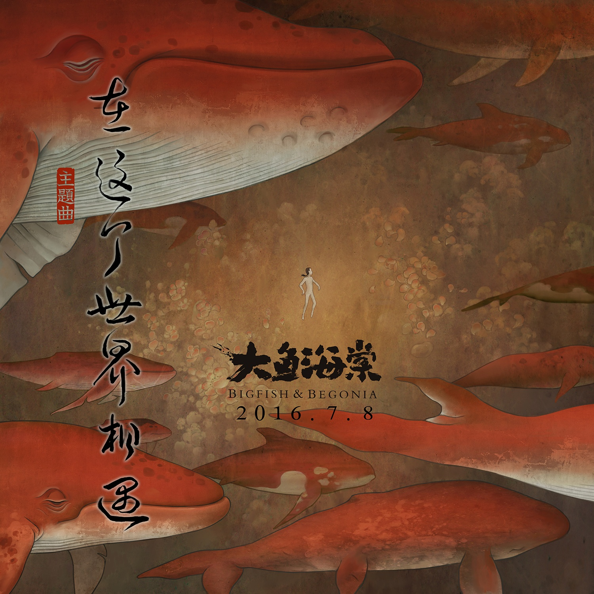

	

# [在这个世界相遇](https://music.163.com/album?id=34735139)

* 时间：2016-06-16
* 歌手：陈奕迅
* 唱片公司：环球唱片
## Songs

* [在这个世界相遇](songs/在这个世界相遇_416552612/README.md)
* [在这个世界相遇(伴奏)](songs/在这个世界相遇_伴奏__417250766/README.md)
## Appendix

### Description

6月14日，由环球音乐旗下歌手陈奕迅献声主题曲《在这个世界相遇》并参与MV拍摄的动画电影《大鱼海棠》在上海召开了“在这个世界相遇”主题曲发布会。本次发布的电影主题曲由知名作曲家窦鹏作曲，《大圣归来》导演田晓鹏作词，陈奕迅演唱。从歌名、歌词再到旋律都深深契合了电影《大鱼海棠》的核心情感。大量电影画面剪辑而成的MV与陈奕迅娓娓道来的演唱相结合，直戳人心，完美诠释了“相遇”的主题，势必将引发新一轮的期待热潮。

发布会上，Eason陈奕迅与到场的所有人共同为电影《大鱼海棠》主题曲《在这个世界相遇》MV 揭幕，并大方与所有媒体们分享与电影主创团队在录制主题曲时的背后故事，同时他也坦言原本并不熟悉国漫行情的自己从没有看见过这么动人和漂亮的动画画面，而自己喜欢的正式歌词中“每条大鱼，都会相遇，每个人都会重聚”很期盼的感觉，非常积极乐观的感觉。
陈奕迅温情演唱和充满情感表现力的MV画面，都无不让人为之动容。MV以广袤的星空为开端，男主鲲渐渐沉入海底，“星月相掩于大海上，微风摇曳细雨也彷徨”暗示着相遇的开端；“流霞飞舞，群青深处”正是椿与湫在“其他人”世界生活的真实写照；鲲穿越风雨，与椿相遇，遨游在天际看四季变化，唯美又引人遐想；副歌部分“每条大鱼，都会相遇；每个人，都会重聚”更唱出了在影片构建的世界观中，大海是每个人最终的归宿，一条条大鱼穿过云层飞向远方，生命旅程，往复不息。大量湫与椿的独白，将主角更立体丰富的个性展现出来。MV后半段，枝头万千海棠绽放，鲲离去场景的大量刻画雨歌曲娓娓道来的情感更是相得益彰，引人注目。而最后一组镜头中，鲲化为人形在海岸边一瞥回首，更是意味深长。

据悉，动画电影《大鱼海棠》从创意之初到制作完成，历时十二年，主创团队表示，很幸运与这么多合适的人相遇，才能坚守这个最初的梦，这个十二年之约，赴自己的约，也是赴观众的约。陈奕迅为《大鱼海棠》献声主题曲《在这个世界相遇》在感动之余，又为大家揭开了影片神秘面纱的一角，同时，这也是陈奕迅本年度发表的第一首单曲！陈奕迅《在这个世界相遇》单曲6/16全网数位平台同步曝光，在音乐的世界温暖相遇，7/8走进电影院和这个世界相遇！

### Score

|歌曲数|评论数|分享数|
|:---:|:---:|:---:|
|2|1052|919|

|歌名|分数|
|:---:|:---:|
|在这个世界相遇|95.0
|在这个世界相遇(伴奏)|60.0
