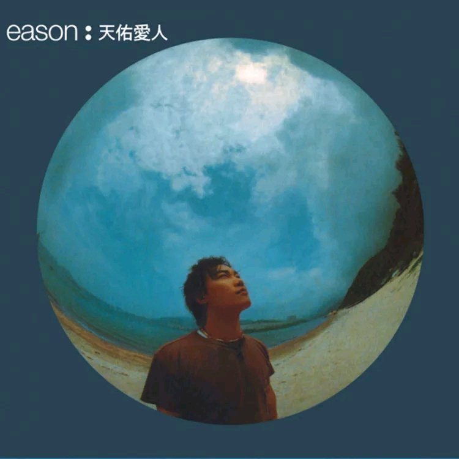

	

# [天佑爱人](https://music.163.com/album?id=2374012)

* 时间：1999-05-01
* 歌手：陈奕迅
* 唱片公司：英皇唱片
## Songs

* [昨日](songs/昨日_26075143/README.md)
* [今日](songs/今日_26075136/README.md)
* [每一个明天](songs/每一个明天_26075138/README.md)
* [眼眉调](songs/眼眉调_26075141/README.md)
* [一](songs/一_26075142/README.md)
* [第五个现代化](songs/第五个现代化_26075135/README.md)
* [快高长大](songs/快高长大_26075137/README.md)
* [如果这一秒钟你跟我讲你不爱我](songs/如果这一秒钟你跟我讲你不爱我_26075139/README.md)
* [我的世界末日](songs/我的世界末日_26075140/README.md)
* [贝多芬与我](songs/贝多芬与我_26075134/README.md)
## Appendix

### Description

香港歌手陈奕迅第六张专辑、第四张粤语专辑《天佑爱人》，华星原版，无条码

这张专辑是陈奕迅早期较优秀的专辑，包含罗伊推荐曲目“第五个现代化”、“贝多芬与我”、“我的世界末日”

### Score

|歌曲数|评论数|分享数|
|:---:|:---:|:---:|
|10|26|4|

|歌名|分数|
|:---:|:---:|
|每一个明天|35.0
|今日|25.0
|我的世界末日|20.0
|昨日|15.0
|眼眉调|15.0
|快高长大|15.0
|贝多芬与我|15.0
|一|5.0
|第五个现代化|5.0
|如果这一秒钟你跟我讲你不爱我|5.0
