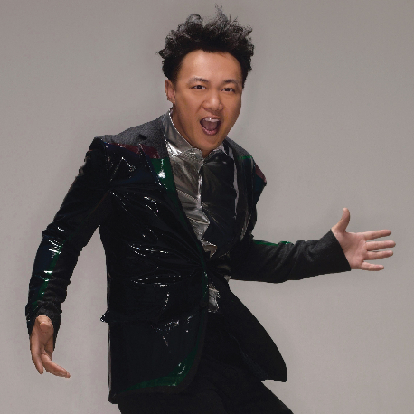

	

# [娱乐天空](https://music.163.com/album?id=2767144)

* 时间：2014-02-25
* 歌手：陈奕迅
* 唱片公司：环球音乐
## Songs

* [娱乐天空](songs/娱乐天空_28282243/README.md)
* [娱乐天空歌曲介绍(国)](songs/娱乐天空歌曲介绍_国__28282175/README.md)
* [娱乐天空歌曲介绍(粤)](songs/娱乐天空歌曲介绍_粤__28282176/README.md)
## Appendix

### Description

事隔两年多，Eason再度推出全新国语专辑，这次找来「火星电台」合作，这个单位的成员分别是黄少锋及曾宇，一位爱说话的人和一位沉默而有智慧的家伙，因为对音乐和生活有了太多相似的想像，所以决定走在一起。 而他们曾经为老狼、周迅等制作歌曲，而Eason就是听了周迅的专辑，给他们的音乐深深吸引，所以当决定今年制作国语专辑时，第一时间找他们合作。

由火星电台包办曲词编监的主打歌《娱乐天空》，歌曲走电子音乐配衬Band Sound鲜明节拍，歌词说的是在娱乐圈工作的人，面对着五光十色的花花世界，其实和一般工作分别不大，一样要面对现实和理想总有出入，还因为是公众人物反而少了一些个人自由，虽然作品充斥无限自嘲，但亦不乏积极的能量。

这首歌Eason用了正能量心态去唱，「用勇敢积极正面态度去面对生活，每天睡醒起来又回到起点，执着也没意思吧！」他有感而发。这个心态其实不只在娱乐圈工作的人，从事各行各业的人亦应该要积极起来。

### Score

|歌曲数|评论数|分享数|
|:---:|:---:|:---:|
|3|118|57|

|歌名|分数|
|:---:|:---:|
|娱乐天空|90.0
|娱乐天空歌曲介绍(国)|25.0
|娱乐天空歌曲介绍(粤)|25.0
