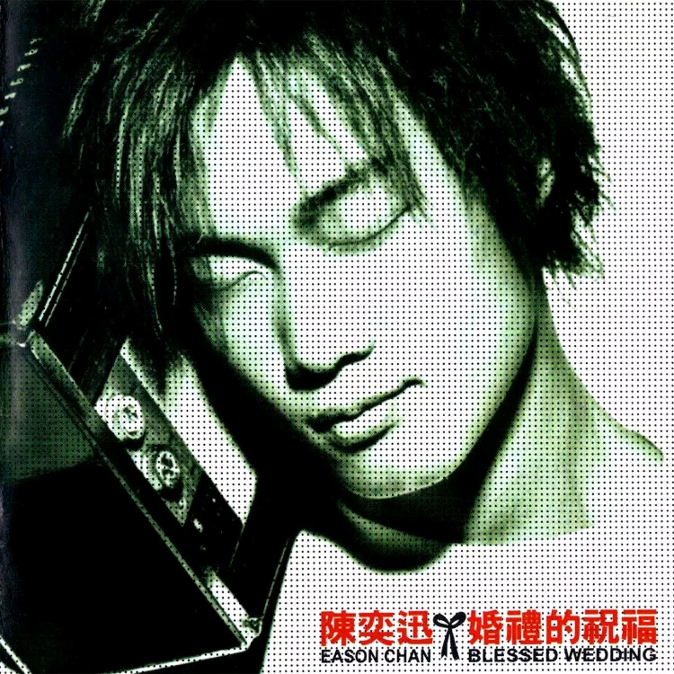

	

# [婚礼的祝福](https://music.163.com/album?id=6604)

* 时间：1999-10-01
* 歌手：陈奕迅
* 唱片公司：Victory Magic
## Songs

* [1个2个3个4个](songs/_个_个_个_个_67604/README.md)
* [Just Between The Two Of Us](songs/just_between_the_two_of_us_67607/README.md)
* [My Girl](songs/my_girl_67591/README.md)
* [拔河](songs/拔河_67576/README.md)
* [存在](songs/存在_67610/README.md)
* [婚礼的祝福](songs/婚礼的祝福_67572/README.md)
* [伤心证明书](songs/伤心证明书_67601/README.md)
* [掏空](songs/掏空_67596/README.md)
* [我的开始在这里](songs/我的开始在这里_67581/README.md)
* [转机](songs/转机_67586/README.md)
## Appendix

### Description

陈奕迅的『婚礼的祝福』全程在台湾制作，EASON和五位台湾顶级制作人合作，交出一份漂亮的成绩单。\n陈子鸿、黄庆元、薛忠铭、侯志坚、PETER WONG 这五位制作人，在各自所擅长的音乐领域给予陈奕迅不同的音乐生命。将EASON在音乐上充沛的活动力和音乐能量表现到最极致，可以看出歌手的用心和多般面貌的可塑性，也因此虽然专辑中的歌曲多偏情歌，却听到陈奕迅丰富的音乐能量。\n在这张专辑中除了『婚礼的祝福』是一首以「新郎不是我」做为歌曲主轴的「事件型情歌」之外，更有陈奕迅和梁汉文的对唱曲『拔河』是以MAN'S TALK的方式，仔细剖析男性在遇到感情问题时的面对态度，也在歌曲中提出了一个不同的感情观。当失意的角色互换时，这首歌中可以看到男性的另一面，十分新颖。

### Score

|歌曲数|评论数|分享数|
|:---:|:---:|:---:|
|10|155|113|

|歌名|分数|
|:---:|:---:|
|婚礼的祝福|100.0
|掏空|95.0
|伤心证明书|90.0
|1个2个3个4个|80.0
|转机|80.0
|拔河|75.0
|存在|60.0
|我的开始在这里|60.0
|Just Between The Two Of Us|45.0
|My Girl|40.0
