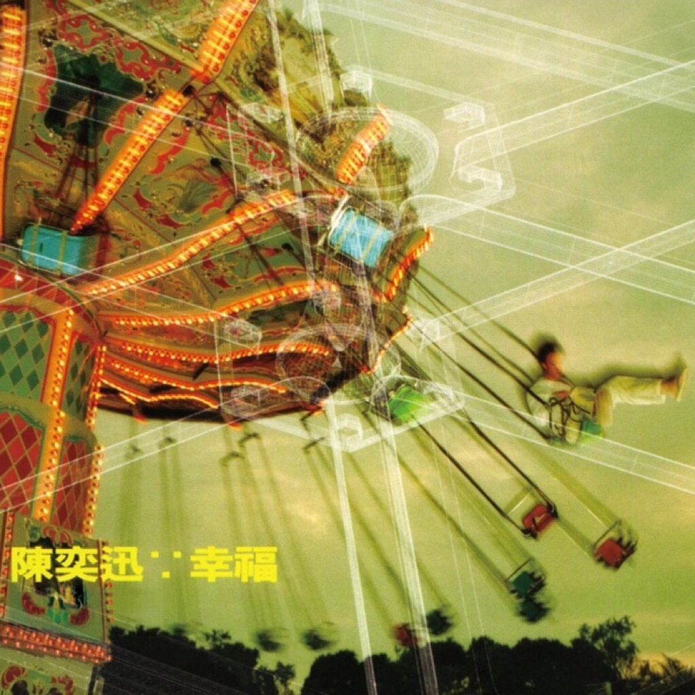

	

# [幸福](https://music.163.com/album?id=2374011)

* 时间：1999-11-01
* 歌手：陈奕迅
* 唱片公司：华星唱片
## Songs

* [幸福摩天轮](songs/幸福摩天轮_26075131/README.md)
* [飘飘飘飘](songs/飘飘飘飘_26075129/README.md)
* [时光倒流二十年](songs/时光倒流二十年_26075130/README.md)
* [忽然难过](songs/忽然难过_26075127/README.md)
* [专家话](songs/专家话_26075133/README.md)
* [有了你](songs/有了你_26075132/README.md)
* [春光乍泄](songs/春光乍泄_26075124/README.md)
* [改造人](songs/改造人_26075126/README.md)
* [垃圾](songs/垃圾_26075128/README.md)
* [非走不可](songs/非走不可_26075125/README.md)
* [超人的主题曲 屎捞人(With梁汉文)](songs/超人的主题曲_屎捞人_with梁汉文__26075123/README.md)
## Appendix

### Description

这是陈奕迅从浮泛的流行歌坛确立自我风格的专辑之一，那些我们生命中的小感动、小细节，都被EASON用慵懒但却真实的声音付诸于旋律。专辑的前3首歌充分表达了“幸福”二字的含义，《幸福摩天轮》《飘飘飘飘》都在惬意中诉说爱的甜美；而《时光倒流二十年》则是对少年懵懂情感的回首。或许我们在多年之后，回首渐行渐远的青春岁月，也会如同EASON的这种遥望和赞颂一样，来得如此细腻而隆重。除了流行风格，《幸福》专辑体现了青春的律动，Rock的《专家话》《改造人》说了叛逆，而忧郁的《垃圾》则如一首爱的挽歌，唱到心碎，但谁又能否认这样的刻骨铭心不是一种另类的幸福呢？

### Score

|歌曲数|评论数|分享数|
|:---:|:---:|:---:|
|11|16|4|

|歌名|分数|
|:---:|:---:|
|时光倒流二十年|65.0
|垃圾|55.0
|幸福摩天轮|45.0
|飘飘飘飘|25.0
|非走不可|25.0
|改造人|20.0
|忽然难过|5.0
|专家话|5.0
|有了你|5.0
|春光乍泄|5.0
|超人的主题曲 屎捞人(With梁汉文)|5.0
