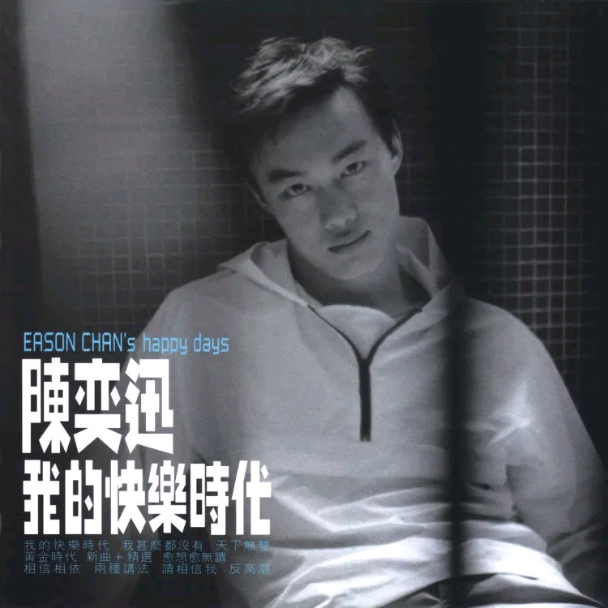

	

# [我的快乐时代](https://music.163.com/album?id=2374013)

* 时间：1998-06-01
* 歌手：陈奕迅
* 唱片公司：华星唱片
## Songs

* [我的快乐时代](songs/我的快乐时代_26075150/README.md)
* [我什么都没有](songs/我什么都没有_26075151/README.md)
* [天下无双](songs/天下无双_26075149/README.md)
* [黄金时代](songs/黄金时代_26075146/README.md)
* [新曲+精选](songs/新曲_精选_28747689/README.md)
* [愈想愈无谓](songs/愈想愈无谓_26075153/README.md)
* [相信相依](songs/相信相依_26075152/README.md)
* [两种讲法](songs/两种讲法_26075147/README.md)
* [请相信我](songs/请相信我_26075148/README.md)
* [反高潮](songs/反高潮_26075145/README.md)
* [多一点](songs/多一点_26075144/README.md)
## Appendix

### Description

“漫长”与“快乐”，或许会是相反的，毕竟“一箭双雕”的美意，是很难存在的。快乐的过程，只会是短暂的；快乐的童年，又会占据漫长的认识的百分之几呢？专辑的点题之作《我的快乐时代》里，歌曲的作词人林夕，深入浅出地将这定理表达了出来。“让我有个美满旅程，让我记着有多高兴......没有结局，也可即兴。”光都光不过黑夜尽头......”
专辑中，更收录了一首作词人林振强，生前为陈奕迅写的一首作品《天下无双》。一首关于，一对恋人互相依恋、双宿双栖的动人故事。这么的故事，或许在现在，也成了许多成年男女眼里的童话。
陈奕迅在专辑中，更参与了歌曲的创作，这应该是其第一次在音乐上的创作吧。陈奕迅作曲的作品《反高潮》，在迷离、阴翳的电音氛围中，则显出了一份别样的颓废

### Score

|歌曲数|评论数|分享数|
|:---:|:---:|:---:|
|11|80|16|

|歌名|分数|
|:---:|:---:|
|我什么都没有|65.0
|我的快乐时代|50.0
|反高潮|45.0
|天下无双|35.0
|黄金时代|25.0
|愈想愈无谓|25.0
|相信相依|20.0
|新曲+精选|15.0
|多一点|15.0
|两种讲法|5.0
|请相信我|5.0
