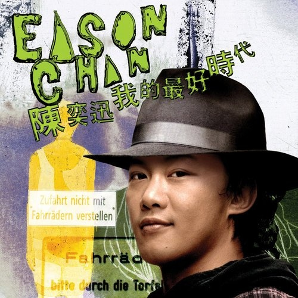

	

# [我的最好时代](https://music.163.com/album?id=6462)

* 时间：2006-02-01
* 歌手：陈奕迅
* 唱片公司：英皇娱乐
## Songs

* [K歌之王](songs/k歌之王_65941/README.md)
* [十面埋伏](songs/十面埋伏_65944/README.md)
* [岁月如歌](songs/岁月如歌_65947/README.md)
* [明年今日](songs/明年今日_65952/README.md)
* [打回原形](songs/打回原形_65954/README.md)
* [Shall We Talk](songs/shall_we_talk_65958/README.md)
* [Lonely Christmas](songs/lonely_christmas_65961/README.md)
* [低等动物](songs/低等动物_65964/README.md)
* [人来人往](songs/人来人往_65967/README.md)
* [1874](songs/__65970/README.md)
* [少见不怪](songs/少见不怪_65973/README.md)
* [单车](songs/单车_65976/README.md)
* [绵绵](songs/绵绵_65979/README.md)
* [猜情寻](songs/猜情寻_65982/README.md)
* [他一个人](songs/他一个人_65986/README.md)
* [爱是怀疑](songs/爱是怀疑_65999/README.md)
* [随意门](songs/随意门_66003/README.md)
* [2001太空漫游](songs/_太空漫游_66005/README.md)
* [King Kong](songs/king_kong_66013/README.md)
* [打得火热](songs/打得火热_66015/README.md)
* [第一类接触](songs/第一类接触_66017/README.md)
* [给爱丽斯](songs/给爱丽斯_66020/README.md)
* [幸灾乐祸](songs/幸灾乐祸_66022/README.md)
* [阿士匹灵](songs/阿士匹灵_66025/README.md)
* [一疋布](songs/一疋布_66028/README.md)
* [小孩不懂怕](songs/小孩不懂怕_66032/README.md)
* [谎言](songs/谎言_66036/README.md)
* [真相](songs/真相_66040/README.md)
* [忘记歌词](songs/忘记歌词_66044/README.md)
* [冲口而出](songs/冲口而出_66049/README.md)
* [一切还好](songs/一切还好_66053/README.md)
* [万佛朝宗](songs/万佛朝宗_66056/README.md)
* [冤气](songs/冤气_66059/README.md)
* [八里公路](songs/八里公路_66062/README.md)
* [放下来](songs/放下来_66064/README.md)
* [开不了心](songs/开不了心_66067/README.md)
* [Katrina](songs/katrina_66070/README.md)
* [活着多好](songs/活着多好_66074/README.md)
* [热带雨林](songs/热带雨林_66078/README.md)
* [失恋太少](songs/失恋太少_66082/README.md)
* [人工智能](songs/人工智能_66085/README.md)
* [孤独探戈](songs/孤独探戈_66088/README.md)
* [天使的礼物](songs/天使的礼物_66091/README.md)
* [孤儿仔](songs/孤儿仔_66095/README.md)
* [呀边个边个](songs/呀边个边个_66099/README.md)
## Appendix

### Description

2005年度陈奕迅（Eason）凭粤语及国语大碟《U 87》和《怎么样》再战华语乐坛，令他再次在香港各大音乐颁奖礼中勇夺不少歌曲及最爱欢迎男歌手等奖项，备受瞩目。Eason的旧东家英皇亦为他推出一套3CD+卡拉OK DVD唱片套装《我的最好时代》，完全收录他多年来在英皇时代的精选金曲，由情歌之最「Lonely X'mas」、「猜情寻」，到快歌大热曲「第一类接触」、「King Kong」共45首Eason精选之最全辑录。

至于卡拉OK DVD方面，则有Eason于英皇年代最辉煌的精选金曲「岁月如歌 / 兄妹 (Live)」、「K歌之王」及「爱是怀疑」等12首。

### Score

|歌曲数|评论数|分享数|
|:---:|:---:|:---:|
|45|116|63|

|歌名|分数|
|:---:|:---:|
|明年今日|85.0
|人来人往|65.0
|K歌之王|60.0
|打回原形|60.0
|Lonely Christmas|60.0
|岁月如歌|50.0
|一切还好|50.0
|孤儿仔|45.0
|十面埋伏|25.0
|1874|25.0
|绵绵|25.0
|给爱丽斯|25.0
|忘记歌词|25.0
|开不了心|25.0
|Shall We Talk|20.0
|少见不怪|20.0
|单车|20.0
|猜情寻|20.0
|一疋布|20.0
|冤气|20.0
|低等动物|5.0
|他一个人|5.0
|爱是怀疑|5.0
|随意门|5.0
|2001太空漫游|5.0
|King Kong|5.0
|打得火热|5.0
|第一类接触|5.0
|幸灾乐祸|5.0
|阿士匹灵|5.0
|小孩不懂怕|5.0
|谎言|5.0
|真相|5.0
|冲口而出|5.0
|万佛朝宗|5.0
|八里公路|5.0
|放下来|5.0
|Katrina|5.0
|活着多好|5.0
|热带雨林|5.0
|失恋太少|5.0
|人工智能|5.0
|孤独探戈|5.0
|天使的礼物|5.0
|呀边个边个|5.0
