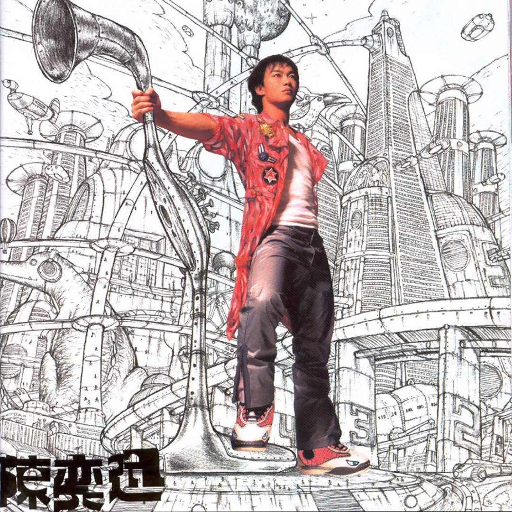

	

# [打得火热](https://music.163.com/album?id=6595)

* 时间：2000-09-01
* 歌手：陈奕迅
* 唱片公司：英皇娱乐
## Songs

* [K歌之王](songs/k歌之王_67467/README.md)
* [打得火热](songs/打得火热_67471/README.md)
* [新广告歌](songs/新广告歌_67475/README.md)
* [低等动物(粤)](songs/低等动物_粤__67480/README.md)
* [绵绵](songs/绵绵_67485/README.md)
* [美丽谎言](songs/美丽谎言_67490/README.md)
* [吹微风](songs/吹微风_67495/README.md)
* [温室效应](songs/温室效应_67498/README.md)
* [活跃症](songs/活跃症_67501/README.md)
* [下周同样时间](songs/下周同样时间_67504/README.md)
## Appendix

### Description

陈奕迅刚刚加入英皇唱片公司就开始新闻不断，先是传出和王杰、谢霆峰、郑伊健争做英皇一哥，后又跪地恳求记者不要骚扰其家人的生活，粤语新专辑《打得火热》也就在这些是是非非中应运而生了。

去年拿下香港众多奖项的陈奕迅，在旧东家出完最后一张专辑《Nothing Really Matters》之后，陈奕迅转投英皇唱片旗下，英皇也不惜余力重金打造。《打得火热》中的大部分歌曲都是中板的情歌，其中还有三首陈奕迅自己谱写的新作。主打歌“打的火热”早已随广告传遍香港，并登上排行榜的冠军；第二主打歌“K歌之王”是一首相当悲伤的歌曲，在录音时陈奕迅有感而发，落泪录音棚；“活跃症”节奏轻快，展现出俏皮诙谐的一面；“下周同样时间(再见)”和“温室效应”都是陈奕迅的心血之作，也为专辑画上了较为圆满的句号。

### Score

|歌曲数|评论数|分享数|
|:---:|:---:|:---:|
|10|69|6|

|歌名|分数|
|:---:|:---:|
|K歌之王|95.0
|绵绵|35.0
|低等动物(粤)|25.0
|打得火热|20.0
|美丽谎言|20.0
|吹微风|20.0
|温室效应|20.0
|新广告歌|5.0
|活跃症|5.0
|下周同样时间|5.0
