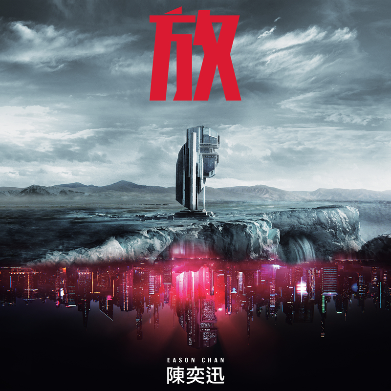

	

# [放 (Budweiser EDM Remix)](https://music.163.com/album?id=35643233)

* 时间：2017-06-21
* 歌手：陈奕迅
* 唱片公司：环球唱片
## Songs

* [放 (Budweiser EDM Remix)](songs/放_budweiser_edm_remix__485595084/README.md)
## Appendix

### Description

抛开烦恼 远离喧嚣 现代都市人都想要放空自己，在这紧迫压逼的生活当中寻找自己的一片天，放空自己就是一个最好的管道，并非是一种逃避也不是一种畏缩，每个人面对无能为力的无奈时刻，何不转个弯转个念让自己轻松一下，也许下一秒面对问题就可以迎刃而解，但往往当下在于执着固执的情绪底下，很多事永远会越缠越紧，所以放手松一松让自己喘口气，天不从人愿但自己可以选择不必如此的哀怨！

歌曲所传递的意义就是要人放宽心，很多事情不必在意一时的不如意，或许碰到瓶颈的当下可以试试先让自己放空，放掉不必要的牵绊，放掉不需要的预料，放掉不再有的不安。尝试用一种正向随心所欲的心态面对，可以发现更多美好的安排！

### Score

|歌曲数|评论数|分享数|
|:---:|:---:|:---:|
|1|395|212|

|歌名|分数|
|:---:|:---:|
|放 (Budweiser EDM Remix)|90.0
