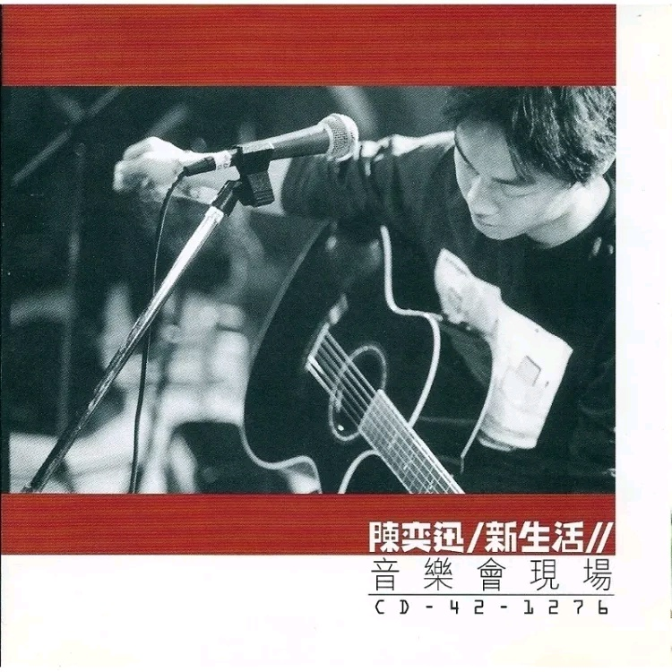

	

# [新生活音乐会现场](https://music.163.com/album?id=6607)

* 时间：1999-02-12
* 歌手：陈奕迅
* 唱片公司：上华国际
## Songs

* [我甚么都没有(Live) - live](songs/我甚么都没有_live_live_67632/README.md)
* [今天等我来(Live) - live](songs/今天等我来_live_live_67637/README.md)
* [时代曲(Live) - live](songs/时代曲_live_live_67639/README.md)
* [Se Vuol Ballare(Live) - live](songs/se_vuol_ballare_live_live_67641/README.md)
* [拜访(Live) - live](songs/拜访_live_live_67644/README.md)
* [爱拼才会嬴(Live) - live](songs/爱拼才会嬴_live_live_67649/README.md)
* [终于一百日(Live) - live](songs/终于一百日_live_live_67653/README.md)
* [新生活(Live) - live](songs/新生活_live_live_67659/README.md)
* [超人的主题曲(Live) - live](songs/超人的主题曲_live_live_67665/README.md)
* [我的快乐年代(Live) - live](songs/我的快乐年代_live_live_67670/README.md)
* [伤信(Live) - live](songs/伤信_live_live_67675/README.md)
* [天下无双(Live) - live](songs/天下无双_live_live_67680/README.md)
* [与我常在(Live) - live](songs/与我常在_live_live_67685/README.md)
* [抱拥这分钟(Live) - live](songs/抱拥这分钟_live_live_67689/README.md)
## Appendix

### Description

十年不是很长的时间，但也绝不短。能在娱乐圈屹立十年不倒的艺人，更是凤毛麟角。十年还是打造一个巨星的最低周期，10年的张国荣，才有了《无心睡眠》等扛鼎力作，拥有叫板谭咏麟的本钱。而谭咏麟，10年是他一跃从温拿主音歌手成为香港首席男歌手的时间，但到2005年他入行30周年，他才完成从巨星到殿堂的跨越。由此看来，十年固然弥足纪念，但也只是继往开来而已。

陈奕迅也要在他入行十年时举行内地第一场演唱会了，不论从专业还是大众的角度，陈奕迅都称得上香港乐坛谭张时代之后惟一能接班的实力巨星。歌神张学友基本上已淡出歌坛的龙争虎斗，从八十年代过来的李克勤音乐上乏善可陈，人气急升的古巨基唱功可喜，但其气质与歌艺仍难称大气。其他的新一辈就更加不值一提了。为何其貌不扬的陈奕迅能在众多偶像歌手之中突围而出，这的确是香港乐坛、也是华语娱乐界一个非常独特的现象。

揭开这个谜底并不难，陈奕迅与谭张等老一辈巨星的成功之道其实并无二致，那就是实力＋创新＋艺德三大法宝。说起来简单，对于靠父母出钱或靠样貌出道的新新偶像来说，实在是难于登天。陈奕迅的唱功完全可以媲美张国荣、谭咏麟、林子祥等上一代巨星，他继承了上代巨星字正腔圆的传统一面，却又加入很多西化的，甚至搞怪的唱腔，尤其在现场的爆发力特别惊人，比之录音室版本更为震撼，这点恐怕连谭张都为之逊色，只有林子祥与他有得一拼。而时下很多新人，连一个八度都唱不全，唱片大都要靠录音师在电脑里修剪而成，真人献唱惨不忍睹。

大部分中国的歌迷都不是极端的类型，因此音乐上一定是要大路情歌和多元曲风兼备，陈奕迅在创新方面把握得十分贴切。当然，他也非常幸运遇到两家容许他这样创新的唱片公司，不管是传统型的华星，还是商业型的英皇，都给了他一个相对开阔的平台。在转投新艺宝后的专辑《U87》虽然被指略为保守，但《浮夸》、《葡萄成熟时》等不同风格的曲目还是展现出他稳中求变的一面。

论艺德，虽然这是个很虚也没有直接产出的品质，但它却是支撑艺人走向10年、甚至更多个十年的基石。谦虚和蔼，没有明星架子，像个大孩子般的陈奕迅的做人原则就是本真，这一点，也是传媒、歌迷喜欢他的很重要一点。联想到时下有些号称“德艺双馨”、动辄批人低俗，私下里却假唱、偷税、耍大牌、玩弄女性，一个都不能少的所谓表演艺术家，陈奕迅的真实、恒久而不“浮夸”，倒更值得送上“德艺双馨”四个字。

### Score

|歌曲数|评论数|分享数|
|:---:|:---:|:---:|
|14|14|3|

|歌名|分数|
|:---:|:---:|
|我甚么都没有(Live) - live|5.0
|今天等我来(Live) - live|5.0
|时代曲(Live) - live|5.0
|Se Vuol Ballare(Live) - live|5.0
|拜访(Live) - live|5.0
|爱拼才会嬴(Live) - live|5.0
|终于一百日(Live) - live|5.0
|新生活(Live) - live|5.0
|超人的主题曲(Live) - live|5.0
|我的快乐年代(Live) - live|5.0
|伤信(Live) - live|5.0
|天下无双(Live) - live|5.0
|与我常在(Live) - live|5.0
|抱拥这分钟(Live) - live|5.0
