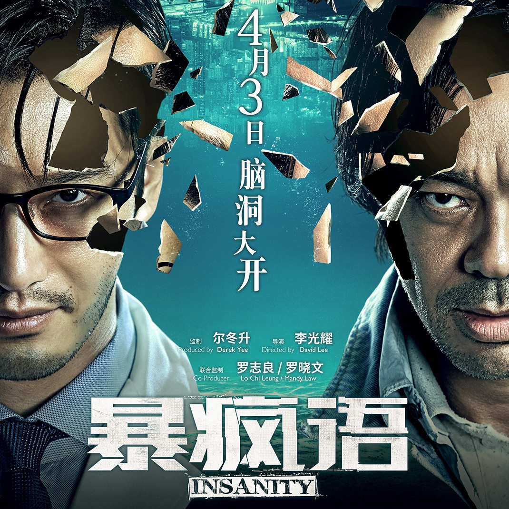

	

# [暴风雨](https://music.163.com/album?id=3109376)

* 时间：2015-03-17
* 歌手：陈奕迅
* 唱片公司：环球音乐
## Songs

* [暴风雨](songs/暴风雨_31010936/README.md)
## Appendix

### Description

由尔冬升监制、李光耀执导，刘青云、黄晓明、方中信、薛凯琪、叶璇、鲍起静、等一众实力派明星加盟，2015年惊悚烧脑巨制《暴疯语》发布重量级物料：华语乐坛男神级歌手陈奕迅献唱的主题曲《暴风雨》正式发布。这款主题曲是按照“治愈神曲”的标准进行打造，为的是让观众挑战完紧张烧脑的99分钟剧情后，情绪得以释放和舒缓。而陈奕迅也因为这首主题曲，在羊年新春来临之际收获一份大礼——第34届香港电影金像奖最佳原创电影歌曲提名。按陈奕迅以往为电影献声的精彩履历来推断，《暴风雨》一经发布，必将成为年度最走红“治愈神曲”。
在收到《暴疯语》邀请后，陈奕迅特地提前观看了全片，并在看后第一时间强烈要求，主题曲必须由他来唱。最终，这首由香港著名词曲作者岑伟宗与高世章合作的作品《暴风雨》，成为了电影《暴疯语》的点睛之笔。许多看过全片的人都表示，最后因为有这样一首治愈神曲，使得紧张了许久的神经得到了释放，心中的迷茫也因歌声而消解。更有甚者表示，《暴风雨》是压力指数的另类测试，如果你听完泪流满面，那真的需要赶紧解压了。
《暴风雨》整首歌曲旋律轻柔舒缓，词句充满正能量，虽然与电影紧张刺激、悬念迭起的节奏截然相反，却正暗合了导演李光耀想要表达的主题：希望所有观众看完电影，走出影院的那一刻，能够放下平日里背负的所有压力。监制尔冬升也表示，现代都市人在各种重重压力之下，已然看不见钢筋水泥外的蓝天，他希望大家能够看过电影之后感受到“被治愈”，带上轻松愉悦的心情重新审视生活。

### Score

|歌曲数|评论数|分享数|
|:---:|:---:|:---:|
|1|90|14|

|歌名|分数|
|:---:|:---:|
|暴风雨|90.0
