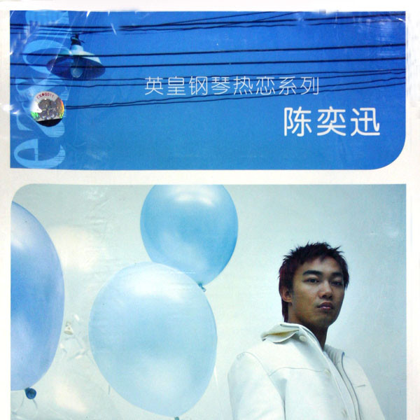

	

# [英皇钢琴热恋系列-陈奕迅](https://music.163.com/album?id=6510)

* 时间：2004-07-01
* 歌手：陈奕迅
* 唱片公司：英皇娱乐
## Songs

* [岁月如歌](songs/岁月如歌_66407/README.md)
* [明年今日](songs/明年今日_66413/README.md)
* [十面埋伏](songs/十面埋伏_66418/README.md)
* [打回原形](songs/打回原形_66423/README.md)
* [K歌之王](songs/k歌之王_66428/README.md)
* [Shall We Talk](songs/shall_we_talk_66432/README.md)
* [给爱丽斯](songs/给爱丽斯_66436/README.md)
* [忘记歌词](songs/忘记歌词_66439/README.md)
* [Lonely Christmas](songs/lonely_christmas_66442/README.md)
* [猜情寻](songs/猜情寻_66444/README.md)
* [幸灾乐祸](songs/幸灾乐祸_66445/README.md)
* [人来人往](songs/人来人往_66447/README.md)
* [想哭](songs/想哭_66449/README.md)
* [你的背包](songs/你的背包_66455/README.md)
* [天使的礼物](songs/天使的礼物_66460/README.md)
* [打得火热](songs/打得火热_66464/README.md)
* [单车](songs/单车_66468/README.md)
* [孤儿仔](songs/孤儿仔_66472/README.md)
* [少见不怪](songs/少见不怪_66478/README.md)
* [他一个人](songs/他一个人_66483/README.md)
## Appendix

### Description

英皇首度推出名歌星钢琴热恋系列，由于唱片市道不景，英皇近日看准时下的纯音乐热潮，及学生市场的学琴风气，发掘出一条新财路，乘势推出一系列旗下歌手的钢琴CD及琴谱。乐曲包括时下最新最流行之歌曲。包装豪华精美，极具珍藏价值。
陈奕迅钢琴乐谱及CD，精美封面内页配以硬皮簿印制，随书更附送陈奕迅的写真、海报及歌词集。

### Score

|歌曲数|评论数|分享数|
|:---:|:---:|:---:|
|20|27|18|

|歌名|分数|
|:---:|:---:|
|K歌之王|25.0
|Lonely Christmas|25.0
|单车|25.0
|孤儿仔|25.0
|明年今日|20.0
|打回原形|20.0
|Shall We Talk|20.0
|人来人往|20.0
|岁月如歌|5.0
|十面埋伏|5.0
|给爱丽斯|5.0
|忘记歌词|5.0
|猜情寻|5.0
|幸灾乐祸|5.0
|想哭|5.0
|你的背包|5.0
|天使的礼物|5.0
|打得火热|5.0
|少见不怪|5.0
|他一个人|5.0
