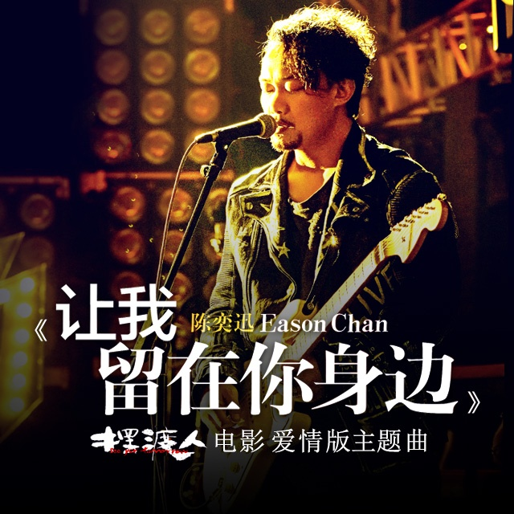

	

# [让我留在你身边](https://music.163.com/album?id=34961173)

* 时间：2016-11-08
* 歌手：陈奕迅
* 唱片公司：环球唱片
## Songs

* [让我留在你身边](songs/让我留在你身边_438801672/README.md)
## Appendix

### Description

《摆渡人》是由王家卫监制，张嘉佳自编自导，梁朝伟、金城武、陈奕迅、Angelababy、张榕容、杜鹃、熊黛林、大鹏、柳岩主演。
影片改编自张嘉佳的短篇小说《从你的全世界路过》，讲述了一个独立又充满侠气的都市女孩小玉痴情暗恋画家马力的感人故事。此次，陈奕迅演唱的《让我留在你身边》为电影爱情版主题曲。

### Score

|歌曲数|评论数|分享数|
|:---:|:---:|:---:|
|1|2322|2519|

|歌名|分数|
|:---:|:---:|
|让我留在你身边|100.0
