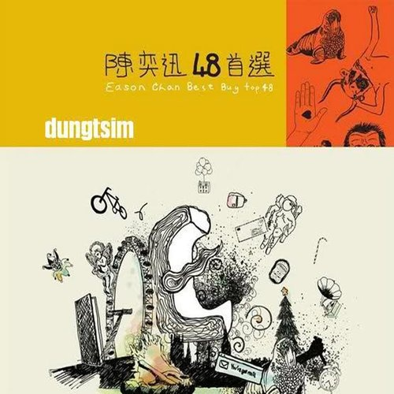

	

# [陈奕迅48首选](https://music.163.com/album?id=3102567)

* 时间：2008-12-23
* 歌手：陈奕迅
* 唱片公司：英皇娱乐
## Songs

* [每一个明天](songs/每一个明天_30569020/README.md)
* [K歌之王](songs/k歌之王_30569021/README.md)
* [与我常在](songs/与我常在_30569025/README.md)
* [岁月如歌](songs/岁月如歌_30569023/README.md)
* [幸福摩天轮](songs/幸福摩天轮_30569026/README.md)
* [明年今日](songs/明年今日_30569024/README.md)
* [时代曲](songs/时代曲_30569027/README.md)
* [十面埋伏](songs/十面埋伏_30569028/README.md)
* [天下无双](songs/天下无双_30569030/README.md)
* [伤信](songs/伤信_30569032/README.md)
* [我甚么都没有](songs/我甚么都没有_30569069/README.md)
* [Shall We Talk](songs/shall_we_talk_30569031/README.md)
* [打回原形](songs/打回原形_30569033/README.md)
* [单车](songs/单车_30569035/README.md)
* [美满人生](songs/美满人生_30569036/README.md)
* [新曲+精选](songs/新曲_精选_30569037/README.md)
* [我的快乐时代](songs/我的快乐时代_30569058/README.md)
* [你的背包 (国语)](songs/你的背包_国语__30569060/README.md)
* [时光倒流20年](songs/时光倒流_年_30569057/README.md)
* [谢谢侬 (国语)](songs/谢谢侬_国语__30569063/README.md)
* [新生活](songs/新生活_30569062/README.md)
* [1874](songs/__30569061/README.md)
* [贝多芬与我](songs/贝多芬与我_30569067/README.md)
* [人来人往](songs/人来人往_30569068/README.md)
* [今日](songs/今日_30569071/README.md)
* [绵绵](songs/绵绵_30569070/README.md)
* [黄金时代](songs/黄金时代_30569029/README.md)
* [低等动物](songs/低等动物_30569072/README.md)
* [阿士匹灵](songs/阿士匹灵_30569076/README.md)
* [活著多好](songs/活著多好_30569075/README.md)
* [Lonely Christmas](songs/lonely_christmas_30569077/README.md)
* [昨日](songs/昨日_30569078/README.md)
* [第五个现代化](songs/第五个现代化_30569082/README.md)
* [2001太空漫游](songs/_太空漫游_30569088/README.md)
* [第一类接触](songs/第一类接触_30569084/README.md)
* [爱是怀疑 (国语)](songs/爱是怀疑_国语__30569089/README.md)
* [随意门](songs/随意门_30569087/README.md)
* [坏情人](songs/坏情人_30569086/README.md)
* [给爱丽斯](songs/给爱丽斯_30569092/README.md)
* [打得火热](songs/打得火热_30569093/README.md)
* [King Kong](songs/king_kong_30569094/README.md)
* [孤独探戈](songs/孤独探戈_30569095/README.md)
* [猜情寻](songs/猜情寻_30569096/README.md)
* [忘记歌词](songs/忘记歌词_30569097/README.md)
* [幸灾乐祸](songs/幸灾乐祸_30569104/README.md)
* [冲口而出](songs/冲口而出_30569103/README.md)
* [Katrina](songs/katrina_30569100/README.md)
* [反高潮](songs/反高潮_30569102/README.md)
## Appendix

### Description

### Score

|歌曲数|评论数|分享数|
|:---:|:---:|:---:|
|48|101|48|

|歌名|分数|
|:---:|:---:|
|岁月如歌|85.0
|明年今日|75.0
|单车|75.0
|人来人往|65.0
|K歌之王|60.0
|1874|60.0
|谢谢侬 (国语)|55.0
|十面埋伏|50.0
|你的背包 (国语)|50.0
|与我常在|40.0
|Shall We Talk|40.0
|天下无双|35.0
|Lonely Christmas|35.0
|伤信|30.0
|猜情寻|30.0
|每一个明天|25.0
|幸福摩天轮|25.0
|我甚么都没有|25.0
|打回原形|25.0
|我的快乐时代|25.0
|时光倒流20年|25.0
|今日|25.0
|绵绵|25.0
|黄金时代|25.0
|低等动物|25.0
|忘记歌词|25.0
|Katrina|25.0
|反高潮|25.0
|时代曲|20.0
|阿士匹灵|20.0
|爱是怀疑 (国语)|20.0
|孤独探戈|20.0
|新曲+精选|15.0
|美满人生|5.0
|新生活|5.0
|贝多芬与我|5.0
|活著多好|5.0
|昨日|5.0
|第五个现代化|5.0
|2001太空漫游|5.0
|第一类接触|5.0
|随意门|5.0
|坏情人|5.0
|给爱丽斯|5.0
|打得火热|5.0
|King Kong|5.0
|幸灾乐祸|5.0
|冲口而出|5.0
