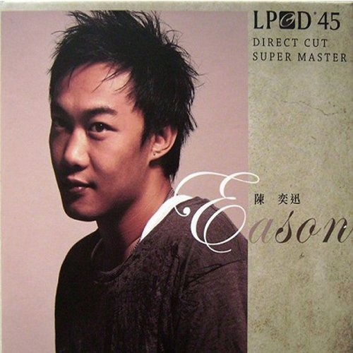

	

# [陳奕迅(LPCD 45)](https://music.163.com/album?id=3170625)

* 时间：2008-07-11
* 歌手：陈奕迅
* 唱片公司：英皇娱乐
## Songs

* [K歌之王](songs/k歌之王_32714430/README.md)
* [十面埋伏](songs/十面埋伏_32714431/README.md)
* [2001太空漫遊](songs/_太空漫遊_32714432/README.md)
* [歲月如歌](songs/歲月如歌_32714433/README.md)
* [明年今日](songs/明年今日_32714434/README.md)
* [人來人往](songs/人來人往_32714435/README.md)
* [低等動物](songs/低等動物_32714436/README.md)
* [打回原形](songs/打回原形_32714437/README.md)
* [Shall Wr Talk ](songs/shall_wr_talk_32714438/README.md)
* [Lonely Christmas](songs/lonely_christmas_32714439/README.md)
* [孤獨探戈](songs/孤獨探戈_32714440/README.md)
* [幸災樂禍](songs/幸災樂禍_32714441/README.md)
* [隨意門](songs/隨意門_32714442/README.md)
* [給愛麗斯](songs/給愛麗斯_32714443/README.md)
* [King Kong](songs/king_kong_32714444/README.md)
* [打得火熱](songs/打得火熱_32714445/README.md)
* [忘記歌詞](songs/忘記歌詞_32714446/README.md)
* [單車](songs/單車_32714447/README.md)
## Appendix

### Description

### Score

|歌曲数|评论数|分享数|
|:---:|:---:|:---:|
|18|15|7|

|歌名|分数|
|:---:|:---:|
|K歌之王|50.0
|明年今日|50.0
|單車|45.0
|Lonely Christmas|30.0
|人來人往|25.0
|十面埋伏|20.0
|2001太空漫遊|5.0
|歲月如歌|5.0
|低等動物|5.0
|打回原形|5.0
|Shall Wr Talk |5.0
|孤獨探戈|5.0
|幸災樂禍|5.0
|隨意門|5.0
|給愛麗斯|5.0
|King Kong|5.0
|打得火熱|5.0
|忘記歌詞|5.0
